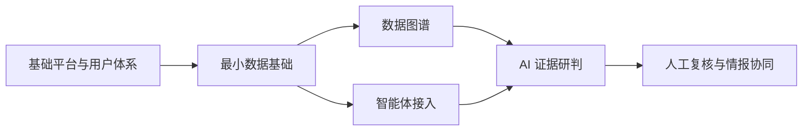

# 海防平台核心能力重建与全链路交付学习方案

日期：2026-09-19。状态：已收档；已整合 monorepo、Docker Compose 容器化开发与运行、基础平台优先、数据图谱与 AI 重点建设、亮色 / 暗黑双主题要求。本文基于当前工作区源码与官方技术文档；本轮只编写方案，尚未创建新项目、连接数据库或运行新技术组合。

新项目采用 **monorepo** 统一管理前端、后端、接口契约和开发交付配置。技术组合建议为 **React + TypeScript + Ant Design，Java 21 + Spring Boot + MyBatis，独立本地 MySQL 库**；通过 **Docker Compose** 统一启动、查看和停止服务，前后端与数据库均提供容器运行方式。

**第一阶段先交付可用的基础管理平台：工程骨架 → 前后端与数据库贯通 → 请求响应与异常约定 → 登录鉴权 → 用户、单位、角色与权限管理，同时形成搜索、表格等通用组件。** 后续围绕“多源数据与证据 → 数据图谱 → AI 辅助研判 → 人工复核 → 情报协同”建设核心能力。

当前目标已调整为有选择地重建核心模块。重复、缺少独立业务规则的 CRUD 页面移出新项目范围；支持核心功能的实体、数据与接口按需要保留。本轮不删除原项目代码。设计输入另见 [OpenDesign 核心页面设计 Prompt](opendesign-core-pages-prompt-2026-09-19.md)。

这次练习的价值，是你能从一个客户需求出发，解释业务规则、画出原型、设计接口与表、实现功能，并拿出验收和交付证据。选择技术时，优先考虑这条路径是否清楚、能否持续完成。

## 1. 本轮建议确定的方向

| 决策 | 建议 | 理由 |
|---|---|---|
| 最终目标 | 重建核心业务与技术能力，重点做数据图谱和 AI | 按学习价值与业务关联筛选，用场景验收而非页面数量衡量 |
| 当前交付范围 | 本地学习与业务复现 | 生产替换、数据迁移和客户上线需另立交付范围 |
| 第一阶段 | 可运行、可管理账号与权限的基础平台 | 先验证工程、公共能力与用户体系，再进入行业业务 |
| 仓库形式与位置 | 同级独立 monorepo，暂名 `merine-rebuild` | 前后端、契约与迁移在同一次变更中维护 |
| 前端 | React + TypeScript + Vite + Ant Design | 满足 React 要求，减少后台基础控件开发 |
| 后端 | Java 21 + Spring Boot 4.1.x + MyBatis | 沿用 Spring 概念，借显式 SQL 学习数据库与事务 |
| 数据库 | 独立 MySQL 8.4 LTS 容器、数据库、账号与数据卷 | 可以独立演练迁移、测试和恢复 |
| 环境与运行 | Docker Compose；默认容器开发，使用应用镜像演示与验收 | 统一管理服务、网络和数据卷，便于在 Docker Desktop 中查看状态与日志 |
| 应用结构 | 按业务分模块的单体 | 一套后端进程，模块边界清晰，交付负担可控 |
| 公共能力 | 请求响应、异常处理、搜索、表格、页面布局与权限控制 | 在用户、角色、单位管理中完成第一轮复用与验收 |
| 核心建设顺序 | 最小数据基础 → 图谱与智能体接入 → AI 证据研判 → 情报协同 | 先形成图谱与 AI 所需输入，再把结果接入可追踪的业务流程 |
| 视觉方向 | 同一设计系统，亮色与暗黑两套主题 | 重点设计图谱、AI、任务、用户管理和情报详情，减少重复页面设计 |
| 浏览器 | 本地学习暂按当前稳定版 Chrome | 原客户 Chrome 94 的要求单独保留为未来交付约束 |

React、Java、monorepo、使用 Docker 管理运行环境、基础平台优先、裁减重复 CRUD、重点建设数据图谱和 AI，以及亮色 / 暗黑双主题，是你的明确要求。具体库、数据模型和接口细节仍是评审建议；项目名、投入时间与未来是否替换原系统采用可调整的默认值。

## 2. 当前项目究竟用了什么

**后端不是 JSP。** JSP 是服务端生成 HTML 的模板技术；当前项目主要由 Spring Boot 提供静态页面和 JSON API，浏览器中的 JS 再请求接口。

| 层次 | 当前实现 | 源码依据 |
|---|---|---|
| 后端 | Java 11、Spring Boot 2.7.6、Spring MVC | [pom.xml](../pom.xml) |
| 数据访问 | Spring Data JPA / Hibernate，以及 JDBC / 原生 SQL | [pom.xml](../pom.xml)、[数据源说明](database.md) |
| 页面 | HTML、CSS、原生 JS、Bootstrap 5；主框架使用 iframe | [index.html](../src/main/resources/static/index.html)、[前端规范](frontend.md) |
| 构建交付 | Maven 打包，页面与 API 同在一个 jar | [本地操作](local-commands.md) |
| 关系数据 | MySQL 主库与边界库 | [数据库规范](database.md)；本轮未连接数据库 |
| 关系图谱 | Neo4j 相关模块和驱动 | [pom.xml](../pom.xml)、[代码地图](code-map.md) |
| 鉴权 | Spring Security 接入自定义 Token，登录信息存入内存 Map | [SecurityConfig](../src/main/java/com/fline/merine/common/config/SecurityConfig.java)、[登录服务](../src/main/java/com/fline/merine/modules/system/service/impl/SysUserInfoServiceImpl.java) |
| 表结构维护 | 当前 properties 中启用 Hibernate `ddl-auto=update` | [数据库规范](database.md)及当前配置中的对应键 |

本轮按工作区文件重新计数：

- `src/main/java` 下有 **828 个 Java 文件，约 6.37 万行**。
- `static/pages` 下有 **89 个 HTML 文件，约 5.47 万行**，包含登录页、详情页和历史页面，不等于 89 个独立业务需求。
- 后端有 **20 个模块目录、82 个以 Controller.java 结尾的文件、111 个包含 @Entity 的文件**。
- `src/test` 下有 **19 个 Java 文件，包含测试和测试辅助工具**；情报流转已有事务、权限、幂等、并发及导出相关覆盖。
- `src` 下未发现 JSP 文件或 `package.json`。上面的行数没有计入公共 JS、CSS 和第三方静态库。

这些统计用于判断原项目规模，不能直接按文件数量估工时，也不再作为新项目必须复刻的数量目标。实体文件数不能代替真实数据库表数。README 与早期记录中的规模、测试状态有历史差异，本方案采用当前源码。

## 3. 现有做法的优势和代价

HTML、CSS、JS 是网页基础，Spring Boot 也是成熟的企业应用框架。这里真正需要讨论的是页面组织、依赖管理、业务边界和验证方式。

| 当前做法 | 实际优势 | 规模扩大后的代价 |
|---|---|---|
| 静态页面直接改 | 改文案、字段和简单交互很直接，浏览器里能追到实现 | 复杂状态依靠手动维护 DOM；字段名、接口结构和组件契约缺少编译检查 |
| iframe 按页组织 | 页面样式有一定隔离，适合逐页补功能 | 父子窗口、弹窗、路由、刷新与共享状态容易产生额外约定；同源 iframe 不是安全隔离 |
| Bootstrap + 自定义 CSS | 常见布局和基础样式现成，学习门槛低 | 树选择、复杂表单、批量操作等业务控件仍需大量手工建设 |
| 一个 jar 提供页面和 API | 部署直接，同源访问，前后端版本一起交付 | 页面更新通常跟随后端打包；多人分工和独立发布不够灵活 |
| Spring Boot 单体 | 调用链直接，事务容易落在同一进程与数据库，维护成本低 | 模块边界薄弱时，公共服务会膨胀，改动影响难以判断 |
| JPA 自动映射与建表 | 初期新增简单表和 CRUD 很快 | 自动生成的 SQL、关联加载和启动 DDL 需要额外理解；缺乏可回放的迁移历史会增加交付风险 |
| 单人贯穿业务实现 | 沟通路径短，可以迅速响应需求 | 隐含规则容易只存在于作者记忆和代码里，交接者难以判断哪些行为是需求、哪些是偶然实现 |

**我的判断：原方案对“一个人把业务做出来”有合理性；现在接手和扩展时，需要补齐可理解性、可验证性与可交接性。** React 能改善组件和状态组织，TypeScript 能提前暴露部分契约错误，但它们不会自动解决权限、事务、SQL 或需求不清的问题。

当前代码也已经包含值得保留的工程成果。例如新情报流转模块有明确的发送快照、回执、反馈模型，以及幂等和并发测试。复刻时应该继承这些业务约束，不能把所有旧代码视为需要抛弃的内容。

新方案同样有成本：前端多了 Node、依赖锁文件和构建步骤；MyBatis 多了 SQL 与映射维护；新数据库多了迁移工作；新旧系统并行还会产生功能差异跟踪。只有把这些成本控制在真实需求内，复刻才有学习价值。

## 4. 数据库：推荐新建，继续使用 MySQL

“使用同一个数据库”需要区分：同一种数据库产品、同一个服务实例，以及同一组业务表。这三者的风险不同。

| 方案 | 好处 | 主要问题 | 建议 |
|---|---|---|---|
| 两个后端读写同一组业务表 | 马上看到同一批数据 | 迁移、测试、后台任务和业务写入互相影响；也很难判断结果是谁写的 | 不作为学习复刻默认方案 |
| 同一个本地 MySQL 实例，两个逻辑库 | 较省内存，数据可以分开 | 仍共用服务生命周期与资源；账号权限必须限制到各自库 | 机器资源紧张时可采用 |
| 独立 MySQL 容器、独立库与数据卷 | 环境边界清楚，适合练习建表、迁移和恢复 | 多占一份本地资源 | **默认推荐** |
| 换成 PostgreSQL 等另一种数据库 | 可以再学一套数据库能力 | 同时引入 SQL 方言、类型、排序规则和导入兼容变化 | 当前阶段收益不足 |

MySQL 中 database 与 schema 在这里可以视为同一层级。即便选择同实例分库，也应使用独立账号；表名前缀无法替代数据库和权限隔离。

### 4.1 新库如何建立

1. **按当前要做的模块建立表结构。** 先做系统基础表，再建立图谱与 AI 需要的人、船、事件、来源记录和任务数据，随后补情报协同。参考实体、现有 DDL 和业务规则，不在第一天复制整套历史表。
2. **业务含义先对齐。** 字段、单位、状态、唯一性、关系和统计口径建立新旧映射。表名可以不同；业务差异必须可解释。
3. **使用合成数据。** 用固定业务编码生成同一组场景，分别装入各自隔离的演示环境，再比较可见结果；比较业务含义，不依赖两库自增主键相等。
4. **所有建表与改表由 Flyway 迁移管理。** 已执行的迁移保持不变，修正写成后续迁移。新项目采用 MyBatis，不引入 Hibernate 自动改表链路。
5. **迁移账号与应用账号分开。** 迁移账号负责目标新库的 DDL，运行账号只拥有需要的查询和写入权限。测试使用一次性独立数据库。
6. **外部来源表按模块接入。** 现有系统包含仓库外程序写入的数据表，只复制 Java 实体不能还原这些来源；先定义输入契约与合成样本。

新项目建议采用 MySQL **8.4 LTS**：继续 MySQL 体系，同时选用面向长期稳定维护的分支。8.0 / PolarDB 的 SQL 与结构仍需逐模块验证，不能宣称直接兼容所有旧表。[MySQL 官方 LTS 说明](https://dev.mysql.com/doc/refman/8.4/en/mysql-releases.html)

本地旧库也不能自动视为纯演示库。外部地址、密钥和配置可能来自数据库表；新项目只生成自己需要的演示单位、角色、菜单和配置，真实连接参数不随配置表复制。

### 4.2 何时才值得共用旧后端或旧库

如果未来目标改成“先换 React 页面，后端保持现状”，新前端临时调用经核实隔离的旧本地 API，可以降低第一阶段工作量。不过这条路线对学习后端和数据库的帮助有限。

若未来要替换生产系统，应另行设计数据迁移、增量同步、最终切换和恢复方案，并明确每组表的唯一写入方。不能把“现在学习时共用表”当作未来迁移方案。

## 5. 前端选型：完整后台组件库，加少量 CSS

你说的“最简单的后台 CSS 框架”，从交付效果看，更适合选 **Ant Design 组件库 + CSS Modules**。它不仅提供样式，还提供表格、表单、日期选择、树、弹窗和反馈组件。[Ant Design 官方介绍](https://ant.design/docs/react/introduce/)

| 用途 | 推荐 | 使用边界 |
|---|---|---|
| 视图与类型 | React 19 + TypeScript | 组件按业务组织；接口 DTO 与页面状态有明确类型 |
| 开发与构建 | Vite | 普通客户端 SPA；Node 只承担开发与构建 |
| UI | Ant Design 6、配套 icons | 基于标准组件封装轻量搜索、表格和页面布局；复用边界见第 7.5 节 |
| 样式 | Ant Design 主题 token + CSS Modules | token 管主题，CSS Modules 管业务布局；按需增加全局 reset |
| 路由 | React Router | 使用客户端路由模式；服务端负责深链接回退 |
| 服务端数据 | TanStack Query | 处理请求状态、缓存和更新后失效；业务表单状态留在表单或组件中 |
| HTTP | 小型原生 fetch 封装 + 生成的接口类型 | 统一请求响应、错误、会话失效、取消请求和 CSRF；契约见第 7.3 节 |
| 日期 | dayjs | 与 UI 组件协调，统一显示与接口转换规则 |
| 数据图谱 | AntV G6，进入图谱阶段再加入 | 先验证搜索定位、展开、路径高亮、双主题及 React 生命周期 |
| 质量检查 | TypeScript、ESLint、Prettier | 维持一套检查与格式规范 |
| 验证 | Vitest / Testing Library、Playwright | 前者覆盖关键组件行为，后者覆盖用户完整操作 |

React 官方当前文档列出 19.2；Ant Design 6 要求 React 18 以上，并已处理 React 19 兼容。初期选择这一组合，具体补丁版在建项目时锁定。[React 版本](https://react.dev/versions)、[Ant Design 6 说明](https://ant.design/docs/react/migration-v6-cn/)

Node 建议使用 **24 LTS**，pnpm 版本随项目锁定，并提交依赖锁文件。Vite 当前文档有明确的 Node 最低版本要求，建项目时会核对模板和插件的完整组合。[Node 发布列表](https://nodejs.org/en/about/previous-releases)、[Vite 入门](https://vite.dev/guide/)

路由只承担页面导航，接口缓存交给 TanStack Query，避免在两处重复管理同一份服务端状态。[React Router 模式](https://reactrouter.com/start/modes)、[TanStack Query 说明](https://tanstack.com/query/latest/docs/framework/react/overview)

图谱展示建议先用 **AntV G6**：其图绘制、布局、交互和自定义元素能力与本项目吻合，并有 React 集成说明。用一个薄的 React 组件管理图实例的创建、更新与销毁；先验证有界数据量的交互，再根据实测决定是否需要其他渲染方案。[G6 介绍](https://g6.antv.antgroup.com/en/manual/introduction)、[React 集成](https://g6.antv.antgroup.com/en/manual/getting-started/integration/react)

### 5.1 其他前端选择如何取舍

| 候选 | 本项目的取舍 |
|---|---|
| Bootstrap / React Bootstrap | 如果主要是简单页面，可以继续使用；本项目有大量后台表单与表格，Ant Design 更能减少业务控件工作 |
| Tailwind CSS | 可以高效组织样式，但仍需决定和维护表格、表单等组件；当前学习重点放在业务与后端 |
| shadcn/ui 体系 | 适合希望掌握组件源码和深度定制的项目；当前需要承担的组合与维护工作更多 |
| Ant Design Pro / 通用后台脚手架 | 暂不整套引入。先掌握登录、路由、权限与一条业务链路，再判断是否值得采用其抽象 |

初期使用组件状态和少量 Context 已足够。跨页面客户端状态出现真实共享需求后，再判断是否引入 Zustand 等库。身份切换和退出登录时清理查询缓存，权限相关 query key 包含必要的身份与查询范围，缓存不承担授权职责。

### 5.2 浏览器是一个真实约束

旧项目规定 Chrome 94；Ant Design 当前官方支持范围面向现代浏览器，不能直接承诺兼容 Chrome 94。[Ant Design 环境支持](https://ant.design/docs/react/introduce/)

本方案默认先在当前 Chrome 完成本地学习。若评审要求从第一版就面向原客户浏览器，需在开工阶段对登录、表格、表单、弹窗、日期选择和导出做兼容性样例验证，再调整依赖或兼容层。修改 Vite 编译 target 只涉及部分问题，不能替代 CSS 和浏览器 API 验证。

### 5.3 亮色与暗黑主题，先由核心页面确定设计语言

只提供亮色和暗黑两种主题；它们共享布局、组件结构、状态含义和品牌强调色，分别定义背景、表面、文字、边框、交互与图谱配色 token。这里的“两种主题”不限制页面只能出现两种颜色，必要的状态色和图谱实体分类色仍然保留。

基础主题切换在 M1 完成，图谱画布、图表、弹窗和 AI 引用卡片都要随主题一致变化。偏好可在本地保存，主题切换不影响查询、选中节点或正在进行的会话。优先让 OpenDesign 设计图谱工作台、AI 研判工作台、数据任务中心、用户管理和情报协同详情五个代表页面，作为后续 React 实现的参考。

完整可复制设计要求已单独整理为 [OpenDesign Prompt](opendesign-core-pages-prompt-2026-09-19.md)，包括页面关系、两套主题、合成数据、失败状态和设计交付要求。

## 6. 后端选型：Spring Boot 模块化单体

### 6.1 为什么继续选 Spring Boot

| 候选 | 本次判断 |
|---|---|
| **Spring Boot + Spring MVC** | 首选。现有代码已经采用这套基本模型，Controller、Service、事务、校验与安全概念可以连续学习 |
| Quarkus / Micronaut | 都是可用的 Java 应用框架；当前没有明确到足以支持生态切换的启动速度或资源约束，暂不优先选择 |
| 直接使用 Servlet / JSP | 会增加基础设施与模板层的手工工作，也不符合 React 前端方向 |
| Spring Cloud 微服务体系 | 当前没有独立团队、独立扩容或独立发布的已确认需求，拆服务会额外引入网络调用和分布式一致性 |

选择依据是当前项目和学习目标的匹配程度，不是通用排名。框架能力参照：[Spring Boot](https://spring.io/projects/spring-boot/)、[Quarkus](https://quarkus.io/)、[Micronaut](https://micronaut.io/)。

“模块化单体”指一个后端进程，按业务组织代码和职责。初期直接用包边界表达模块，跨模块通过明确的服务接口协作；不要求额外安装模块框架或拆成多套 Maven 工程。

### 6.2 版本与依赖建议

Java 采用 **Temurin 21 LTS**。它已经满足当前 Spring Boot 的 Java 要求，也有明确的后续维护窗口，适合用来学习现代 Java。Java 25 也是可选 LTS，但当前业务没有需要它才能实现的功能。旧项目仍使用自己的 Java 11，新项目通过目录级工具配置选择 JDK。[Temurin 支持计划](https://adoptium.net/support)、[Spring Boot 系统要求](https://docs.spring.io/spring-boot/system-requirements.html)

以下是新项目的候选依赖清单，不是本轮已经运行成功的环境：

| 能力 | 建议依赖 / 约定 | 加入时机 |
|---|---|---|
| 框架与构建 | Spring Boot 4.1.x、Maven Wrapper | 起步；由 Boot 统一管理它覆盖的依赖版本 |
| HTTP API | Spring MVC / `spring-boot-starter-webmvc` | 起步，采用 REST JSON API |
| 入参校验 | `spring-boot-starter-validation` | 起步，后端最终校验 |
| 登录与授权 | `spring-boot-starter-security` | 起步，使用标准认证链路 |
| 数据访问 | MyBatis 3，Spring Boot Starter 4.1.x | 起步，Mapper + 显式 SQL |
| 数据库驱动 | `mysql-connector-j` | 起步，由依赖管理协调版本 |
| 结构迁移 | `spring-boot-starter-flyway` + `flyway-mysql` | 起步，SQL 迁移随代码保存 |
| JSON | Boot 管理的 Jackson | 起步，保持一个默认 JSON 体系 |
| API 文档 | springdoc-openapi 3.x | 第一条接口，生成 OpenAPI 并核对实际请求响应 |
| 健康与日志 | Actuator、SLF4J / Logback | 起步，先有健康检查、请求定位和必要业务日志 |
| 后端验证 | Spring Boot Test、JUnit、MockMvc；数据库测试用 Testcontainers MySQL | 第一条写入链路起使用 |
| 文档导出 | Apache POI | 实现 Excel / Word 导出时加入 |

本轮官方页面展示 Spring Boot **4.1.1**；MyBatis 已发布 **Starter 4.1.0**，其发布说明升级到 Boot 4.1.0。springdoc 页面推荐 **3.1.1** 并声明 3.x 面向 Boot 4，但页面的详细兼容矩阵仍主要列出 Boot 4.0。故 springdoc 与完整 Boot 4.1 组合还要做本地启动和文档生成验证，不能只凭大版本推定。[Spring Boot](https://spring.io/projects/spring-boot/)、[MyBatis 4.1.0 发布](https://github.com/mybatis/spring-boot-starter/releases/tag/mybatis-spring-boot-4.1.0)、[springdoc 兼容说明](https://springdoc.org/#what-is-the-compatibility-matrix-of-springdoc-openapi-with-spring-boot)

版本信息是 2026-09-19 本轮读取官网所得，不把页面展示值当作永久的“最新补丁版”。开工时统一核对稳定版本、锁定依赖，并通过最小联调验证；不采用 Snapshot / RC。

Flyway 的 MySQL 支持需要数据库专用模块，不能只加一个通用依赖就认为迁移环境已经完整。[Spring Boot 数据库初始化说明](https://docs.spring.io/spring-boot/how-to/data-initialization.html)

### 6.3 为什么本次选 MyBatis

JPA 本身可以支持严肃的企业项目。若主要目标是快速复用现有实体与 Repository，继续 JPA 会减少重写量。

本次更看重你理解“一个接口最终执行了什么 SQL、为什么需要这个索引、哪几次写入必须同时成功”。项目也包含大量列表、统计、多来源档案和权限条件，因此选择 MyBatis：把查询和写入明确放在 Mapper 中，业务决策留在 Service，事务边界可直接审查。

代价是需要手写更多 SQL、映射和分页逻辑。我们接受这部分学习成本，首期用少量明确的约定控制重复；完成两三个模块后再提炼公共模式。MyBatis-Plus 可以后续重新评估，不在第一阶段同时引入多套数据访问抽象。

### 6.4 起步时就落实的工程约定

- **登录**：单机同源管理后台先用 Spring Security Session + HttpOnly Cookie，有明确超时和退出机制；HTTPS 交付环境启用 Secure，并配置适当的 SameSite 与 CSRF。单实例内存 Session 重启后需要重登，先接受这一行为；需要跨实例或持久化时再引入 Session 存储。[Spring Security SPA / CSRF 文档](https://docs.spring.io/spring-security/reference/servlet/exploits/csrf.html)
- **授权**：菜单控制可见入口；后端同时检查操作权限和数据范围。列表、详情、统计、导出、写入都要覆盖。账号身份、单位和时间由服务端确定。
- **业务权限分开建模**：一般档案模块可按区划范围判断；情报流转按单位直接参与关系判断，省级账号也不天然拥有所有流转记录。
- **接口**：统一分页、排序白名单、错误码与 HTTP 状态；DTO 与持久化对象分开。对前端不安全的大整数 ID 使用字符串表示，时间格式和业务时区明确写入契约。
- **SQL 与事务**：使用参数绑定，禁止拼接用户输入；多表写入设置事务，关键唯一性放到数据库约束；发送、签收等操作考虑重试和并发。
- **配置**：新项目只有经过核实的本地配置，演示数据与真实集成参数分离。外部 AI、视频、同步任务默认关闭或由本地替身实现。
- **依赖**：Boot 管理的版本由 Boot 协调，其他依赖明确锁定；旧 pom 和旧 SDK 按用途筛选后再接入。

Redis、消息队列、工作流引擎、分布式锁和 Kubernetes 等，都等到具体模块提出需求再评估。多步流转先用明确的状态与数据库事务表达。

## 7. Monorepo 工程与第一阶段基础平台

### 7.1 一个仓库管理前后端，保留各自构建工具

新项目使用一个 Git 仓库，前端、后端、迁移与接口类型随同一次功能变更一起提交和评审。Java 依赖由 Maven 管理，前端和 TypeScript 包由 pnpm workspace 管理；根目录提供统一操作入口。

建议目录如下，路径仅为方案，目前尚未创建：

```text
haiphong-platform/
├── merine-daas/                       原项目，保留业务参照
└── merine-rebuild/                    新 monorepo，只有根目录一份 Git 历史
    ├── apps/
    │   ├── web/                      React + TypeScript + Vite
    │   │   └── src/
    │   │       ├── app/              路由、布局、provider、启动恢复
    │   │       ├── features/         auth、users、roles、orgs，以及后续业务
    │   │       └── shared/           HTTP、搜索、表格、权限控件和公共 hooks
    │   └── api/                      Spring Boot，包含 pom.xml 与 Maven Wrapper
    │       └── src/main/
    │           ├── java/.../
    │           │   ├── system/       用户、单位、角色、权限
    │           │   ├── common/       响应、异常、身份上下文等公共能力
    │           │   ├── integration/  外部服务适配
    │           │   └── .../          后续行业业务包
    │           └── resources/db/migration/
    ├── packages/
    │   └── api-contract/             OpenAPI 快照与生成的 TypeScript 类型
    ├── scripts/                      启动、检查、迁移和打包编排
    ├── infra/
    │   ├── compose.yaml              共用服务：MySQL、一次性迁移任务等
    │   ├── compose.dev.yaml          开发模式：web、api 与源码挂载
    │   ├── compose.run.yaml          演示验收：构建好的 app 镜像
    │   └── docker/                   开发与交付镜像的 Dockerfile
    ├── docs/                         功能清单、业务决定、运行说明
    ├── .dockerignore                 排除本地密钥、数据和无关构建产物
    ├── .env.example                  环境变量说明与占位值
    ├── package.json                  根目录命令入口，private
    ├── pnpm-workspace.yaml           apps/web 与 packages/*
    ├── pnpm-lock.yaml
    ├── mise.toml                     固定可选本机调试所用的工具版本
    └── README.md
```

pnpm workspace 使用根目录 `pnpm-workspace.yaml` 声明 JavaScript / TypeScript 包，本地包引用使用 `workspace:`。Java 工程仍由 `apps/api` 的 Maven Wrapper 编译，根脚本负责调用它。[pnpm workspace 官方说明](https://pnpm.io/workspaces)

公共 UI 初期放在 `apps/web/src/shared`，由用户、角色和单位页面复用。有第二个前端应用确实需要共享时，再抽成 `packages/ui`。现阶段两个应用用根脚本即可编排，构建时间或任务依赖变复杂后再评估 Turborepo / Nx。

### 7.2 开发、检查和交付入口

以下命令是拟实现的根目录接口，尚不可在当前仓库执行。运行类命令封装 Docker Compose，运行说明同时给出等价的 `docker compose` 命令；使用后者启动整套环境时，无需在宿主机安装项目的 JDK、Node 或 MySQL。

| 根命令 | 职责 |
|---|---|
| `pnpm deps:up` | 用 Compose 启动新项目自己的 MySQL；Neo4j 到图谱阶段按需启用 |
| `pnpm db:migrate` | 显式选择目标环境，以一次性迁移容器和迁移账号执行已审查的 Flyway 迁移 |
| `pnpm dev` | 检查数据库就绪与迁移状态，通过开发 Compose 启动 web、api；支持源码修改后的更新 |
| `pnpm dev:web` / `pnpm dev:api` | 可选的本机调试入口；先停止对应开发容器，复用新项目的容器数据库 |
| `pnpm contract:generate` | 从隔离本地后端导出 OpenAPI，生成前端接口类型 |
| `pnpm check` | 前端类型与规范检查、后端编译、关键测试和接口契约一致性检查 |
| `pnpm build` | 通过多阶段 Docker 构建完成前端与后端打包，产出带版本的 app 镜像；jar 是其中的应用产物 |
| `pnpm stack:up` | 在独立验收环境启动 app 镜像与 MySQL；先检查该环境的迁移状态，再验证就绪 |
| `pnpm stack:status` / `pnpm stack:logs` | 查看指定环境的容器状态、健康状态与日志 |
| `pnpm stack:down` | 停止并移除指定环境的容器与网络，保留命名数据卷 |

数据库迁移是明确步骤。常规 API 运行使用应用账号，关闭应用启动时自动执行迁移的行为；数据库测试由隔离测试流程建库和迁移。演示账号的初始化另有明确入口，不随每次启动重新灌入或重置数据。

本地开发暂定 Vite `5173`、API `9002`、新 MySQL 映射 `3307`。Vite 与 API 在容器内监听 `0.0.0.0`，发布到宿主机的端口绑定 `127.0.0.1`，实施时检查占用。浏览器只请求同源 `/api`，由 Vite 代理到后端；容器内的 Vite 通过 `api:9002` 访问后端，后端通过 `mysql:3306` 访问数据库。本机 IDE 调试时才使用本机映射端口，不能把容器里的 `localhost` 当成 MySQL 地址。[Compose 网络说明](https://docs.docker.com/compose/how-tos/networking/)

**开发时 web 和 api 分别运行在容器里；第一版演示与交付使用一个 app 镜像加数据库容器。** app 镜像内运行包含 React 静态产物的 Spring Boot jar，前端页面与 API 同源。React 产物进入打包阶段的生成目录，不手工复制进后端源码目录，也不纳入源码提交。运行镜像保留必要的 Java 运行环境与应用产物，Node、Maven 等构建工具留在构建阶段。

后端独立编译和启动不依赖前端构建产物。契约检查先从隔离后端导出接口类型，再检查前端；交付时才聚合前端资源，避免形成“先构建前端才能启动后端、先启动后端才能生成前端类型”的循环。

SPA 深链接回退只处理前端页面路由，不能吞掉 `/api`、健康检查、API 文档和静态文件错误。打包验收实际验证刷新、后退、404 和登录过期。后续 CI 复用根目录检查命令；需要前端独立发布时，可以使用同一份静态产物。

#### 7.2.1 Docker 的职责、开发方式与验收

原方案已包含 MySQL 容器；本次将前后端的开发、镜像构建和整套运行一并纳入 Docker Compose。Compose 管理多个服务及其网络、数据卷，不改变 React、Spring Boot 或 MyBatis 的职责。[Docker Compose 官方说明](https://docs.docker.com/compose/)

**MyBatis 是通过 Maven 引入的 Java 依赖，运行在后端进程里，不是一个独立服务。** Docker 化的是包含 Spring Boot、MyBatis 和业务代码的 Java 应用；MySQL、Neo4j 则各自运行在独立容器中。[MyBatis 安装说明](https://mybatis.org/mybatis-3/getting-started.html)

| 组成 | 默认开发方式 | 演示与验收方式 |
|---|---|---|
| React 前端 | `web` 容器运行 Vite，挂载源码并支持热更新 | 构建为静态文件，随 app 镜像提供页面 |
| Spring Boot + MyBatis | `api` 容器使用 JDK 21 与 Maven Wrapper，修改后增量编译并重启；不必每次重建镜像 | `app` 容器运行已构建的 jar，按镜像版本更新 |
| MySQL | 独立 `mysql` 容器，使用本项目的命名数据卷 | 验收环境另有独立容器与数据卷，不复用开发库 |
| Flyway | 显式执行一次性迁移任务，成功后退出 | 对目标验收库单独迁移，失败时阻止应用进入验收 |
| Neo4j | M3 图谱阶段再加入可选服务组和独立数据卷 | 按同一模块版本启用并验证同步、查询与恢复 |
| AI 平台 / 模型 | 先用受控替身或获授权的测试服务 | 记录实际接入方式；使用 API 不意味着第一阶段必须自部署模型或整套智能体平台 |

日常默认使用容器开发，让 Docker Desktop 中能看到 `web`、`api`、`mysql` 的运行状态、日志和资源占用。需要 IDE 断点调试时，可将相应进程切换到本机运行；业务代码、依赖版本与数据库迁移保持一致，只切换连接配置。Docker Desktop 的容器视图可查看 Compose 应用及各容器详情。[Docker Desktop 容器视图](https://docs.docker.com/desktop/use-desktop/container/)

开发与验收通过不同的 Compose 项目名隔离，例如 `merine-rebuild-dev`、`merine-rebuild-run`；端口也分别分配。基础配置共用，开发配置增加源码挂载，验收配置只引用构建产物。新旧项目分别使用自己的数据库、文件目录、数据卷、会话 cookie 名称和工具版本。

落地时落实以下约定：

- **代码与持久数据分开。** 开发源码挂载到容器，容器内依赖和 Maven / pnpm 缓存独立保存，不混用宿主机 `node_modules`；数据库和上传文件使用明确的命名数据卷。常规停止保留数据卷，不把 `down -v` 或重灌当作重启步骤；数据卷不是备份。[Compose 停止与数据卷说明](https://docs.docker.com/reference/cli/docker/compose/down/)
- **就绪检查与迁移分开。** 数据库健康检查通过后，显式执行并核对迁移，再启动应用。Compose 中“容器已启动”不等于数据库可用，依赖就绪应使用 `healthcheck` 与 `service_healthy`；应用仍需处理运行中的数据库断连。[Compose 启动顺序](https://docs.docker.com/compose/how-tos/startup-order/)
- **配置与镜像分开。** 固定镜像版本，实际构建记录镜像标识；本地连接和凭据在运行时注入，`.env.example` 只保留说明和占位值，实际配置不提交、不打入镜像。旧项目配置和生产数据不带入新容器。
- **调试与验收分开。** 开发环境验证前端热更新、后端修改后生效与日志；验收环境使用构建好的镜像，不挂载源码。Testcontainers 通过独立测试入口使用 Docker，测试库不复用开发或验收数据卷。

这套方式增加了镜像构建、Docker 内存占用和文件监听调试的成本。M1 先启动必要服务并缓存依赖；Neo4j 和其他服务按模块加入。容器方案在本机实际验证后再确定资源配置，不预设“放进 Docker 就没有兼容性问题”。

**M1 验收增加一条：** 从空的独立验收环境完成迁移并启动镜像，在浏览器完成用户管理链路；停止后再启动，数据仍在；能定位各服务日志、区分健康检查失败与业务失败，并确认没有连到旧库。镜像构建成功本身不代表这条链路已经通过。

### 7.3 先统一请求、响应与接口契约

普通 JSON 业务接口采用一套明确契约，建议如下：

| 对象 | 约定 |
|---|---|
| 成功响应 | `{ code: "OK", message, data, requestId }`，HTTP 使用实际成功状态 |
| 错误响应 | `{ code, message, data: null, requestId, fieldErrors? }`，code 是稳定业务错误码 |
| 分页数据 | `data: { items, total, page, pageSize }`，接口页码从 1 开始 |
| 查询入参 | 明确允许的筛选项、排序字段与方向，限制 pageSize；服务端再次校验 |
| ID 与时间 | 可能超过 JS 安全整数范围的 ID 用字符串；接口时间采用约定格式与业务时区 |
| 参数错误 | HTTP 400，可带字段错误，前端能定位到具体表单项 |
| 未登录 / 无权限 | HTTP 401 / 403，分别处理会话恢复和禁止操作 |
| 资源不存在 / 状态冲突 | HTTP 404 / 409；重复键、并发覆盖等给出可理解的业务提示 |
| 未预期异常 | HTTP 500，返回通用提示与 requestId，详细异常留在服务端日志 |

文件下载、流式响应、健康检查和 OpenAPI 等已有协议单独处理，不强制套 JSON 包装。普通业务接口不把失败都转换成 HTTP 200。后端优先显式返回公共响应类型，避免全局包装器误伤文件或第三方端点。

前端 fetch 封装负责解析契约、生成统一的 `ApiError`、携带会话和 CSRF 信息、处理取消和超时。401 统一清理身份与查询缓存，避免多个并发请求重复弹提示或跳转；登录接口的凭据错误在登录页处理。403 显示权限提示，不强制退出。字段校验错误由表单展示，普通操作错误由页面统一提示，避免 HTTP 层与组件层重复报错。网络取消不作为操作失败提示，写请求不自动重试。

后端 DTO 和 OpenAPI 定义是接口结构的来源，`packages/api-contract` 保存可比对的规范快照及生成类型，前端通过包引用使用。更新接口时同步生成并检查差异，生成文件不手改。`openapi-typescript` 可将 OpenAPI 转成 TypeScript 类型；生成的静态类型不能代替运行时校验和接口行为测试。[openapi-typescript 官方说明](https://openapi-ts.dev/introduction)

### 7.4 后端公共能力：先覆盖实际基础链路

每个业务包内部采用 Controller → Service → Mapper。Controller 负责协议和入参，Service 负责业务、授权与事务，Mapper 负责 SQL。公共代码按职责放进 `common`，业务规则留在所属模块。

| 公共能力 | 第一阶段做到什么 |
|---|---|
| 响应与分页 | 公共响应、分页 DTO、稳定错误码和 requestId，与前端约定一致 |
| 参数与异常 | Bean Validation、JSON / 参数解析错误、业务异常、数据库约束冲突、未知异常统一处理 |
| 安全入口 | 未认证和无权限时，也返回相同错误契约；登录与退出明确使用 API 响应 |
| 身份上下文 | 从 SecurityContext 得到当前用户、单位、权限与数据范围；业务代码不从请求体信任身份 |
| 权限策略 | 明确的操作权限检查和单位数据范围条件，详情与修改同样校验 |
| 数据与事务 | MyBatis 映射约定、参数化 SQL、审计字段、唯一约束、多表写入事务和必要的版本检查 |
| 配置与运行 | 类型化配置、环境隔离、健康检查、迁移校验和外部任务开关 |
| 日志与留痕 | 请求定位、失败日志，以及账号、角色、权限变更的操作者和结果；密码与会话凭据不入日志 |

MVC 的全局异常处理不能自动覆盖安全过滤器中的全部失败。认证与授权失败通过 Spring Security 的对应处理器接入同一响应约定，再用接口测试确认返回的状态和结构。[Spring Security 架构说明](https://docs.spring.io/spring-security/reference/servlet/architecture.html)

先用明确的 Service 和 Mapper 实现业务。通用 BaseController、万能 BaseService、任意表 CRUD 生成器等，等重复模式和权限边界稳定后再判断是否值得引入。

### 7.5 前端公共组件：由用户管理页面验证

| 组件或能力 | 第一版职责 | 保留给业务页面的职责 |
|---|---|---|
| `AppLayout` / `PageContainer` | 导航、面包屑、标题、操作区和页面布局 | 页面内容和具体操作 |
| `SearchForm` | 基于 Ant Design Form 提供字段布局、查询、重置、展开收起 | 筛选字段、联动和业务校验 |
| `DataTable` | 基于 Ant Design Table 统一分页、加载、空状态、错误重试、行选择及工具区 | 列定义、单元格渲染、行操作与批量操作逻辑 |
| `useListQuery` | 将已提交筛选条件、分页、排序与 TanStack Query 连接起来 | API 函数、具体 query key 和参数转换 |
| 表单弹窗 / 抽屉 | 统一提交中、关闭、错误反馈等交互 | 表单字段及新增、编辑的业务请求 |
| `PermissionGuard` / `usePermission` | 页面入口、按钮的显示与可操作状态 | 后端仍独立检查每次操作权限 |
| 错误边界与状态组件 | 未预期页面错误、403、404、空数据和重试入口 | 具体业务错误的解释与恢复 |

组件尽量保留 Ant Design 原有能力，通过 props、children 或渲染函数扩展，避免为了统一样式重新设计一套表格语言。表格组件不直接决定请求地址和业务权限。

表单正在输入的值与已提交查询条件分开；点击查询或重置回到第一页。前端分页、排序和后端口径一致；更新成功后精确失效相关查询，筛选变化时取消或隔离旧请求，清理不再适用的行选择。

第一版在用户列表完成搜索、分页、编辑和状态变更，再放到角色或单位页面复用。能稳定支持这两类页面后，就进入行业业务；复杂动态表单、可视化配置器和任意页面生成器不列入起步范围。

### 7.6 用户体系：登录、身份、授权和管理操作一起打通

基础平台必须能用账号实际开展管理。建议首版包含以下能力，具体操作规则在实施前的小型原型中核对：

| 功能 | 首版范围 |
|---|---|
| 登录与会话 | 登录、退出、当前用户信息、刷新恢复、过期处理、修改密码；密码采用 Spring Security 密码编码器保存 |
| 用户管理 | 分页搜索、新增、编辑、启用 / 禁用、分配单位与角色、授权范围内的密码重置 |
| 单位管理 | 单位树、必要的新增与编辑、上下级关系和状态；有关联用户或下级时限制破坏性变更 |
| 角色管理 | 角色列表、新增与编辑、权限分配、必要的数据范围设置 |
| 菜单与权限 | 维护菜单、页面路由 key 与操作权限码的映射，登录后按权限生成导航和按钮状态 |
| 操作留痕 | 记录账号状态、角色分配、权限与密码重置等关键管理操作的操作者和结果 |

数据模型先围绕下面的关系建立，字段与约束通过迁移固化：

| 对象 | 建议关系与约束 |
|---|---|
| 用户 `sys_user` | 唯一登录名、密码哈希、所属单位、账号状态与授权版本；不使用单位名称作为关联键 |
| 单位 `sys_org` | 父单位、稳定编码、名称、状态及必要区划信息；禁止层级成环 |
| 角色 `sys_role` | 稳定角色编码、状态与数据范围规则 |
| 权限 `sys_permission` | 稳定权限码，例如 `system:user:read`、`system:user:update` |
| 用户角色 `sys_user_role` | 用户与角色多对多，关系唯一 |
| 角色权限 `sys_role_permission` | 角色与权限多对多，关系唯一 |
| 菜单 `sys_menu` | 父菜单、排序、前端已注册的路由 key 和进入权限；由权限推导可见导航 |

菜单、路由和权限有各自职责。前端只识别已注册的页面 key；隐藏菜单不能替代后端检查。权限码在代码与迁移中登记，角色管理负责分配；首期菜单配置不承担任意创建页面的能力。

授权采用 **RBAC 操作权限 + 单位数据范围**。首期围绕用户管理验证本单位、下级单位及获明确授权的全部范围，组合角色时按操作计算有效范围。个人密码修改只允许操作当前账号；用户、单位、角色的管理还要限制可管理单位和可授予角色，防止通过管理接口扩大自己的权限。

系统管理角色的权限限定在相应管理能力。行业数据仍执行所属模块的规则，例如情报流转按直接参与单位判断，不因拥有省级身份或账号管理权限就获得所有情报的访问权。

**禁用账号、修改密码和授权变更必须影响已有会话。** 建议登录时绑定授权版本，鉴权时检查当前账号状态与版本；变更角色权限时同步使受影响用户的旧授权失效，要求重新登录。前端相应清理身份、菜单与查询缓存。首期使用数据库与单实例 Session 即可完成，不以引入 Redis 为前提。

提供两级演示单位及管理员、单位管理者、普通用户等合成账号进行验收。初始管理员仅在显式初始化时创建，凭据由本地安全配置提供；重启不重置账号。默认采用启停而非随意删除账号，管理员操作还需防止误停用最后一个可用的管理账号。

### 7.7 第一阶段实施顺序与验收

公共封装和用户体系在同一阶段逐步形成，每一步都有可以运行的结果：

| 步骤 | 实现内容 | 当步验证 |
|---|---|---|
| M1.1 工程骨架 | monorepo、Docker Compose、web / api / MySQL 容器、迁移与根命令 | 容器状态与日志可查看；页面能访问 API；合成数据查询证明实际连到新库 |
| M1.2 基础协议与登录 | 请求响应、错误处理、接口类型、身份上下文、登录与会话；最小单位和角色数据 | 成功、参数错误、401、403 的结构一致；登录、刷新、退出与过期处理可运行 |
| M1.3 用户管理与通用组件 | 用户列表、搜索、分页、表单、角色 / 单位分配、状态变更 | 完成一条持久化管理链路，验证搜索与表格封装及数据库约束 |
| M1.4 单位角色与授权闭环 | 单位与角色管理、菜单权限、数据范围、会话失效和操作留痕 | 组件在第二类页面复用；跨单位和越权写入被拒绝；授权变化对已有登录生效 |
| M1.5 基础平台验收 | 契约检查、关键自动化测试、双主题、空库迁移与应用镜像运行 | 独立验收环境演示用户体系；重启后数据仍在，通过后进入核心数据、图谱与 AI 建设 |

M1 的完整演示路径是：**管理员登录 → 建立演示单位与角色 → 创建并授权用户 → 新用户登录看到对应菜单 → 按范围查询和操作 → 管理员调整权限 → 原会话失效 → 重新登录核对新权限 → 管理员禁用账号 → 旧会话失效且不能重新登录。** 退出登录另行验证，退出后的会话也不能继续调用受保护接口。

验收还覆盖用户名重复、错误密码、字段错误、分页与排序、无权限直调接口、跨单位详情和修改、清理登录缓存，以及重启后数据仍在。数据库测试使用独立实例或测试库，页面 E2E 使用上述合成场景；运行构建好的 app 镜像，重做登录和一条用户管理操作。

第一阶段达到这些标准，就具备开展行业模块的基础。后续复刻过程中按真实重复补充组件和公共处理，不要求先做完一套通用开发平台。

## 8. 当前模块取舍：集中建设核心能力

### 8.1 筛选标准

优先保留能训练多源数据建模、可靠任务、关系查询、AI 集成、证据核对和复杂权限的能力。普通 CRUD 在基础平台中练习并验证复用后，后续只实现核心流程实际需要的部分。

“移出范围”指新项目不再建设对应的重复页面和独立菜单，不代表这些业务对原客户没有价值，也不代表删除原项目代码或必要数据。核心模块所需的人员、船舶、港口、事件和字典，仍通过合成数据、导入或最小维护入口提供。

### 8.2 逐模块判断

| 原模块 | 当前职责或可见代码能力 | 新项目取舍 |
|---|---|---|
| `system` | 用户、单位、角色、菜单、字典、配置、日志 | **保留 M1 基础平台**；字典和配置只维护核心能力实际用到的项 |
| `person`、`ship` | 人船档案、关联资料、船舶生命周期与统计 | **保留聚合画像和关联查询**，合并为对象检索与详情；各类登记、证书、维修、注销等重复 CRUD 页面不逐个复写 |
| `inout`、`gab` | 进出港与报备记录，为关系与比对提供输入 | **作为数据来源保留**，用合成导入、事件时间线和证据查询呈现，不另做全套台账菜单 |
| `geography` | 港口、码头、锚地、海岛及辖区基础信息 | **保留图谱所需地点与辖区模型**；首轮省去多套基础信息维护页 |
| `graph` | MySQL → Neo4j 同步、搜索、关系扩展、路径、社区与标签传播等 | **重点建设**可靠同步、实体检索、邻居扩展、路径解释；社区、异常、传播算法作为后续扩展 |
| `agent` | Dify、毕昇、百炼调用分支；流式输出、会话、文件、调用日志 | **重点建设**智能体接入与会话运行能力；先接通一个平台，接口留出扩展点，不复刻工作流编辑器 |
| `caseevent` | 案事件资料与 AI 物品抽取、摘要、分类等处理 | **重点保留 AI 研判业务样例**，包括输入快照、结构化结果与人工复核；办案基础表单按样例最小化 |
| `knowledge` | 文档上传、知识同步、问答资料维护 | **保留证据检索与引用能力**，并入 AI 研判；普通知识条目 CRUD 和完整知识运营后台暂不建设 |
| `intelligenceflow` | 草稿、收发、签收、反馈、转发、快照与导出 | **保留为成果协同模块**，承接经人工复核的研判结果；安排在图谱与 AI 核心链路之后 |
| `risk`、`warning` | 风险标签、比对、重点对象、预警签收与处置 | **第二轮可选扩展**：选一条有解释依据的规则 → 命中 → 复核链路；不同时复制所有标签、评分和预警管理页面 |
| `intelligence`、`message` | 旧情报录入、分发与消息流转 | **新项目不并行复写旧入口**；需要的业务语义统一核对后纳入 `intelligenceflow` |
| `dashboard` | 综合数据汇总与看板 | **只保留核心模块的任务、待办和结果概览**；不另做一套装饰性大屏或重复统计页 |
| `device` | 设备台账及部分设备外部接入 | **重复设备 CRUD 移出范围**；实时视频或设备协议在有独立学习目标与测试条件时再立模块 |
| `antismuggling` | 走访记录等维护 | **首轮移出范围**，当前代表性 Service 以记录维护为主，与图谱和 AI 主链路关联不足 |
| `boundary`、`zjzz` | 边界交换、外部统一认证 | **后置**，待实际接口契约与测试环境明确后决定；M1 的本地用户体系先独立完成 |
| `share/` 等公共入口 | 文件下载与共享 | **按核心业务需要实现受控文件访问**，不作为独立学习模块 |

表格覆盖当前 20 个模块目录及公共入口，取舍依据是本次学习目标。本轮对核心链路和代表性 CRUD 做了源码检查，未逐个运行所有页面或穷举所有业务规则。

### 8.3 当前代码中最有学习价值的部分

- **聚合档案有实际业务关联。** [人员档案服务](../src/main/java/com/fline/merine/modules/person/service/impl/PersonArchiveServiceImpl.java)和[船舶档案服务](../src/main/java/com/fline/merine/modules/ship/service/impl/ShipArchiveServiceImpl.java)包含跨表详情和关联记录；因此裁掉重复登记页时仍应保留对象模型与来源关系。
- **图谱包含数据工程。** [同步服务](../src/main/java/com/fline/merine/modules/graph/sync/service/impl/DataSyncServiceImpl.java)已经维护批次、水位和执行日志；源码中可见失败行计数后仍按批次末行推进水位，新的方案应明确验证失败重放与漏数问题。
- **图谱查询包含算法与解释。** [路径服务](../src/main/java/com/fline/merine/modules/graph/path/service/impl/PathServiceImpl.java)实现路径与最短路径；[社区服务](../src/main/java/com/fline/merine/modules/graph/community/service/impl/CommunityServiceImpl.java)调用 GDS Louvain。后者依赖额外运行条件，优先级低于把基本关系与来源解释做正确。
- **AI 接入包含协议和状态。** [平台调用服务](../src/main/java/com/fline/merine/modules/agent/service/impl/PlatformInvokeServiceImpl.java)有毕昇、Dify、百炼分支；[聊天服务](../src/main/java/com/fline/merine/modules/agent/service/impl/AgentChatServiceImpl.java)处理会话和文件。现有代码可以作为协议线索，不作为权限与生命周期设计的默认答案。
- **AI 已连接实际业务。** [案件 AI 分析](../src/main/java/com/fline/merine/modules/caseevent/service/impl/CaseAIAnalysisComponent.java)包含物品提取、摘要分类与结果保存；新版重点训练结果校验、证据定位、版本和复核。
- **页面存在不等于链路已完成。** [知识库服务](../src/main/java/com/fline/merine/modules/knowledge/service/impl/DocKnowledgeBaseServiceImpl.java)的批量同步方法内实际调用被注释；相关能力需要从上传、处理到可检索结果重新验收。

重复维护页的代表性依据见[港口 Service](../src/main/java/com/fline/merine/modules/geography/service/impl/OmniMaritimeGeoPortServiceImpl.java)、[雷达 Service](../src/main/java/com/fline/merine/modules/device/service/impl/UpArchiveRadarServiceImpl.java)和[走访 Service](../src/main/java/com/fline/merine/modules/antismuggling/service/impl/AntiSmugglingVisitServiceImpl.java)。这些模块仍可能有客户价值，当前只是不重复投入相同的工程练习。

## 9. 核心模块的建设范围和验收

建议围绕一条连续场景：**导入合成的人船与事件记录 → 形成可追溯图谱 → 查找关系与路径 → 将已授权证据交给 AI 辅助整理 → 人工核对 → 生成情报草稿并协同反馈。** 数据图谱和 AI 是重点，数据与流程为它们提供输入和实际用途。

### 9.1 最小多源数据与对象画像

保留人员、船舶、地点、事件、来源记录和它们之间的关联。提供一套合成导入、一处对象检索和一个可复用的画像详情，不按来源表逐个制作后台。

学习重点是稳定业务标识、跨来源映射、重复记录处理、字段冲突、时间线和证据追溯。同名人员或同名船舶不能自动合并为同一实体；未解决的映射应标为待核对。图谱中的关系应能追溯到来源记录、发生时间与数据版本。

**验收**：同一批数据重复导入不重复生成实体；冲突可定位；画像能解释每个关联从哪来；单位权限同时作用于检索、详情和来源记录。缺少来源或字段时，展示缺口，不合成不存在的事实。

### 9.2 可靠同步与数据图谱工作台

建议把 `graph` 中分散页面收敛为一个数据图谱工作台，加一个数据任务中心。

| 能力 | 第一版做到什么 | 验收重点 |
|---|---|---|
| 关系建模 | 人、船、地点、事件的稳定 ID；关系保存来源与时间 | 同名不同实体不误合并，同一关系重放不重复 |
| 数据同步 | MySQL 是事实来源，Neo4j 是可重建的查询投影；记录任务、批次、进度与失败 | 重跑、失败、中断恢复后与源数据一致 |
| 图谱探索 | 搜索、节点展开、类型与时间筛选、详情及证据面板 | 图上的节点和边均能解释来源 |
| 路径分析 | 两个对象间的有界路径、最短路径与路径证据 | 限制跳数、节点 / 路径数量和查询时间；结果可人工核对 |
| 数据权限 | 在允许访问的图数据范围内进行探索和路径查询 | 不借隐藏中间节点、路径长度或统计泄露其他单位的数据 |
| 运行反馈 | 数据版本、同步时间、失败项与可执行的恢复操作 | 部分失败不能显示为全部成功；图数据落后时有明确提示 |

首版建议用新库内的变更日志记录新增、修改和删除标记，与业务写入保持同一事务，再按顺序消费到 Neo4j。失败批次不越过确认游标，重放依靠稳定键、约束和幂等写入；模拟“图已写入、游标尚未保存就中断”也必须能恢复。这能覆盖更新与删除，避免把单纯 `id > 上次 ID` 当成通用增量同步。

MySQL 与 Neo4j 之间采用可核对的最终一致性，不假定一次本地事务能同时提交两个数据库。先完成确定性的批处理与恢复，不提前引入 CDC 集群、消息中间件或分布式事务。Neo4j 的 MERGE 需要配合合适的键与唯一约束，不能仅靠语句名字保证所有并发场景正确。[Neo4j MERGE 文档](https://neo4j.com/docs/cypher-manual/current/clauses/merge/)

Neo4j 在本模块通过 Compose 加入独立容器与数据卷；镜像和 Java Driver 在开工时选择匹配的稳定版本，并验证查询行为，不修改旧项目的版本。社区发现、标签传播、大图算法与空间轨迹作为扩展，待基础图谱有可靠数据和明确分析问题后再做。

### 9.3 智能体接入与运行管理

首期接通一个明确类型的智能体应用，建议先验证 Dify；如果实际可用的授权测试环境是毕昇或百炼，则以该平台为第一个适配器。最小接口围绕当前使用的对话、流式事件、取消和状态查询设计，新增第二个平台时再验证公共部分。

第一版需要覆盖：

- 后端持有平台凭据，按真实登录身份检查智能体、会话、消息与文件归属。平台端的 user / conversation ID 由服务端映射，不接受前端冒用其他用户。
- 创建会话、继续对话、历史加载和上下文管理；记录本地调用 ID 与上游 task / conversation ID。前端能区分排队、生成中、已完成、失败、请求取消和已取消。
- 用 POST 提交请求内容，由 fetch 消费流式响应，沿用会话与 CSRF 机制；正文不放进 URL 查询串。流式协议独立于普通 JSON 响应包装。
- 明确超时、并发上限、连接断开与资源清理。取消请求只有在上游能力与结果得到确认时才能显示“已取消”；超时后结果未知时，先核对状态，不盲目重复付费调用。
- 记录平台、智能体配置版本、耗时、结束状态和必要的用量信息；上游未返回用量时显示未知，不估算成实际消耗。日志与界面不输出密钥。

Dify 的官方接口区分 `user`、`conversation_id` 和 `task_id`，流式与取消都有相应协议。接入前按所选应用类型和平台版本核对能力，不能把所有“智能体”都视为相同接口。[Dify 对话接口](https://docs.dify.ai/en/api-reference/chat-messages/send-chat-message)、[停止生成](https://docs.dify.ai/en/api-reference/chat-messages/stop-chat-message-generation)

**验收**：正常完成、连续对话、刷新恢复、会话串号、用户越权、上游错误、断流、取消与超时都能解释最终状态。平台替身先验证协议和失败处理；真实平台通过后才标记接入完成。替身与真实调用在界面和验收记录中明确区分。

### 9.4 AI 证据研判与知识检索

选择现有案事件资料作为第一种业务输入，先实现“对已授权资料做摘要、结构化提取和证据核对”，然后接入图谱中的相关对象与路径。这样 AI 有明确的数据边界与可检查的输出。

| 交付能力 | 具体要求 |
|---|---|
| 资料与证据准备 | 用户明确选择对象、事件或资料；服务端再次做权限检查，生成输入快照与证据编号 |
| 最小知识检索 | 用少量合成文档验证上传、处理中、可检索、失败及来源定位；可复用平台知识库，首期不自建完整向量基础设施 |
| 图谱上下文 | 只传入查询范围内的关系和来源摘要；使用受控业务查询接口，不能让模型提交任意 SQL 或 Cypher |
| 结果结构 | 分开呈现来源事实、整理摘要、推断与待核实项；结构化字段由服务端校验 |
| 引用核对 | 引用必须能定位到本次输入中的记录或文档片段；不存在的来源不能包装为已引用证据 |
| 人工复核 | 允许编辑、驳回、重新生成和保存草稿；保留输入 / 输出版本与复核人，未经复核不直接写入正式结论或发送情报 |
| 效果验证 | 用一组代表性合成样例检查信息缺失、互相矛盾、无依据提问、异常格式、越权与服务失败；分别记录抽取正确性、引用可核对性和失败处理 |

检索资料中的文字只作为资料内容，不能替代系统授权或变成任意工具调用指令。页面展示检索到的证据与任务状态，不要求显示或伪造模型内部思维过程。

**验收**：相同输入能追溯所用资料与配置版本；关键字段正确，引用可打开核对；资料不足时明确说明；图谱关联不自动等于有风险或违法。审核后的结果能生成情报草稿，生成失败、结构校验失败和人工未复核均不进入正式发送流程。

### 9.5 情报协同与成果交付

保留 `intelligenceflow` 的复杂业务价值，作为图谱与 AI 研判结果的后续协同渠道。参考[业务设计](business/intelligence-flow-design.md)、[当前 Service](../src/main/java/com/fline/merine/modules/intelligenceflow/service/impl/IntelligenceFlowServiceImpl.java)、[现有验收场景](../src/test/java/com/fline/merine/modules/intelligenceflow/IntelligenceFlowApiIntegrationTest.java)和[表结构 DDL](../sql/20260918-intelligence-flow-tables.sql)。

首版保留草稿、发送、多单位回执、签收、追加反馈、转发、正文快照，以及一套有实际用途的 Word / Excel 导出。新功能是把人工复核过的研判结果带入草稿，并保留可核对的来源关联；发送仍由有权限的用户确认。

**验收**：发送原子性、重复请求幂等、并发签收、草稿冲突、分支权限、历史不可覆盖、统计与导出一致。“已反馈”仍不自动等于“办结”；无关单位不能借记录 ID 查看或操作其他分支。

### 9.6 首轮之后再选择的扩展

优先候选为一条可解释的风险规则与人工复核流程，或一个有明确分析问题的图算法。实时设备 / 视频、完整知识运营、多平台工作流画布、统一认证与边界交换，都在有业务问题、测试条件和单独验收目标时再加入。

主功能清单使用“未开始 / 开发中 / 本地验收通过 / 仅替身验证 / 待真实接入验收 / 移出范围”记录。新项目的完成标准是上述核心链路可靠可用，不再要求覆盖全部旧菜单。真实外部系统没有接入时保留明确缺口，不能将模拟结果当作真实效果。

## 10. 怎样把它做成学习，而不仅是完成代码

每个小功能只维护一份简短说明，按需要附原型、SQL 或接口文档。已有材料能够使用时直接复用，避免为流程本身重复写文档。

| 环节 | 你要能做的判断 | 对应产出或证据 |
|---|---|---|
| 需求沟通 | 谁在什么场景遇到什么问题，完成后有什么变化 | 用户场景、范围和验收条件 |
| 业务分析 | 哪些状态可变化、谁有权操作、异常如何处理 | 流程、状态与权限规则 |
| 原型设计 | 用户如何看到信息、做决定、得到反馈 | 列表、详情、表单及异常状态原型 |
| 数据设计 | 哪些事实需要保存，如何关联，如何防止矛盾 | 表、约束、索引与迁移 |
| 接口设计 | 页面需要什么输入输出，失败如何表达 | OpenAPI 与具体请求响应样例 |
| 实现与调试 | 从页面请求追到 SQL，解释事务与权限判断 | 可运行功能、日志与必要测试 |
| 验收交付 | 如何证明完成，怎样部署和恢复 | 场景演示、应用镜像、Compose 配置、运行说明 |
| 项目管理 | 范围变化如何影响时间、风险和验收 | 小里程碑、变更影响与评审决定 |

AI 可以协助查代码、生成重复实现、解释异常和补测试。你需要亲自掌握三件事：解释一次完整请求链路；独立修改一个业务约束并补验收；说清一个技术选择的代价。否则功能虽然完成，你很难在客户或团队面前判断变更影响。

你的目标可以表述为“具备全链路交付能力的技术型项目负责人”。项目经理还需要真实的范围协商、进度估算、风险沟通和客户验收经验。可以把每个阶段的演示交给总监或实际业务人员评审，把反馈变成明确的变更记录；仅靠个人复刻，无法证明已经具备全部项目管理能力。

## 11. 里程碑与验收

| 里程碑 | 本阶段交付 | 完成标准 |
|---|---|---|
| M0：明确范围与设计参考 | 核心模块清单、用户与权限规则、OpenDesign 核心页面参考、环境决定 | 确定保留与移出项；核心页面与亮暗主题能支持本方案的业务场景 |
| M1：基础平台可用 | monorepo、Docker Compose、请求响应、前后端公共能力与完整的首版用户体系 | 按第 7.7 节完成管理与授权闭环，契约、组件复用、迁移和容器运行通过验证 |
| M2：最小数据基础 | 合成人船与事件导入、来源记录、对象画像和任务记录 | 去重、冲突、来源追溯与单位权限可验证，足以支撑后续图谱和 AI |
| M3：数据图谱 | 可靠同步、搜索展开、路径查询、证据详情 | 同步中断可恢复；关系可追溯；有界查询、权限与双主题可用 |
| M4：智能体接入 | 一个平台适配器、流式会话、历史、取消与运行状态 | 正常与失败场景可解释；会话隔离；替身验证与真实接入状态分别记录 |
| M5：AI 证据研判 | 资料检索、图谱上下文、结构化结果、引用与人工复核 | 代表性样例通过；来源可核对；不足或错误不变成正式结论 |
| M6：情报协同与核心交付 | 研判成果转草稿，多单位流转、历史与导出，环境复建 | 核心链路完整演示；权限、并发、幂等、快照与导出通过验收 |

M3 和 M4 可按环境条件交错推进，M5 再将图谱与 AI 连起来。实际依赖关系如下：



真实外部接入单独验收：有授权测试环境时验证真实协议、效果和限制；没有时先完成本地替身与失败处理，并保留“待真实接入验收”状态。未来是否替换原系统另行决定。

建议先按 **每周 8–12 小时**作排期假设。前两周优先完成基线、M1.1 和登录链路，完整的 M1 还包含管理页面、授权与验收，不能用“脚手架启动成功”代替。M1 后进入最小数据基础，再用实际用时估算图谱与 AI 迭代；不按旧系统 89 个页面估算新项目工作量，也不提前承诺总工期。

各阶段按影响选择必要验证：

- 正常操作、空数据、校验失败、接口失败，以及权限不同的账号对照。
- 关键事务、重复请求、并发冲突与 SQL 行为，在真实 MySQL 测试环境验证。
- 页面与 API 对日期、ID、分页、排序、统计和状态的理解一致。
- 图谱同步的新增、修改、删除与失败恢复；路径和统计不能泄露不可见对象。
- AI 连续对话、断流、取消、结果未知与越权；引用可核对，人工复核前不进入正式成果。
- 亮色与暗黑的页面、图谱、弹窗和状态可读；主题切换保留查询、选择与会话状态。
- 数据库从空的新测试库可迁移成功，从上一版本可升级；测试不触碰旧库。
- 最终应用镜像通过 Compose 实际启动，验证登录、深链接和一个核心流程；容器重建后命名卷中的数据仍在，导出文件核对内容和版面。
- 外部依赖的验证状态单独记录，服务替身通过不能替代真实接入通过。

全项目验收最终以选定的核心功能清单为准。范围内未完成、外部依赖未接入或浏览器要求未验证时，明确保留缺口；已移出范围的旧菜单不作为欠账。

## 12. 评审重点与后续开工入口

评审围绕以下四点展开：

1. **先以本地学习为目标，未来生产替换另行立项。** 若从第一天就要承担生产替换，需要提前纳入迁移、兼容性和客户验收要求。
2. **采用 Docker Compose 与独立数据库环境。** 默认容器开发，以应用镜像演示与验收，保留本机调试入口；按模块建模，开发、验收和旧项目各自使用独立数据。
3. **先交付 monorepo 基础平台，后续重点做数据图谱和 AI。** 请求响应、通用搜索表格、登录鉴权与用户体系先通过 M1 验收；后续按数据基础、图谱与智能体接入、AI 研判、情报协同推进。重复 CRUD 移出范围，必要的数据模型保留。
4. **用五个核心页面确定一套双主题设计。** [OpenDesign Prompt](opendesign-core-pages-prompt-2026-09-19.md)覆盖图谱、AI、任务、用户管理与情报详情，要求同一布局的亮色 / 暗黑版本，重点检查信息可读、来源可核对与操作状态清楚。

后续开工从 M1.1 建立同级 monorepo、Docker Compose 和独立开发数据库，先打通容器中的前端、后端与数据库，再依次完成协议、登录、用户管理、单位角色与授权闭环；主题和公共组件以评审后的核心设计为参考。基础平台验收后进入 M2，随后集中建设图谱与 AI。本轮交付方案和设计 Prompt，尚未开始上述实现，也未改动或启动原项目的容器。

本轮证据边界：检查了模块目录、相关页面与代表性服务链路、指定项目文档和官方技术资料；未运行原系统或新技术栈，未读取业务数据库，未验证真实客户环境与外部服务。模块取舍是基于源码与学习目标的建议，不代表所有旧模块都做过运行验收。当前方案中的兼容性组合和投入时间属于待落地验证的建议。
