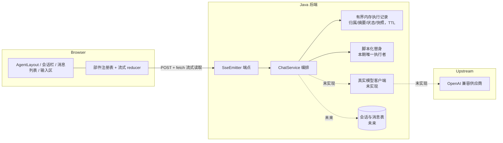
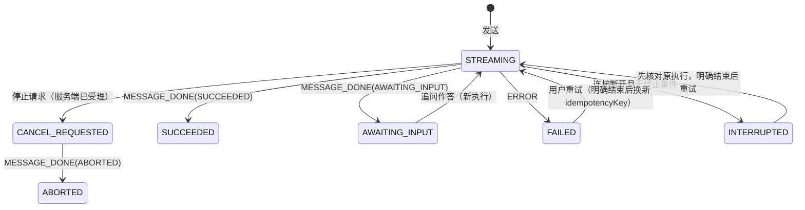
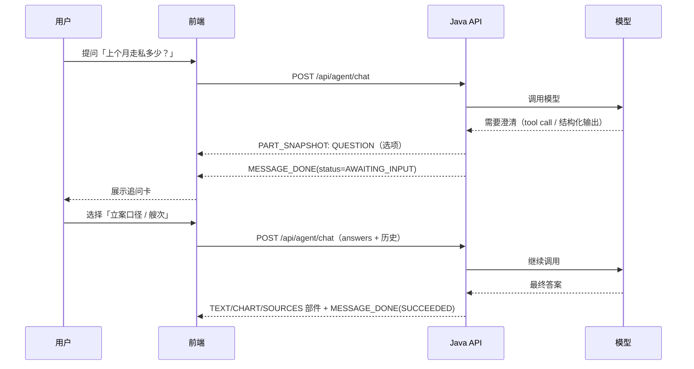

# 海防助手对话与流式交互设计（评审稿）

文档状态：**待评审**，尚未实现、未新增依赖。调研日期 2026-10-09，包版本事实均标注核对日期。
评审对象：本文档 + 第 4、5 节的协议与部件模型 + 第 14 节的开放问题。
阅读标记：`【事实】` 已在仓库或 npm 核对；`【建议】` 本方案主张；`【待决策】` 需要评审或项目所有者拍板。

---

## 0. 给评审者的摘要

要在现有「海防助手」页面里补齐真正的对话能力，本方案的核心主张是：

1. **协议与消息部件模型自研**（Java DTO → OpenAPI → TS 类型），**UI 组件用 Ant Design X + `@ant-design/x-markdown`**，不引入整框架、不采用 JS 侧服务端流协议。
2. 一条对话由「用户消息 → 服务端 SSE 流 → 助手消息（多个部件）」组成；部件类型包括文本、表格、图表、来源、步骤、追问、提示。
3. 模型可以在一轮结束时**追问**：给出选项或输入框，用户回答后再开一段新流（回合式，不挂着连接等输入）。
4. 第一版**不落库**：历史由前端随请求携带；服务端只保留有上限、有 TTL 的内存执行记录（去重、停止确认、断连核对），重启即丢失并如实显示未知（见 §17）。
5. 这一版覆盖的只是「对话外壳 + 协议 + 部件渲染」；真正的问数/指标能力由另外的受控查询设计承接（见 `docs/tasks/intelligent-data-query-handoff.md`）。

需要评审重点回答的问题集中在第 14 节。

---

## 1. 项目背景与约束

### 1.1 项目与技术栈【事实】

Merine Rebuild 是海边防业务的全栈学习型项目，模块化单体：

| 层                           | 现状                                                                                                                        |
| ---------------------------- | --------------------------------------------------------------------------------------------------------------------------- |
| 前端 `apps/web`              | React 19.3、TypeScript 5.9、Vite 8、Ant Design 6.6.4、TanStack Query 5、react-router 8、CSS Modules（无 Tailwind）          |
| 后端 `apps/api`              | Java 21、Spring Boot 4.1.1（`spring-boot-starter-webmvc`，Servlet 栈）、MyBatis、MySQL 8.4                                  |
| 契约 `packages/api-contract` | 后端 springdoc 导出 OpenAPI 快照（`openapi/*.json`）再生成 TS 类型（`src/generated/*.d.ts`），`src/agent.ts` 只做显式再导出 |
| 运行                         | 开发栈 docker compose；交付栈 nginx 静态站点 + `/api` 同源反代；Flyway 迁移；`./scripts/dev.sh check/build`                 |

### 1.2 海防助手现状【事实】

- 路由 `/agent`（`apps/web/src/app/routes.tsx`），只要求登录，不属于主菜单权限模型。
- `AgentLayout`：56px 图标栏（主页/资料库/账号）+ 240px 会话栏 + 工作区。
- `AgentSessionSidebar`：「新聊天」+ 会话列表，**仅前端内存**，刷新即清空。
- `AgentHomePage`：按本地时间与登录用户显示问候语 + `AgentComposer`。
- `AgentComposer`：文本输入区、禁用的「补充资料」「发送」、模型选择（选项来自 `GET /api/agent/providers/options`，登录即可读已启用供应商配置）。
- 后端 `com.merine.rebuild.agent.provider.*` 只做供应商连接配置：表 `ai_model_provider`（迁移 V41）、权限码 `agent:provider:read|create|update|delete`、AES-256-GCM 密钥密文（`MODEL_PROVIDER_ENCRYPTION_KEY`）。
- **没有**会话、消息、模型调用、SSE。供应商配置里**没有 model ID 字段**。

### 1.3 必须遵守的工程约束（来自 AGENTS.md 与 docs/rules）

| 约束                                                                              | 对本设计的影响                                                     |
| --------------------------------------------------------------------------------- | ------------------------------------------------------------------ |
| 新增依赖先批准                                                                    | `@ant-design/x` 等进入第 11 节待批清单，批准前不动                 |
| 契约一致：后端 DTO 定义契约，生成文件不手改                                       | SSE 事件载荷必须由 Java 类型生成 TS 联合类型，不能前端手写平行模型 |
| 权限在后端；系统管理员不等于可看全部业务数据                                      | 对话接口与后续业务数据访问都要服务端判定；前端只决定显示           |
| 数据可靠：表/字段有注释、只加迁移、运行账号仅 DML、无物理外键、引用锁校验         | 一旦落库，会话/消息表按此执行                                      |
| 幂等：可重试动作由客户端生成 key，服务端按「发起单位 + 操作类型 + key」返回原结果 | 对话发送是典型可重试动作，第 4.6 节给出方案                        |
| 外部 AI 调用需明确授权                                                            | 当前不联通外部模型；阶段 1 只能用本地替身                          |
| 设计红线：不展示模型思维，不编造引用/置信度/费用，事实与推断分开                  | 部件模型不包含 chain-of-thought；步骤只描述可观察动作              |
| 测试按风险：权限、事务、并发、真实 MySQL 语义不能用 mock 代替                     | 第 10 节给出分层测试矩阵                                           |

### 1.4 既有设计输入

- `docs/sys-design/implementation-notes.md` §4「AI 生成与复核」：状态机为 排队 → 生成中 → 已完成 / 失败 / 请求取消 → 已取消；断连 → 结果待确认；只显示可观察步骤；失败与取消保留已接收内容。
- `docs/tasks/intelligent-data-query-handoff.md`：问数主线（模型理解 → 澄清 → 受控查询 → 可核对答案 → 连续追问），明确「有影响结果的歧义时给选项或请用户补充」「连续追问不能丢已确认条件」。
- `docs/rules/frontend.md`：TanStack Query 管服务端状态、写请求不自动重试、401 统一处理、禁用按钮说明原因等。

---

## 2. 需求

### 2.1 功能需求

| 编号  | 需求                                                                                           | 优先级                             |
| ----- | ---------------------------------------------------------------------------------------------- | ---------------------------------- |
| FR-1  | 流式回答：增量文本、逐段出现、生成中可见、结束/失败/取消状态分明                               | 必须                               |
| FR-2  | 富内容部件：助手消息中可穿插表格、图表、来源、步骤、提示等；一条消息内可有多个部件并按顺序出现 | 必须                               |
| FR-3  | 对话内链接：点击来源/链接可跳本系统菜单或业务详情；外链受限                                    | 必须                               |
| FR-4  | 模型追问：一轮结束时给出单选题、多选题、文本输入或「其他」输入；用户作答后继续                 | 必须                               |
| FR-5  | 多会话：新建、切换、列表展示（现有骨架），切换时不串流                                         | 必须                               |
| FR-6  | 模型选择：使用供应商配置中已启用的选项（现有能力，需补 model ID 决策）                         | 必须                               |
| FR-7  | 中止与重试：用户可停止；失败可重试；已接收内容保留；断连不自动重发                             | 必须                               |
| FR-8  | 权限与数据范围：接口按权限码判定；模型只能看到当前用户有权访问的数据                           | 必须                               |
| FR-9  | 历史持久化（刷新后仍在、可跨标签页）                                                           | 待决策（阶段 2）                   |
| FR-10 | 用量展示（token/耗时）                                                                         | 可选（无数据时显示「未知」）       |
| FR-11 | 「补充资料」附件上传与解析                                                                     | 本期不做                           |
| FR-12 | 重新生成成功答案 / 编辑历史消息 / 分支 / 导出 / @提及                                          | 本期不做（失败与中断的重试见 4.6） |

### 2.2 非功能需求

- 性能：首字延迟只受上游模型影响；流式渲染不阻塞输入；长会话（≥200 条）仍可滚动操作。
- 兼容：桌面 1366×768 与 1440×900，亮/暗主题；键盘可达；`prefers-reduced-motion` 下关闭打字动画。
- 安全：不渲染模型提供的 HTML/脚本；不把会话内容写入 localStorage；日志不落密钥与正文敏感信息。
- 可解释：任何一次回答都能说明它用了哪个模型配置、执行了哪些可观察步骤、引用了哪些来源。

### 2.3 本期不做（明确边界）

多智能体、图谱联动、语音、图片生成、附件解析、提示词管理后台、跨设备同步、移动端布局、真实模型调用的部署与配额治理。

### 2.4 典型场景（验收样例，均为合成数据）

1. **直接回答**：「上周任务处置完成情况？」→ 文本 + 表格 + 来源（3 条任务链接）。
2. **需要澄清**：「上个月走私多少？」→ 追问卡：统计口径（线索/立案/认定）× 计量单位（艘次/船舶数）→ 用户作答后给出文本 + 图表 + 说明「统计期间/数据范围/更新时间」。
3. **无法回答**：「帮我预测下个月的趋势」→ 提示部件说明数据与口径不足，不给编造数字。

---

## 3. 总体方案

### 3.1 选型结论【建议】

**协议与部件模型自研；UI 用 Ant Design X 原子组件 + `@ant-design/x-markdown`；不引入整框架。**

理由：

1. 协议是后端契约的一部分。SSE 事件、消息与部件 DTO 由 Java 定义并生成 TS 类型，才能保持 `页面 → API → SQL` 可解释；AI SDK UI stream、assistant-ui、CopilotKit 都要求后端跟随它们的运行时/协议。
2. 富内容本就是领域模型：图表、表格、来源跳转需要自己的判别联合与组件注册表；框架的 generative UI 解决同一问题，但会绑定其 schema 与状态机。
3. UI 层不必自研也不必换设计语言：`@ant-design/x` 与现有 antd 6/React 19 同源，组件覆盖本需求的大部分交互（消息、输入、来源、步骤、附件、建议），`sideEffects: false` 可摇树。

### 3.2 架构【建议】



要点：前端只消费 SSE 事件；本期执行者是脚本化替身，模型客户端与业务查询能力都未实现；执行归属、去重与断连核对依赖有界内存记录，不落库。

### 3.3 方案对比（不做整框架的原因）

| 方案                           | 优势                                               | 成本/风险                                        | 判断     |
| ------------------------------ | -------------------------------------------------- | ------------------------------------------------ | -------- |
| AntD X + x-markdown + 自有协议 | 同源主题；流式 Markdown 安全默认；原子组件可按需取 | 库较年轻；bundle 需懒加载                        | **采用** |
| 纯自研（+ react-markdown）     | 依赖最少、完全可控                                 | 流式 Markdown、滚动、无障碍都要自建              | 备选     |
| `@ai-sdk/react` useChat        | 部件模型成熟、可自定义 transport                   | 服务端辅助函数 JS-only；在 Java 复刻其版本化协议 | 暂不采用 |
| assistant-ui                   | 交互最全、生成式 UI                                | Tailwind/shadcn 主题 + 自有 runtime              | 暂不采用 |
| CopilotKit                     | Agent 全栈                                         | 需要 AG-UI 协议，超出聊天 UI                     | 不采用   |
| streamdown / AI Elements       | 流式处理好                                         | 依赖 Tailwind                                    | 不采用   |
| Stream Chat 等托管             | 开箱即用                                           | 数据出域、付费                                   | 不采用   |

---

## 4. 流式协议规范（核心）

### 4.1 端点与请求

**阶段 1（无状态）【建议】**

```http
POST /api/agent/chat
Content-Type: application/json
Accept: text/event-stream
X-XSRF-TOKEN: <CSRF>
```

```ts
interface ChatRequest {
  idempotencyKey: string; // 前端生成的幂等键（UUID）；同一意图重试保持不变
  generationId?: string; // 回答追问时指向上一轮执行，服务端校验归属与待答状态
  clientConversationId: string; // 仅用于客户端关联，不作为授权依据
  clientTimeZone: string; // IANA 时区名，仅作提示；业务时区由服务端判定
  messages: { role: 'USER' | 'ASSISTANT'; text: string }[]; // 历史（文本级，有上限）
  answers?: { questionId: string; values: string[]; freeText?: string; skipped?: boolean }[];
  context?: SyntheticChatContext; // 本期只接受类型明确的合成上下文（见 7.4）
}
```

规则（本期评审结论，见 §17）：

- `requestId` 是服务端 HTTP 诊断编号，与业务无关；`idempotencyKey` 才是幂等标识。
- `generationId` 由服务端在 `STREAM_START` 下发；客户端回答追问时回传，服务端校验归属、有效期与待答状态。
- `clientConversationId` 只用于客户端关联与日志；授权一律按会话身份判定，不信任该字段。
- `messages` 只承载模型需要的历史文本；结构化部件不回传（需要时由服务端维护的合成条件摘要补充）。
- **本期不要求 `providerId`/`model`**：执行固定走本地替身，界面明确标注「本地演示」，不读取或解密供应商密钥。
- 配套端点（本期评审新增）：
  - `POST /api/agent/chat`：首次提交返回 SSE；同 key 不同有效命令 409；同 key 正在执行返回冲突码并引导查询；同 key 已结束返回原结果快照，不重跑替身。
  - `GET /api/agent/chat/requests/{idempotencyKey}`：按当前身份查询原执行状态与结果快照。
  - `POST /api/agent/chat/requests/{idempotencyKey}/stop`：请求停止；服务端确认终态后才算停止。
- 上限本期冻结并由服务端执行（具体数值实现时写入配置与测试）：历史消息数/字节数、单事件与单轮输出、部件与表格尺寸、每用户并发（本期 1 条活动执行）、全局并发、临时记录数量与总容量。

响应形态（同一路径，不同结果）：

| 场景                | HTTP            | Content-Type        | 响应                                 |
| ------------------- | --------------- | ------------------- | ------------------------------------ |
| 首次执行            | 200             | `text/event-stream` | SSE 事件流                           |
| 同 key 正在执行     | 409             | `application/json`  | `ApiResponse` 冲突码 + 查询入口提示  |
| 同 key 已完成       | 200             | `application/json`  | 原执行状态与受限结果快照，不重跑替身 |
| 同 key 不同有效命令 | 409             | `application/json`  | `ApiResponse` 冲突                   |
| 查询执行            | 200 / 404       | `application/json`  | 状态与快照；归属不符不泄露存在性     |
| 停止请求            | 202 / 200 / 409 | `application/json`  | 已受理 / 已终态 / 无此执行           |

请求头 `Accept` 同时接受 `text/event-stream` 与 `application/json`；服务端按上述场景决定返回类型。前端先看 HTTP 状态与 `Content-Type`，再决定按 JSON 还是 SSE 解析。只声明 `text/event-stream` 的客户端（脚本或第三方集成）在业务错误时同样会拿到 JSON 错误体：错误响应由统一异常处理直接写出，不经过内容协商，避免变成 500。

### 4.2 SSE 帧格式【建议】

- `Content-Type: text/event-stream; charset=utf-8`、`Cache-Control: no-cache`、`X-Accel-Buffering: no`。
- **只用一个事件名，载荷 JSON 内用 `type` 判别**：整个协议就是一个可生成的联合类型，前端一个 `switch` 穷尽处理。
- 每个事件带 `id:`（流内从 1 递增），为将来的 `Last-Event-ID` 续传预留；阶段 1 不实现续传。
- 心跳用 SSE 注释：`: ping`（约 15s 一次），不进入事件流。
- 协议带版本：`STREAM_START.protocolVersion`（本期 `1`）；不兼容变更递增版本；`id:` 与 `data:` 在同一事件内连续书写，事件之间空行分隔。

```text
id: 1
data: {"type":"STREAM_START", ...}

id: 2
data: {"type":"PART_START", ...}

: ping
```

### 4.3 事件目录

```ts
type ChatStreamEvent =
  | {
      type: 'STREAM_START';
      protocolVersion: 1;
      messageId: string;
      generationId: string;
      clientConversationId: string;
      executionMode: 'LOCAL_STUB' | 'PROVIDER';
      model?: string;
    }
  | { type: 'PART_START'; messageId: string; partId: string; partType: MessagePart['type'] }
  | { type: 'TEXT_DELTA'; messageId: string; partId: string; delta: string }
  | { type: 'PART_SNAPSHOT'; messageId: string; partId: string; part: MessagePart }
  | { type: 'PART_DONE'; messageId: string; partId: string }
  | {
      type: 'MESSAGE_DONE';
      messageId: string;
      status: 'SUCCEEDED' | 'AWAITING_INPUT' | 'ABORTED';
      usage?: { inputTokens?: number; outputTokens?: number } | null;
    }
  | { type: 'CANCEL_REQUESTED'; messageId: string }
  | { type: 'ERROR'; messageId?: string; code: ChatErrorCode; message: string; retryable: boolean };
```

| 事件               | 时机                 | 不变量                                                               |
| ------------------ | -------------------- | -------------------------------------------------------------------- |
| `STREAM_START`     | 建立助手消息         | 每个流恰好一次，且必须是第一个事件                                   |
| `PART_START`       | 新部件开始           | 每个 `partId` 恰好一次；部件顺序 = `PART_START` 顺序                 |
| `TEXT_DELTA`       | 文本增量             | 只作用于已 `PART_START` 的 `TEXT` 部件；`delta` 非空                 |
| `PART_SNAPSHOT`    | 结构化部件定稿       | 同一 `partId` 只发一次（重复即替换，前端需容忍）；载荷必须是完整部件 |
| `PART_DONE`        | 部件结束             | 每个已开始部件恰好一次                                               |
| `CANCEL_REQUESTED` | 服务端已受理停止请求 | 仅表示进入停止流程；随后由 `MESSAGE_DONE(ABORTED)` 确认              |
| `MESSAGE_DONE`     | 本轮正常结束         | 与 `ERROR` 互斥；`AWAITING_INPUT` 表示在等用户作答                   |
| `ERROR`            | 本轮失败             | 终止事件；已发送的文本/部件保留                                      |

设计取舍：

- 文本用增量（`TEXT_DELTA`），**结构化部件一次发完整**（避免前端渲染半成品图表/表格）。
- 不发送模型思维链；可观察步骤用 `STEPS` 部件表达（检索资料/整理结果/标注引用等固定标签）。
- `AWAITING_INPUT` 放在 `MESSAGE_DONE.status` 里而不是单独事件：一轮只有一种结束方式，状态收敛到一处。

### 4.4 状态机



`CANCEL_REQUESTED` 是「已请求停止、等待服务端终态」的中间态，收到 `MESSAGE_DONE(ABORTED)` 才变成 `ABORTED`。`INTERRUPTED`（断连→结果待确认）不对应用户可见的失败：先查原执行（`GET .../requests/{idempotencyKey}`）再决定重试；记录过期/服务重启/无法确认时显示未知，不自动重新执行；与 `docs/sys-design/implementation-notes.md` §4 一致。

### 4.5 追问回合（回合式，不挂连接）【建议】



为什么不用长连接等待：代理/网关超时、断线重连、服务端线程与待答状态都会复杂化，刷新与多标签也无法处理。回合式天然支持超时、审计与刷新。

### 4.6 中止、断连、重试、幂等（本期评审结论）

- **停止**：前端 `AbortController.abort()` 只表示本地停止接收；真正的停止走 `POST /api/agent/chat/requests/{idempotencyKey}/stop`。服务端新增 `CANCEL_REQUESTED` 事件，**只有服务端确认终态才标记 `ABORTED`**。
- **断连**：没有终止事件就落 `INTERRUPTED`，先查原执行（`GET .../requests/{idempotencyKey}`）再决定；临时记录已过期、服务重启或无法确认时，明确显示「结果未知」，**不自动重新执行**，本期不承诺跨重启幂等或续传。
- **重试**：同一意图未结束时沿用原 `idempotencyKey`；已明确结束后再次发起换新 key。
- **幂等**：服务端保留**有上限、有 TTL 的内存执行记录**（执行归属、规范化请求摘要、状态、受限结果快照、待答问题、已确认的合成条件），提供有限窗口的去重与核对；记录不落库，重启即丢失并如实显示未知。

### 4.7 错误码

| code                                       | 场景             | retryable | 前端表现               |
| ------------------------------------------ | ---------------- | --------- | ---------------------- |
| `PROVIDER_NOT_FOUND` / `PROVIDER_DISABLED` | 配置不存在/停用  | false     | 提示重新选择模型       |
| `MODEL_AUTH_FAILED`                        | 供应商密钥无效   | false     | 提示联系管理员检查配置 |
| `MODEL_RATE_LIMITED`                       | 限流             | true      | 可重试，建议等待       |
| `MODEL_TIMEOUT` / `MODEL_UNAVAILABLE`      | 上游超时/不可用  | true      | 可重试                 |
| `UPSTREAM_PROTOCOL_ERROR`                  | 上游返回无法解析 | true      | 可重试并提供请求编号   |
| `INVALID_REQUEST` / `PAYLOAD_TOO_LARGE`    | 入参问题         | false     | 提示修正               |
| `FORBIDDEN`                                | 无权限           | false     | 403 表现，不退登录     |
| `INTERNAL`                                 | 服务端异常       | true      | 可重试 + 请求编号      |

错误响应按**响应是否已提交**分两段：响应尚未提交（HTTP 状态与 JSON 错误体仍是唯一响应）时用普通 `ApiResponse` 错误体；已提交（SSE 已开始写）时发 `ERROR` 事件再关闭。不用「首字节」描述这一边界。

### 4.8 契约生成策略【建议】

- Java：`ChatStreamEvent` 用 sealed interface + record，`@JsonTypeInfo(use = NAME, property = "type")`；springdoc 生成 `oneOf` + discriminator。
- 端点用 `produces = text/event-stream` 声明，并用 `@Content(mediaType = "text/event-stream", schema = @Schema(implementation = ChatStreamEvent.class))` 描述载荷；生成的 OpenAPI/TS 里得到事件联合类型。
- 已知缺口：OpenAPI 不能表达 SSE 分帧。生成类型只覆盖 `data:` 的载荷；前端仍需一个手写的「拆帧 → JSON.parse → type 判别」小函数（不手写第二份字段模型）。
- 兼容：未知展示类部件渲染升级占位；未知关键控制事件、损坏的已知事件不静默成功（进入失败或待确认）；新增部件/事件属于向后兼容变更。

### 4.9 限制与配额（本期冻结并由服务端执行）

历史消息数/字节数、单事件与单轮输出、部件与表格尺寸、每用户并发（本期 1 条活动执行）、全局并发、临时记录数量与总容量，均需在实现时写入配置并由边界测试验证；单轮最大时长 5 分钟（超时发 `MODEL_TIMEOUT`），心跳约 15s，容器兜底晚于业务超时。

---

## 5. 消息与部件模型

### 5.1 消息

```ts
type MessagePartStatus = 'STREAMING' | 'DONE' | 'FAILED' | 'ABORTED';

interface MessagePartItem {
  partId: string; // 与 PART_START/PART_SNAPSHOT/PART_DONE 对应
  status: MessagePartStatus;
  part: MessagePart;
}

interface ChatMessage {
  id: string;
  role: 'USER' | 'ASSISTANT';
  status:
    | 'STREAMING'
    | 'CANCEL_REQUESTED'
    | 'SUCCEEDED'
    | 'AWAITING_INPUT'
    | 'FAILED'
    | 'ABORTED'
    | 'INTERRUPTED';
  parts: MessagePartItem[]; // 按 PART_START 顺序
  error?: { code: string; message: string; retryable: boolean };
  createdAt: string; // ISO-8601
}
```

- 部件外层带 `partId` 与完成状态；`ERROR`/取消允许保留 `STREAMING` 状态的未完成部件并明确标记。
- 用户消息由前端生成临时 id 并立即上屏；助手消息在 `STREAM_START` 时由服务端给 `messageId`/`generationId`。
- 消息状态与第 4.4 节状态机一一对应；`AWAITING_INPUT` 表示该轮以追问结束（不因用户后续作答而改写旧消息）；「已答未答」由服务端单独记录（见 6.7）。

### 5.2 部件联合类型【建议】

```ts
type MessagePart =
  | { type: 'TEXT'; text: string }
  | {
      type: 'TABLE';
      title?: string;
      columns: TableColumn[];
      rows: (string | null)[][];
      note?: string;
    }
  | { type: 'CHART'; spec: ChartSpec }
  | { type: 'SOURCES'; items: SourceRef[] }
  | { type: 'STEPS'; items: StepItem[] }
  | {
      type: 'QUESTION';
      questionId: string;
      prompt: string;
      mode: 'SINGLE' | 'MULTIPLE' | 'TEXT';
      options?: { value: string; label: string; hint?: string }[];
      allowOther?: boolean; // 选择型问题允许自由输入「其他」
      minSelections?: number; // MULTIPLE 的最少选择数
      maxSelections?: number; // MULTIPLE 的最多选择数
      placeholder?: string;
      maxLength?: number; // TEXT/自由文本的最大长度，服务端执行
      required: boolean;
    }
  | { type: 'NOTICE'; level: 'INFO' | 'WARNING' | 'ERROR'; text: string; code?: string };

interface TableColumn {
  key: string;
  title: string;
  unit?: string;
  numeric?: boolean;
}

interface ChartSpec {
  chartType: 'LINE' | 'BAR' | 'STACKED_BAR' | 'PIE';
  title?: string;
  unit?: string;
  categories?: string[];
  series: { name: string; data: (number | null)[] }[];
  meta?: { metricId?: string; period?: string; coverage?: string; updatedAt?: string };
}

interface SourceRef {
  kind: 'TASK' | 'FLOW' | 'INTEL' | 'MENU' | 'EXTERNAL';
  refId?: string; // TASK / FLOW / INTEL 的业务 id
  routeKey?: string; // MENU：前端路由注册表的 key
  url?: string; // EXTERNAL：仅 http(s)
  title: string;
  snippet?: string;
}

interface StepItem {
  label: 'RETRIEVE' | 'PLAN' | 'QUERY' | 'ANALYZE' | 'CITE';
  text: string;
  status: 'RUNNING' | 'DONE' | 'FAILED';
}
```

### 5.3 部件规则

| 部件     | 规则                                                                                                                                                                                 |
| -------- | ------------------------------------------------------------------------------------------------------------------------------------------------------------------------------------ |
| TEXT     | 流式增量；Markdown 渲染；不做 HTML 直出；链接走 6.6                                                                                                                                  |
| TABLE    | 行列同长；`numeric` 列右对齐、等宽数字；单位在列或 `note` 说明；大表分页或截断由前端决定，服务端限制行数                                                                             |
| CHART    | 只下发数据与类型，不下发代码/回调/任意配置；类型白名单校验；必须带 `meta.period/coverage` 之一，回答里给出口径说明；本期只支持 BAR 子集，用简单 SVG 渲染并提供等价表格，不引入图表库 |
| SOURCES  | 只包含当前用户有权的来源；站内跳转由 app 装配的导航解析能力完成（feature 不导入 `app/`）；未知 `routeKey`/`refId` 渲染为不可点文本                                                   |
| STEPS    | 固定标签 + 文本，描述可观察动作；不出现模型推理内容；失败步骤保留原因                                                                                                                |
| QUESTION | 选项由服务端下发；`SINGLE/MULTIPLE` 必须有 `options`；`TEXT` 用 `placeholder`；`required` 决定能否跳过；`allowOther`/`minSelections`/`maxSelections`/`maxLength` 由服务端校验        |
| NOTICE   | 失败/缺口/口径提醒；与业务错误区分（业务错误走 `ERROR` 事件）                                                                                                                        |

### 5.4 未知部件与向后兼容

- 未知**展示类**部件：渲染「此内容需要升级前端版本」的占位，不影响其他部件；未知**关键控制事件**或损坏的已知事件不得静默成功，进入失败/待确认并记录。
- 新增部件 = 后端 DTO + 契约生成 + 前端注册表项 + 渲染测试；删除/改字段按不兼容变更处理并同步升级两端。

### 5.5 渲染职责与安全边界

后端只发数据与类型；前端注册表只渲染已知组件；**任何情况下都不执行模型提供的代码、HTML 或表达式**。Markdown 渲染**必须显式开启 `escapeRawHtml`**（2.9.0 默认 `false`，原始 HTML 会被解析）；DOMPurify 清洗与禁止原始 HTML 是两件事，不能互相替代。

---

## 6. 前端设计

### 6.1 落点与职责

| 文件                                     | 职责                                                                                 |
| ---------------------------------------- | ------------------------------------------------------------------------------------ |
| `features/agent/AgentLayout.tsx`         | 外壳；会话切换；中止在途请求                                                         |
| `features/agent/AgentSessionSidebar.tsx` | 会话列表（现有，后续接持久化）                                                       |
| `features/agent/AgentHomePage.tsx`       | 欢迎态/对话态切换                                                                    |
| `features/agent/AgentComposer.tsx`       | 输入区；阶段 1 迁移到 AntD X `Sender`（自带提交/中止/插槽/IME/计数）                 |
| `features/agent/model.ts`                | 纯函数：事件归约、部件映射、链接分类、状态文案                                       |
| `features/agent/api.ts`                  | 普通请求 + 流式请求（fetch + 流读取）                                                |
| `features/agent/components/`             | 部件渲染组件：TablePart、ChartPart、SourcesPart、StepsPart、QuestionPart、NoticePart |

### 6.2 状态与数据流【建议】

- 会话列表：阶段 1 前端内存（现状）；阶段 2 由 `GET /api/agent/conversations` 提供，走 TanStack Query。
- 消息：会话与消息由 `AgentLayout` 范围的本地状态协调器管理（本期没有服务端历史 API，不伪装成 TanStack 查询缓存）；流式中消息用局部 reducer，终止后一次性提交到会话状态。
- 事件归约（伪代码）：

```ts
function applyEvent(state: ChatMessage, event: ChatStreamEvent): ChatMessage {
  switch (event.type) {
    case 'STREAM_START':
      return { ...state, status: 'STREAMING' };
    case 'PART_START':
      return appendPart(state, {
        partId: event.partId,
        status: 'STREAMING',
        part: emptyPart(event.partType),
      });
    case 'TEXT_DELTA':
      return appendText(state, event.partId, event.delta);
    case 'PART_SNAPSHOT':
      return upsertPart(state, event.partId, event.part);
    case 'PART_DONE':
      return markPartDone(state, event.partId);
    case 'CANCEL_REQUESTED':
      return { ...state, status: 'CANCEL_REQUESTED' };
    case 'MESSAGE_DONE':
      // 终态前先冲刷批量文本增量，再改状态
      return finalize(state, event.status, event.usage ?? null);
    case 'ERROR':
      return fail(state, event); // 保留未完成部件并标记
  }
}
```

- 不变量：忽略未知 `messageId/partId` 的事件；`PART_SNAPSHOT` 同 id 覆盖；终态先冲刷待处理增量再改状态；文本只在最后一段做 Markdown 重解析（见 6.4）。
- 切换会话、退出登录、组件卸载：`abort()` 在途流；旧响应不得写入新会话（请求携带会话 id，写入前校验）。

### 6.3 组件映射（AntD X）【建议】

| 场景       | 组件                                                                                                         |
| ---------- | ------------------------------------------------------------------------------------------------------------ |
| 消息列表   | `Bubble.List`，`contentRender` 按部件注册表渲染；`streaming` / `typing` 处理流式外观                         |
| 输入区     | `Sender`（value/onChange/onSubmit/onCancel/loading/readOnly，header/footer/prefix 插槽放模型选择与附件入口） |
| 引用来源   | `Sources`（`onClick` 拦截做站内跳转）                                                                        |
| 可观察步骤 | `ThoughtChain` 或 `Think`                                                                                    |
| 追问选项   | 消息内自绘（AntD `Button`/`Radio.Group`/`Checkbox.Group`/`Input`）；也可把快捷选项放 `Sender` 的插槽         |
| 欢迎态     | `Welcome`（可替换现有问候语实现或保持现状）                                                                  |
| 补充资料   | 本期不接；后续 `Attachments`                                                                                 |

阶段 1 先只引入用得到的组件，避免把整包拉进主 chunk；助手路由当前是静态导入（`apps/web/src/app/routes.tsx`），本期改为懒加载（§16.2 任务 4）。

### 6.4 流式 Markdown 与性能

- 增量按帧合并（约 16–50ms 一批）再交给 `XMarkdown`；`streaming.hasNextChunk` 在 `PART_DONE` 时置 false 以刷新未闭合语法。
- `components` 用 `useMemo` 保持引用稳定（2.9.0 没有 `componentsProps`；需要额外上下文的组件用 React Context 或模块级稳定引用，避免每次渲染新建组件类型）。
- 部件与历史消息按 key memo；不引入全局状态库。

### 6.5 滚动、无障碍、键盘

- 只有用户接近底部时自动跟随；否则显示「回到底部」。
- 流式容器 `aria-live="polite"`，只在消息结束/失败时播报；打字动画遵循 `prefers-reduced-motion`。
- 追问卡：Tab 顺序与视觉一致；`SINGLE/MULTIPLE` 用原生 radio/checkbox 语义；提交后置为已答。
- 输入区：Enter 发送、Shift+Enter 换行（由 `Sender` 提供），生成中显示停止按钮。

### 6.6 链接与引用

- `SourceRef` 由服务端下发；前端按 `kind` 解析：
  - `TASK/FLOW/INTEL` → 由 app 装配传入的路径解析能力拼装（如 `collaboration/tasks/:taskId`；feature 不导入 `app/routeRegistry`）。
  - `MENU` → 由同一导航能力按 routeKey 解析；未注册则不可点。
  - `EXTERNAL` → 新标签页 + `rel="noopener noreferrer"`，仅允许 `http(s)`。
- Markdown 内链接用 `XMarkdown` 的 `components.a` 覆盖：站内路径走 react-router，其余按上一条处理；拒绝 `javascript:` 等协议。
- 后端只下发可见来源；点击后目标页再次鉴权。

### 6.7 追问交互

- 问题卡渲染在助手消息内；`SINGLE` 点击即选中，`MULTIPLE` 勾选后点「提交」，`TEXT` 输入后提交，`allowOther` 时展开输入框；选择数量与文本长度按部件里的上限在前端提示、服务端最终校验。
- 未作答的追问阻塞该会话的下一次发送（提示先完成选择），但不阻塞新建会话。
- 作答提交后：问题卡置为只读并显示所选值；**原回合终态 `AWAITING_INPUT` 不变**（历史就是「等待作答」那一轮），服务端单独记录该问题已答、答案与所属 `generationId`。
- 同一 `questionId` 只能原子受理一次：即使换新的 `idempotencyKey` 再次提交，也按「已回答」拒绝；拒绝时保留用户输入。
- 服务端不信任提交值：按允许集合校验，自由文本按数据处理（见 9）。

### 6.8 错误与中断体验

| 情况       | 表现                                              |
| ---------- | ------------------------------------------------- |
| 提交前失败 | 气泡内 `NOTICE` + 原因 + 重试                     |
| 生成中失败 | 保留已接收内容，`ERROR` 说明 + 重试               |
| 用户停止   | 显示「已停止」，保留内容；重试 = 重新发起同一问题 |
| 断连       | 「连接中断，内容可能不完整」+ 重试；不自动重发    |
| 无权限     | 403 状态，不退出登录                              |
| 未返回用量 | 显示「未知」，不编造                              |

「重新生成」本期不做（评审结论 Q14）；失败与中断的重试按 4.6 处理。

### 6.9 会话与切换

- 会话列表阶段 1 内存；新建会话即空对话；删除/重命名不做。
- 切换会话立刻中止在途流；`idempotencyKey`/`generationId` 与会话绑定，写入前校验归属。
- 刷新页面：阶段 1 丢失会话（已知边界）；阶段 2 由服务端提供。

---

## 7. 后端设计

### 7.1 端点与处理链

`ChatController` → `ChatService` →（`ChatRunRegistry` + 脚本化替身）→ `SseEmitter`；不预建未来的 `ModelClient` 或受控查询接口。

- 入口校验：登录、参数与上限、`idempotencyKey` 格式、执行归属；本期不校验权限码与供应商。
- 错误按响应是否已提交区分：未提交走统一 `ApiException` JSON；已提交走 `ERROR` 事件。
- 本期不落库：`ChatService` 不写业务表，只维护有界内存执行记录（见 4.6）。

### 7.2 SseEmitter 实现要点【建议】

- `SseEmitter` 显式设置超时（如 5 分钟，大于上游最长耗时）；默认 30s 不够。
- 心跳：独立调度器每 15s 发 `: ping` 注释；写失败即取消上游并 `completeWithError`。
- 上游读取跑在专用线程/虚拟线程（Java 21 可用虚拟线程），不占用 Web 线程。
- 取消：`onCompletion/onTimeout/onError` → 取消上游（关闭响应流/取消 future）；用户中止后不再写事件。
- 优雅停机：`server.shutdown=graceful` + `timeout-per-shutdown-phase: 30s`，超过 30s 的在途流会被切断，属于已知边界。
- 压缩：`server.compression.mime-types` 目前不含 `text/event-stream`，保持不变；SSE 不应 gzip 缓冲。

### 7.3 上游模型客户端

- 用 JDK `HttpClient` 调 OpenAI Chat Completions 兼容接口（不用新依赖），请求体含 `stream: true`。
- 逐行读取 SSE，解析 `data:` 增量，映射为本项目事件：文本增量 → `TEXT_DELTA`；工具调用 → `STEPS` / `QUESTION`；结束 → `MESSAGE_DONE`。
- 超时/限流/鉴权错误映射为第 4.7 节错误码；上游原文不直接透传给前端（避免泄露内部信息）。
- 密钥只在服务端解密使用；日志不落密钥、正文与上游原始响应。

### 7.4 模型标识（评审结论 Q5：正式版用 C，本期走替身）

- 正式方案（未来）：供应商配置维护模型列表，请求只传 `providerId + modelId`，服务端校验属于该配置（选项 C）。
- 本期：不要求真实模型配置，请求不加 `providerId`/`model`，执行固定为本地脚本化替身，界面明确标注「本地演示」；不读取或解密供应商 API Key。

### 7.5 权限与数据范围（评审结论 Q6）

- 正式对话未来新增权限码 `agent:chat:use`；本期不新增权限码、不改菜单引导。
- 本期演示入口仅在 `(dev | test) & !prod` 且显式开关为 true 时注册，登录可用；查询、停止、追问一律校验执行归属（真实用户与会话），拒绝通过请求参数指定身份。
- 数据范围：本期不接触业务数据；后续问数能力必须按「操作权限 + 数据范围」判定。

### 7.6 持久化（评审结论 Q13：本期不落库，未来再设计）

本期不新增会话/消息/模型/权限/幂等表，不加迁移，不改 V41；以 §4.6 的有界内存执行记录完成去重、停止确认与断连核对。若将来落库，按下表设计（全部字段带注释、无物理外键、运行账号仅 DML）：

| 表                        | 关键列                                                                                                        | 说明                                                   |
| ------------------------- | ------------------------------------------------------------------------------------------------------------- | ------------------------------------------------------ |
| `ai_conversation`         | id、owner_user_id、unit_id、title、status、version、created_at、updated_at                                    | 所有者 + 单位；删除前校验引用                          |
| `ai_conversation_message` | id、conversation_id、role、status、sequence_no、client_request_id、provider_id、model、usage_json、created_at | 唯一键 `(conversation_id, client_request_id)` 支撑幂等 |
| `ai_message_part`         | id、message_id、part_type、sequence_no、payload_json、created_at                                              | 或把 parts 作为 JSON 存在消息行；两种都在评审时定      |
| `ai_chat_idempotency`     | 单位 + 操作类型 + key、请求摘要、结果引用                                                                     | 按 `docs/rules/backend.md` §4                          |

未定项：parts 单表 vs JSON 列、历史保留期、软删除、跨单位可见性。

### 7.7 日志与审计

- 记录：请求编号、用户、供应商配置 id、模型、事件数量、耗时、终止状态、错误码；**不记录**密钥、正文全文、上游原始响应。
- 阶段 1 不做独立审计表；阶段 2 与会话表一起设计。

---

## 8. 安全

| 风险                 | 控制                                                                                                      |
| -------------------- | --------------------------------------------------------------------------------------------------------- |
| XSS（模型输出 HTML） | 只渲染 Markdown（安全默认）+ 结构化部件；不执行模型提供的代码/HTML                                        |
| 链接伪造/钓鱼        | 站内链接由 app 装配的导航白名单解析（feature 不导入 `app/`）；外链仅 http(s) + 新标签；后端只下发可见来源 |
| 提示注入             | 模型输出视为不可信数据；工具参数服务端校验；身份与权限不交给模型                                          |
| 越权数据             | 业务查询由服务端按身份与数据范围执行；前端不做权限过滤                                                    |
| 密钥泄露             | 沿用现有密文与主密钥机制；日志脱敏                                                                        |
| CSRF/会话            | 沿用 Cookie 会话 + `X-XSRF-TOKEN`；流式请求用 fetch 从而能带头                                            |
| 本地存储             | 不写 localStorage：会话/草稿/权限事实不落浏览器持久存储                                                   |
| 成本滥用             | 权限码 + 并发流上限 + 单轮超时（待决策项）                                                                |

---

## 9. 部署与运维【事实 + 建议】

现状：`infra/docker/nginx/default.conf` 的 `/api/` 代理**没有** SSE 相关配置；Vite 开发代理默认透传流式响应。

交付 nginx 建议（放在 `/api/` 之前，更具体的 location 优先）：

```nginx
location = /api/agent/chat {
    proxy_pass http://api:9002;
    proxy_http_version 1.1;
    proxy_set_header Host $host;
    proxy_set_header X-Real-IP $remote_addr;
    proxy_set_header X-Forwarded-For $proxy_add_x_forwarded_for;
    proxy_set_header X-Forwarded-Proto $scheme;
    proxy_pass_request_headers on;
    proxy_buffering off;      # SSE 必需，否则事件被缓冲
    proxy_cache off;
    gzip off;                 # 事件流不压缩
    proxy_read_timeout 300s;  # 大于单轮最大时长
    proxy_send_timeout 300s;
}
```

后端同时返回 `X-Accel-Buffering: no` 作为兜底。容器 `stop_grace_period: 30s` 与长流的冲突见 7.2。

---

## 10. 测试与验收

### 10.1 分层测试

| 层                             | 内容                                                                                                    |
| ------------------------------ | ------------------------------------------------------------------------------------------------------- |
| 前端纯函数                     | 事件归约、部件注册映射、链接分类（站内/外链/非法）、追问答案序列化、问候语时段                          |
| 前端交互                       | 流式更新不串会话、中止后不再写入、失败保留内容、未知部件降级（可用现有 Node 测试 + 手动浏览器）         |
| 后端 MockMvc（真实 MySQL）     | 参数校验、权限 401/403、CSRF、供应商状态、提交前错误体                                                  |
| 后端 SSE 集成（`RANDOM_PORT`） | 用 `HttpClient` 逐行读取：事件顺序与不变量、心跳、`MESSAGE_DONE`、`ERROR`、客户端断开触发上游取消、超时 |
| 契约                           | OpenAPI 快照包含 `ChatStreamEvent` 联合与端点；生成结果稳定                                             |
| 浏览器验收                     | 第 2.4 节的三个场景 + 中止/重试/断连 + 双主题 + 1366×768/1440×900 + 键盘                                |

SSE 不能用 `MockMvcRegressionSupport` 的 MockMvc 方式断言增量；需要新的 `RANDOM_PORT` 测试基座（这是本轮要新增的测试基础设施）。

### 10.2 替身模型（阶段 1）

在 `dev`/`test` profile 下提供脚本化模型客户端（本期唯一执行者，不预建 `ModelClient` 接口），按固定脚本产生文本增量、表格、图表、来源、追问；**生产 profile 不注册**，并在实现说明中标注「替身验证」。真实调用需要单独授权（AGENTS 约束）。

### 10.3 验收样例

- 场景 2 的追问：断言出现 `QUESTION`、`MESSAGE_DONE(AWAITING_INPUT)`、作答后新消息、图表部件带 `meta.period`。
- 中止：生成中点停止 → 状态 `ABORTED`，已接收内容保留，上游被取消（服务端日志/替身计数）。
- 断连：人为断开 → `INTERRUPTED`，不自动重发。
- 访问控制：未登录 401；查询/停止他人 `idempotencyKey` 一律拒绝；本期不引入 `agent:chat:use`（未来），演示端点仅在 dev/test 开关下注册。

---

## 11. 依赖与版本事实（核对日期 2026-10-09）

| 包                               | 版本                                                                                                                | 许可 | 兼容/说明                                                                                                                                                  |
| -------------------------------- | ------------------------------------------------------------------------------------------------------------------- | ---- | ---------------------------------------------------------------------------------------------------------------------------------------------------------- |
| `@ant-design/x`                  | 2.9.0                                                                                                               | MIT  | peer `antd ^6.1.1`、`react >=18`；`sideEffects: false`；依赖含 `mermaid`、`react-syntax-highlighter`（未用组件可摇树）                                     |
| `@ant-design/x-markdown`         | 2.9.0                                                                                                               | MIT  | 依赖 `marked`、`dompurify`、`html-react-parser`、`katex`；流式渲染；2.9.0 可用 `components`、`escapeRawHtml`、`dompurifyConfig` 等（无 `componentsProps`） |
| `@ant-design/x-sdk`（未来评估）  | 2.9.0                                                                                                               | MIT  | `useXChat`/`XRequest`/`XStream`；**本期不引入**                                                                                                            |
| `eventsource-parser`（未来评估） | 4.1.1                                                                                                               | MIT  | SSE 拆帧；**本期手写，不引入**                                                                                                                             |
| 图表候选                         | `echarts` 6.1.0（Apache-2.0）/ `@antv/g2` 5.4.8（MIT）/ `@ant-design/charts` 2.6.7（MIT）/ `recharts` 3.10.1（MIT） | —    | 评审结论 Q9：本期不装图表库，只做 BAR 的简单 SVG + 等价表格；`ChartSpec` 保持与图表库无关                                                                  |

**待批准依赖（阶段 1 安装）**：仅 `@ant-design/x`、`@ant-design/x-markdown`。`@ant-design/x-sdk` 与 `eventsource-parser` 本期不引入（SSE 拆帧手写，见 §16.2 任务 3），图表库本期不引入。

排除项：`streamdown`、AI Elements（依赖 Tailwind）；assistant-ui（Tailwind/shadcn + 自有 runtime）；CopilotKit（AG-UI 全栈）；`@ai-sdk/react`（服务端协议 JS-only）；聊天 UI 套件与托管服务。

---

## 12. 分阶段计划

| 阶段           | 交付                                                                                                  | 前置                 | 退出标准                                                                               |
| -------------- | ----------------------------------------------------------------------------------------------------- | -------------------- | -------------------------------------------------------------------------------------- |
| 0（本次评审）  | 本文档定稿；第 14 节结案                                                                              | 无                   | 结论已写入 §17                                                                         |
| 1 本地对话链路 | 依赖批准后：Java SSE 端点、有界内存执行记录、脚本化替身、契约生成、部件渲染、停止/断连/追问、会话隔离 | 依赖批准；无需数据库 | 第 10.3 节场景在替身下通过；200 条混合消息可输入与滚动；双主题与双尺寸；无真实外部调用 |
| 2 真链路       | 真实模型客户端、模型配置（选项 C）、权限码 `agent:chat:use`、落库与幂等                               | 阶段 1；模型调用授权 | 真实接口 + 隔离 MySQL 回归；中止/断连/超时/重试用例通过；契约更新                      |
| 3 业务部件     | 表格/图表/来源/追问接问数能力；导航跳转与图表库选型                                                   | 阶段 2；指标层设计   | 合成数据数值可核对；来源跳转落到有权限的页面；长会话性能结论                           |

---

## 13. 风险登记册

| 风险                                        | 影响                 | 缓解                                                                                                    |
| ------------------------------------------- | -------------------- | ------------------------------------------------------------------------------------------------------- |
| AntD X 版本演进（v1→v2 已有 API 变化）      | 升级成本             | 固定版本；只用原子组件；不深度定制内部结构；保留自研渲染回退                                            |
| bundle 体积（x + markdown + katex/mermaid） | 首屏变慢             | 助手路由懒加载；只引需要的组件；构建后检查 chunk                                                        |
| SSE 被代理/压缩缓冲                         | 看不到增量           | nginx `proxy_buffering off` + `X-Accel-Buffering: no`；验收显式检查首字与增量                           |
| 长流与优雅停机/会话超时冲突                 | 流被切断             | 单轮超时 5 分钟；停机 30s 为已知边界并记录                                                              |
| 内存执行记录占用/淘汰                       | 内存压力或旧结果丢失 | 明确 TTL、数量与总容量上限；活动执行不参与普通淘汰；容量不足拒绝新执行并返回明确错误；重启/过期显示未知 |
| 无状态版无法跨重启幂等                      | 重复消息             | 有限窗口服务端去重 + 前端防重；重启后显示未知而非重放；阶段 2 落库补全                                  |
| 待答问题不持久化，刷新丢失                  | 用户重复输入         | 本期已知边界并在界面说明；阶段 2 会话落库一并解决                                                       |
| 提示注入/链接伪造                           | 安全问题             | 部件白名单 + 服务端校验 + 来源可见性后端控制；未知控制事件不静默成功                                    |
| 图表库选型拖延                              | 阶段 3 阻塞          | 评审结论 Q9：本期不装图表库，只做 BAR 的简单 SVG + 等价表格；选型留到阶段 3                             |
| SSE 契约只能部分生成                        | 前后端漂移           | 事件 DTO 生成 + 拆帧手写函数 + 契约快照测试 + 运行时未知类型降级                                        |

---

## 14. 开放问题（已于 2026-10-09 评审结案，结论见 §17）

1. 事件协议用「单事件名 + `data.type` 判别联合」是否合适？还是多命名事件更清晰？
2. 结构化部件「一次发完整快照」是否符合预期？是否有必须增量的场景（超大表格）？
3. `AWAITING_INPUT` 放在 `MESSAGE_DONE.status` 里是否足够表达追问态？是否需要独立的 `QUESTION_ASKED` 事件？
4. 阶段 1 无状态（历史由前端携带、不落库）是否可接受？还是直接进入落库？
5. 模型标识放哪里：请求携带、供应商配置字段、还是配置子表 + `modelId` 引用？（当前配置没有 model ID）
6. 对话权限：登录即可还是新增 `agent:chat:use`？（涉及权限码迁移与菜单引导回归）
7. 追问状态与「已确认的查询条件」是否必须服务端保存？无状态方案下由前端随后续请求携带是否可行？
8. 会话列表继续保留前端内存（刷新清空）能否作为阶段 1 验收状态？
9. 图表库选型（ECharts / AntV G2 / @ant-design/charts / Recharts）与 `ChartSpec` 字段是否足够？
10. SSE 的契约生成方案（`oneOf` + 手写拆帧）是否认可？还需要哪些测试防止漂移？
11. 长会话虚拟化阈值与触发条件？
12. 无状态版幂等缺口的处理方式是否可接受（前端防重 + 阶段 2 补）？
13. 断连「结果待确认」在无持久化时无法与后端对账，是否需要阶段 1 就引入最小持久化？
14. 是否有遗漏的需求或部件类型（例如引用折叠、错误重试范围、导出、复制、@提及）？

---

## 15. 附录

### A. 端到端样例（本期替身协议，含追问、表格、图表、来源）

> 对应评审后的本期协议：`idempotencyKey` 幂等、服务端下发 `generationId`、`executionMode=LOCAL_STUB`；不出现真实模型与业务数据。每个事件的 `id:` 与 `data:` 连续书写，只在完整事件之间留空行；`id:` 在单条流内递增。

```text
POST /api/agent/chat
Accept: text/event-stream
{ "idempotencyKey": "6f1f2c2a-9f4e-4d3a-9a4f-2b7c1d8e5a01",
  "clientConversationId": "b0c9e6d2-3f21-4f0e-8c7a-5d4b3a2c1e90",
  "clientTimeZone": "Asia/Shanghai",
  "messages": [{ "role": "USER", "text": "上个月走私多少？" }] }

id: 1
data: {"type":"STREAM_START","protocolVersion":1,"messageId":"m-1","generationId":"g-0001","clientConversationId":"b0c9e6d2-3f21-4f0e-8c7a-5d4b3a2c1e90","executionMode":"LOCAL_STUB"}

id: 2
data: {"type":"PART_START","messageId":"m-1","partId":"p-q1","partType":"QUESTION"}

id: 3
data: {"type":"PART_SNAPSHOT","messageId":"m-1","partId":"p-q1","part":{"type":"QUESTION","questionId":"Q1","prompt":"“走私”按哪种口径统计？","mode":"SINGLE","required":true,"options":[{"value":"LEAD","label":"风险线索"},{"value":"CASE","label":"立案案件"},{"value":"CONFIRMED","label":"认定事实"}]}}

id: 4
data: {"type":"PART_DONE","messageId":"m-1","partId":"p-q1"}

id: 5
data: {"type":"MESSAGE_DONE","messageId":"m-1","status":"AWAITING_INPUT","usage":null}

POST /api/agent/chat
Accept: text/event-stream
{ "idempotencyKey": "9a2d5f10-7c3b-4a8e-9d61-0f2e4b6c8a02",
  "generationId": "g-0001",
  "clientConversationId": "b0c9e6d2-3f21-4f0e-8c7a-5d4b3a2c1e90",
  "clientTimeZone": "Asia/Shanghai",
  "messages": [{ "role": "USER", "text": "上个月走私多少？" }],
  "answers": [{ "questionId": "Q1", "values": ["CASE"] }] }

: ping

id: 1
data: {"type":"STREAM_START","protocolVersion":1,"messageId":"m-2","generationId":"g-0002","clientConversationId":"b0c9e6d2-3f21-4f0e-8c7a-5d4b3a2c1e90","executionMode":"LOCAL_STUB"}

id: 2
data: {"type":"PART_START","messageId":"m-2","partId":"p-s1","partType":"STEPS"}

id: 3
data: {"type":"PART_SNAPSHOT","messageId":"m-2","partId":"p-s1","part":{"type":"STEPS","items":[{"label":"QUERY","text":"按立案口径统计 2026-09（合成数据）","status":"DONE"}]}}

id: 4
data: {"type":"PART_DONE","messageId":"m-2","partId":"p-s1"}

id: 5
data: {"type":"PART_START","messageId":"m-2","partId":"p-t1","partType":"TEXT"}

id: 6
data: {"type":"TEXT_DELTA","messageId":"m-2","partId":"p-t1","delta":"2026 年 9 月按立案口径共 "}

id: 7
data: {"type":"TEXT_DELTA","messageId":"m-2","partId":"p-t1","delta":"12 起（合成数据）。"}

id: 8
data: {"type":"PART_DONE","messageId":"m-2","partId":"p-t1"}

id: 9
data: {"type":"PART_START","messageId":"m-2","partId":"p-c1","partType":"CHART"}

id: 10
data: {"type":"PART_SNAPSHOT","messageId":"m-2","partId":"p-c1","part":{"type":"CHART","spec":{"chartType":"BAR","title":"9 月立案数（按港口，合成数据）","unit":"起","categories":["甲港","乙港"],"series":[{"name":"立案","data":[8,4]}],"meta":{"period":"2026-09","coverage":"合成数据"}}}}

id: 11
data: {"type":"PART_DONE","messageId":"m-2","partId":"p-c1"}

id: 12
data: {"type":"PART_START","messageId":"m-2","partId":"p-so1","partType":"SOURCES"}

id: 13
data: {"type":"PART_SNAPSHOT","messageId":"m-2","partId":"p-so1","part":{"type":"SOURCES","items":[{"kind":"MENU","routeKey":"collaboration.tasks","title":"任务处置"},{"kind":"MENU","routeKey":"collaboration.flows","title":"信息流转"}]}}

id: 14
data: {"type":"PART_DONE","messageId":"m-2","partId":"p-so1"}

id: 15
data: {"type":"MESSAGE_DONE","messageId":"m-2","status":"SUCCEEDED","usage":null}
```

### B. Java 端草图（评审用，非实现）

```java
public sealed interface ChatStreamEvent
        permits StreamStart, PartStart, TextDelta, PartSnapshot, PartDone, CancelRequested, MessageDone, ChatError {
    String type();
}

@JsonTypeInfo(use = JsonTypeInfo.Id.NAME, property = "type")
record TextDelta(String messageId, String partId, String delta) implements ChatStreamEvent {
    public String type() { return "TEXT_DELTA"; }
}
```

```java
@PostMapping(
        path = "/chat",
        consumes = MediaType.APPLICATION_JSON_VALUE,
        produces = {MediaType.TEXT_EVENT_STREAM_VALUE, MediaType.APPLICATION_JSON_VALUE})
Object chat(@Valid @RequestBody ChatRequest request, Authentication auth) {
    // 首次执行 → SseEmitter；重复/冲突 → ApiResponse JSON（HTTP 200/409）
    // 本期登录即可，服务端只校验执行归属；agent:chat:use 属于未来范围
}
```

### C. 术语

| 术语                    | 含义                                                       |
| ----------------------- | ---------------------------------------------------------- |
| 部件（Part）            | 消息内的结构化片段，如文本、表格、图表、来源、步骤、追问   |
| 回合（Turn）            | 一次用户发送到助手结束（或进入追问等待）                   |
| 追问（Clarification）   | 模型在本轮结束前向用户提问，等待作答后继续                 |
| `AWAITING_INPUT`        | 消息状态：本轮已结束，等待用户回答追问                     |
| `INTERRUPTED`           | 连接中断且无终止事件，内容可能不完整                       |
| 幂等键 `idempotencyKey` | 前端生成、同一意图重试保持不变的标识；服务端据此去重与查询 |
| `requestId`             | 服务端 HTTP 诊断编号，出现在日志与错误体中，不参与幂等     |
| `generationId`          | 服务端下发的执行标识；追问作答与停止按它校验归属           |
| 契约                    | 后端 DTO → OpenAPI 快照 → TS 类型；生成文件不手改          |

### D. 仓库索引（评审定位用）

- 现有助手前端：`apps/web/src/features/agent/`（Layout、SessionSidebar、HomePage、Composer、api、model）
- 供应商后端：`apps/api/src/main/java/com/merine/rebuild/agent/provider/`、迁移 `V41__model_providers.sql`
- 助手使用侧选项接口：`GET /api/agent/providers/options`（登录即可）
- 契约：`packages/api-contract/openapi/agent.json`、`src/generated/agent.d.ts`、`src/agent.ts`
- 部署：`infra/docker/nginx/default.conf`、`infra/compose.yaml`、`infra/compose.prod.yaml`
- 相关设计：`docs/tasks/intelligent-data-query-handoff.md`、`docs/tasks/model-provider-management.md`、`docs/sys-design/implementation-notes.md` §4
- 规范：`AGENTS.md`、`docs/rules/{frontend,backend,database,testing,structure}.md`、`DESIGN.md`

---

## 16. 与 Codex 的交接提示

### 16.1 第一步：只读评审 + 重写执行提示

> 用法：在仓库根目录的新 Codex 会话里粘贴下面整段。本轮只做评审与提示词重写，不写业务代码、不改仓库文件。

```text
角色：你是本次方案评审的技术评审者，不是实现者。本轮只做只读评审与提示词产出：不写业务代码、不改仓库文件、不安装依赖、不提交。

目标：在真实仓库里核对《海防助手对话与流式交互设计》（docs/tasks/agent-chat-design-plan.md），找出事实错误、设计漏洞与遗漏，然后基于你的评审结论，重写「给实现者的执行提示」（原草案在文档 §16.2）。

第一步：读全这些文件
- AGENTS.md（硬约束：依赖审批、权限在后端、契约一致、数据可靠、测试按风险、环境隔离）
- docs/tasks/agent-chat-design-plan.md（评审对象，全文）
- docs/rules/frontend.md、backend.md、database.md、testing.md、structure.md
- docs/tasks/intelligent-data-query-handoff.md、docs/tasks/model-provider-management.md、docs/sys-design/implementation-notes.md（§4 AI 生成与复核）
- 现状代码：apps/web/src/features/agent/、apps/api/src/main/java/com/merine/rebuild/agent/、apps/api/src/main/resources/application.yaml、packages/api-contract/、infra/docker/nginx/default.conf、infra/compose.yaml

第二步：事实核对（只读）
逐条核对文档中带【事实】的条目，至少覆盖：
- 文件路径、组件/类名、表名与迁移编号（当前最新 V41）、权限码、菜单引导
- 前后端依赖与版本（package.json / pom.xml）、Spring Boot 4.1.1 为 Servlet 栈、Java 21
- nginx 现有配置是否真的缺少 SSE 所需设置、后端压缩配置是否真的不含 text/event-stream
- 前端现状（会话列表在内存、模型选项来自 /api/agent/providers/options、发送与补充资料禁用）
- 设计稿引用的 npm 包版本、peer 依赖、模块体积（可用 npm view 只读查询；不要安装）
输出差异清单：条目、文档说法、实际情况、证据（文件+行号或命令输出）、影响。

第三步：按维度评审（每条给出问题/影响/理由/建议/优先级：P0 阻塞、P1 应改、P2 可选）
1. 需求与非目标：是否覆盖业务场景，有没有遗漏（重试语义、并发、内容保留、配额）
2. 协议：事件模型、不变量、状态机、追问回合、幂等、断连与超时；是否符合 HTTP/SSE/代理的真实限制
3. 部件模型：类型是否足以表达表格/图表/来源/追问/步骤/提示；安全与向后兼容
4. 前端：状态生命周期、会话切换与中止、流式渲染性能、无障碍、错误与中断体验
5. 后端：Spring MVC SseEmitter 的可行性细节（线程、超时、取消、优雅停机、会话超时）、契约生成（OpenAPI oneOf 与 SSE 分帧缺口）
6. 测试：分层是否成立、RANDOM_PORT + 流式读取是否可行、替身模型如何不污染生产、需要哪些新测试基座
7. 阶段划分与依赖：阶段 1 能否独立验收、@ant-design/x 与 x-markdown 的最小依赖集合、是否需要 x-sdk
8. 与仓库规则冲突：是否违反依赖审批、权限、数据可靠、契约一致与设计红线

第四步：逐条回答设计稿第 14 节的开放问题（同意/反对/替代方案 + 理由）

第五步：重写执行提示
- 基于你的评审结论，重写「给实现者的执行提示」（原草案在 §16.2）
- 必须包含：角色与目标、范围与非目标、依赖与授权边界、动手前的确认检查点、分任务拆解（每个任务写明改动落点文件、验收方式、验证命令）、测试与契约要求、交付汇报格式（改了什么/验证了什么/未验证/剩余缺口）、禁止事项（不真实调用模型、不落库、不装额外依赖、不提交/推送/清库/删卷）
- 只输出一段可直接粘贴的 Prompt，放在代码块里；开头注明「评审结论前提」（采纳了第 14 节的哪些结论）；若你的结论与文档【建议】不同，以你的结论为准写入，并在评审报告里列出差异

输出顺序：
1. 事实差异清单（表格）
2. 评审报告（按 8 个维度，带 P0/P1/P2 优先级）
3. 第 14 节逐条回答
4. 重写后的执行提示（代码块）
5. 无法确认项与需要的证据

约束：只读评审；不安装依赖、不连接外部模型、不提交/推送、不清库/删卷；未经确认不要改动仓库文件（本轮结论输出到对话即可）。无法在仓库内确认的事项（例如 @ant-design/x 的真实行为）标注「无法确认」并说明需要什么证据，不要臆断。
```

### 16.2 第二步：执行提示（已由 Codex 评审重写，2026-10-09）

> 下面这段是评审后的执行提示，直接粘贴给实现者会话即可；其前提与第 17 节结论一致。

```text
评审结论前提：
本任务采用《海防助手对话与流式交互设计》只读评审对第14节的结论：
Q1 单事件名＋data.type；Q2 结构化部件完整快照；Q3 AWAITING_INPUT作为本轮终态；
Q4/Q8 会话不落库，但服务端保留有上限、有TTL的临时执行记录；
Q5 正式模型配置未来采用C，本期固定本地替身；
Q6 正式对话未来新增agent:chat:use，本期仅门控的本地演示入口登录可用并校验执行归属；
Q7 追问及已确认的合成条件由服务端维护；
Q9 不装图表库，只实现简单BAR SVG和等价表格；
Q10 Java契约生成＋手写SSE拆帧＋真实协议测试；
Q11 先测200条混合消息，再决定是否虚拟化；
Q12 不接受仅前端防重，提供有限窗口的服务端去重；
Q13 不建持久化表，以临时记录完成停止确认与断连核对，过期或重启保留未知；
Q14 补齐必要失败路径，不做导出、@提及、分支和成功答案重新生成。
上述评审结论与原文【建议】冲突时，以本提示为本次实施范围。
本提示不是两个新依赖已经获批的证明。

角色与目标：
你是本次实现者。在现有Merine Rebuild仓库完成“海防助手本地对话与流式交互第一阶段”：
浏览器→真实本地Java HTTP/SSE→脚本化替身→部件渲染，
并验证停止确认、断连核对、失败保留、追问作答和会话隔离。
完成仅代表替身链路通过，不代表模型接入或智能问数完成。

先读：
AGENTS.md、DESIGN.md；
docs/rules/frontend.md、backend.md、database.md、testing.md、structure.md；
docs/tasks/agent-chat-design-plan.md全文、本次评审结论；
docs/tasks/intelligent-data-query-handoff.md；
docs/tasks/model-provider-management.md；
docs/sys-design/implementation-notes.md §4；
随后核对当前agent前后端、shared/http.ts、认证链、契约脚本和代理配置。

范围：
1. 保留现有Agent外壳、资料库空页、账号菜单及供应商配置管理。
2. 实现真实Java SSE和本地脚本化响应，不只是浏览器定时器。
3. 会话列表、消息和草稿保留在当前页面内存；刷新丢失，身份变化清空。
4. 服务端临时保存执行归属、规范化请求摘要、状态、受限结果快照、
   待答问题和已确认的合成条件，用于去重、核对和追问校验。
5. 七类部件可以使用合成数据展示；CHART只支持本期BAR子集。
6. 合成来源不得冒充真实业务来源；不存在的示例ID不可生成可点击详情链接。

非目标与禁止事项：
- 不调用任何外部模型；不读取或解密供应商API Key用于本任务。
- 不创建真实模型客户端、受控查询接口空壳或多供应商抽象框架。
- 不查询任务/情报等业务数据生成回答；不执行模型生成的SQL、代码或表达式。
- 不新增会话、消息、模型、权限或幂等数据库表；不新增迁移、不修改V41。
- 不改供应商配置结构、既有权限码、菜单引导或供应商管理行为。
- 不把聊天、草稿、权限事实保存到localStorage、sessionStorage或IndexedDB。
- 不做附件、联网搜索、语音、持久历史、分支、成功答案重生成。
- 不提交、不推送、不清库、不删卷，不接旧库或生产。
- 不输出.env内容、Cookie、密钥、完整请求正文或聊天正文日志。

依赖与授权：
拟新增的直接依赖仅限：
@ant-design/x@2.9.0
@ant-design/x-markdown@2.9.0
先核对会话中是否有对这两个具体包的明确批准。
没有批准时，说明用途、传递依赖及体积风险，请求一次明确批准；
等待期间可以完成不依赖它们的Java契约、协议与测试工作。
批准前不得改清单/锁文件或安装。
不新增x-sdk、SSE解析库、图表库、状态库、DOM测试库或构建插件。
既有传递依赖不等于获准直接导入。
如果不新增依赖就无法满足某项要求，说明具体缺口，不自行换库。

动手前检查点：
- 检查Git状态，记录并保护已有及未跟踪文件，特别是菜单模块已有改动。
- 核对本项目本地容器、实际profile、隔离测试库及外部调用关闭状态；
  不输出凭据，不用profile名称代替环境核验。
- 用简短列表说明本次修改文件、协议调整、临时记录边界及验证顺序。
- 不要求用户重新批准已经明确的范围；仅缺依赖授权或出现实质范围冲突时询问。
- 当前只有供应商选项，没有具体模型配置；替身模式必须明确显示本地演示，
  不把供应商名称作为实际执行模型，也不要求用户填写真实API Key。
- 冻结本期具体上限：请求消息数/字节数、单事件和单轮输出、
  部件和表格大小、并发、临时记录数量及总容量。上限要服务端执行并有边界测试。

任务1：先确定并实现最小协议
落点：
apps/api/src/main/java/com/merine/rebuild/agent/chat/dto/
docs/tasks/agent-chat-design-plan.md中与本期直接相关的协议和阶段章节
apps/api/src/test/java/com/merine/rebuild/agent/chat/

要求：
- requestId保留服务端HTTP诊断编号；请求使用idempotencyKey；
  generationId标识一次执行，clientConversationId只作客户端关联，不作为授权依据。
- 保留POST /api/agent/chat。
- 增加按当前身份及idempotencyKey查询原执行、请求停止的明确端点，
  例如GET /api/agent/chat/requests/{idempotencyKey}
  和POST /api/agent/chat/requests/{idempotencyKey}/stop。
- 首次提交返回SSE；同key不同有效命令返回409；
  同key正在执行不得再启动，返回明确冲突码并引导查询；
  同key已结束返回原结果快照，不再运行替身。
  JSON/SSE两种响应分别写明HTTP状态、Content-Type和契约。
- 断连先查原执行。记录已过期、服务重启或无法确认时，返回明确未知结果，
  不自动重新执行；本期不承诺跨重启幂等或续传。
- 协议包含版本和事件顺序；STREAM_START是首个数据事件，
  正常连接只有一个终态，终态后无内容事件。
- MessagePart外层保留partId和完成状态；成功前部件完成；
  ERROR/取消允许保留未完成部件并明确标记。
- PART_START/类型/快照一致；TEXT只接受增量；结构化部件一次定稿；
  第一版STEPS只发最终可观察步骤摘要。
- 新增CANCEL_REQUESTED；只有服务端确认终态才标记ABORTED。
- 追问请求绑定上一轮generationId，答案分别表达选项、自由文本和跳过；
  校验归属、有效期、待答状态、选项集合、数量、长度和重复作答。
- 第一版只接受类型明确的合成上下文，不接受任意Record<string,unknown>作为已确认事实。
- 未知可选展示部件占位；未知关键控制事件、损坏已知事件不能静默成功。
- 修正附录为合法UUID、完整PART_DONE和带空行的可解析SSE示例。

验收：
纯Java测试验证事件不变量、答案校验、状态竞争、请求摘要及JSON序列化。
验证命令：
按现有容器方式运行 ./mvnw -B -q -Dtest=ChatProtocolTest test；
测试类名称可调整，但必须使用*Test并核对实际发现数量。

任务2：实现真实本地SSE与有界临时执行状态
落点：
apps/api/src/main/java/com/merine/rebuild/agent/chat/
其中按职责建立ChatController、ChatService、ChatRunRegistry和脚本化替身；
apps/api/src/main/resources/application.yaml
infra/compose.yaml
apps/api/src/test/resources/application-test.yaml

要求：
- 整组演示端点与替身仅在(dev | test) & !prod且显式开关为true时注册；
  开关默认false；默认环境、prod、dev+prod不能注册。
- 登录和CSRF沿用现有安全链；查询、停止、追问都核对真实用户/会话归属；
  不允许通过传入userId或单位指定身份。
- 不新增数据库业务写入；认证及测试fixture沿用现有机制。
- 临时记录明确TTL、容量和重启丢失；活动执行不能被当作普通缓存随意淘汰；
  容量不足拒绝新执行，完成/取消/超时统一释放资源。
- 每用户最多一个活动执行，另设全局上限；在服务端原子准入，
  多标签和并发POST也只能获得一个名额。
- 使用受管理执行器和调度器，每流串行发事件；心跳约15秒；
  总执行期限不超过5分钟，业务超时早于容器兜底。
- 不依赖虚拟线程代替并发上限，不长期持有数据库事务或连接。
- 停止命令、完成、超时、写失败采用单一终态竞争规则；
  只在工作停止并完成清理后确认取消。
- abort只表示本地停止接收；服务端通过停止命令、写失败或期限停止工作。
- 发送IOException后清理本任务资源，不重复调用emitter.completeWithError；
  应用侧错误与容器写失败分别处理。
- 返回Cache-Control:no-store和X-Accel-Buffering:no；
  建流前错误明确JSON，建流后不得拼接普通ApiResponse。
- 显式传递可信身份和requestId；异步日志不依赖遗留MDC。
- 定义并验证退出/授权失效后在途执行的结束方式；
  不假定AccountStateFilter会在每个SSE事件前自动执行。
- 脚本化场景覆盖直接回答、澄清后回答、资料不足、
  慢流、业务失败、超时及中途断开；所有内容为合成数据。
- 不预建只有未来真实实现才需要的ModelClient或ChatQueryCapability接口。

验收：
真实端点能持续发送；停止可核对；重复提交不重复执行；
越权查询/停止拒绝；失效和超时后任务、心跳、并发名额释放。
验证命令：
./scripts/dev.sh check
针对当前源码启动的API进行后续SSE集成验收；
不能以旧进程或编译通过代替运行验证。

任务3：契约生成与公共流式传输
落点：
packages/api-contract/openapi/agent.json（生成）
packages/api-contract/src/generated/agent.d.ts（生成）
packages/api-contract/src/agent.ts（显式导出）
scripts/contract-schema.test.mjs或就近新增聊天契约测试并接入contract:test
apps/web/src/shared/http.ts
apps/web/src/features/agent/api.ts
apps/web/src/features/agent/stream.ts及stream.test.ts

要求：
- Java多态根类型明确subtypes/discriminator；
  生成TS必须能按type缩窄，核对required、nullable和嵌套部件。
- 使用Boot现有Jackson配置，不新增全局ObjectMapper替换。
- HTTP公共层提供最小流Response能力，复用Cookie、CSRF、401通知、
  ApiError和AbortSignal；不复制第二套认证处理。
- 前端先检查HTTP状态和Content-Type，再决定解析JSON或SSE；
  处理代理HTML错误页、空body和无终态EOF。
- SSE parser覆盖增量UTF-8、任意字节切分、CR/LF/CRLF、多行data、
  注释、空行、id及未完成EOF；不自动重连或重新POST。
- 解析入口从unknown开始，验证已知载荷；TS类型断言不算校验。
- 单事件及累计缓冲有大小上限；错误不得记录整个载荷。
- 不手改生成文件，不手写平行的请求/事件字段模型。
  客户端专用会话和请求句柄状态可以在feature内定义。

验收：
用真实服务端序列化样本跑parser和reducer；
缺字段、错误type、半帧、中文跨块、错误媒体类型都有测试。
验证命令：
docker compose --env-file .env -f infra/compose.yaml exec -T web pnpm contract:generate
docker compose --env-file .env -f infra/compose.yaml exec -T web pnpm contract:test
docker compose --env-file .env -f infra/compose.yaml exec -T web pnpm --filter @merine/web test
生成前确认API确实是本次源码和正确演示配置。

任务4：会话状态与文本对话闭环
落点：
apps/web/src/features/agent/AgentLayout.tsx
AgentSessionSidebar.tsx、AgentHomePage.tsx、AgentComposer.tsx
model.ts及model.test.ts
按实际职责新增useAgentChat.ts或内部状态协调器及测试
apps/web/src/app/routes.tsx

要求：
- 侧栏改为受控，会话、消息、草稿、选项与请求归属在AgentLayout范围统一管理；
  不把没有服务端历史API的本地消息伪装成查询缓存。
- 新建/切换会话可见且不串流；切换时请求停止旧执行并终止本地接收，
  未获服务端确认前旧执行保留待确认状态。
- 每个异步回调、批处理和状态回填验证用户/会话/执行归属。
- 首次发送立即防重；网络失败保留草稿与原意图；
  未知结果先核对，明确结束后再试创建新执行，旧尝试保留。
- 追问提交成功后才锁定卡片；拒绝时保留答案；
  显式支持合法跳过与放弃当前追问，不能让会话永久卡死。
- 身份变化/卸载清理请求、计时器和内存正文。
- 依赖获批后使用Sender和Bubble，关闭语音/附件功能；
  不假设Sender具有不存在的计数props。
- 将实际Agent路由依赖变为懒加载，并在正确位置设置Suspense。
- 终态先冲刷待处理增量，再改变状态；
  不因缺少PART_DONE丢失已收到文本。
- 正文不逐token aria-live播报，使用独立状态播报区；
  保留可见键盘焦点、中文IME和reduced-motion行为。

验收：
自动测试可控ReadableStream下的切会话、迟到事件、停止竞争、
批处理尾部、401、双提交及草稿隔离；
浏览器验证真实输入和切换，不将纯函数测试冒充组件测试。
验证命令：
docker compose --env-file .env -f infra/compose.yaml exec -T web pnpm --filter @merine/web typecheck
docker compose --env-file .env -f infra/compose.yaml exec -T web pnpm --filter @merine/web test

任务5：安全部件渲染与站内导航
落点：
apps/web/src/features/agent/components/
相关CSS Modules
apps/web/src/app/中的最小导航装配文件及routes.tsx
必要时通过所属feature的public.ts暴露已存在导航能力

要求：
- TEXT使用XMarkdown，显式escapeRawHtml；
  使用2.9.0真实存在的components等API，不使用componentsProps。
- 禁止远程图片自动加载，不注册由模型HTML触发的业务组件，
  不渲染可执行Mermaid/表达式/任意图表配置。
- URL先规范化，再判断同源及允许的路径；
  外链仅明确HTTP(S)，使用noopener noreferrer；
  非法或未知目标显示不可点文本。
- agent feature不能导入app/routeRegistry；由app装配导航解析能力。
- TABLE限制行列和单元格长度，保持行列一致；截断必须说明。
- CHART仅BAR，验证categories与series长度、有限数值、单位及期间/范围；
  用简单SVG展示并提供等价表格，不新增图表依赖。
- SOURCES只展示真实可解释的合成来源；不捏造T-1024等业务详情链接。
- STEPS只展示可观察的已完成/失败摘要；
  QUESTION支持单选、多选、文本、其他和合法跳过；
  NOTICE表达缺口，不冒充HTTP错误或正式查询结果。
- 未知可选部件有升级提示；非法已知部件不得静默渲染为成功答案。

验收：
恶意协议、原始HTML、远程图片、异常图表值、未知部件和长内容；
1366×768与1440×900亮暗主题、键盘、滚动跟随/回到底部；
200条混合消息仍可输入和滚动，记录测量后再决定优化。
验证命令：
前端typecheck/test；
docker compose --env-file .env -f infra/compose.yaml exec -T web pnpm --filter @merine/web build
浏览器手验并记录实际尺寸、主题及结果，不宣称未测的无障碍行为已通过。

任务6：真实HTTP流、代理与发布隔离验收
落点：
apps/api/src/test/java/com/merine/rebuild/agent/chat/ChatStreamRegressionTest.java
同目录测试support或确有复用时放support/
infra/docker/nginx/default.conf
必要的本地验收脚本及简短运行说明

要求：
- RANDOM_PORT使用现有Boot测试依赖和JDK HttpClient；
  真实Cookie/CSRF登录，不拿MockHttpSession当网络Cookie。
- fixture写入前验证实际隔离数据库；只使用专用合成fixture；
  不清开发库，跨HTTP事务不能依靠测试方法回滚清理。
- 用屏障控制脚本，证明首帧在终态前到达；
  所有读取和等待有期限，测试finally关闭客户端流和任务。
- 覆盖事件顺序、心跳、JSON建流前错误、流中错误、无终态EOF、
  停止/完成竞争、多标签并发、同key异内容、
  越权状态查询/停止、追问重复提交/过期、资源释放与身份失效。
- 验证默认/关闭开关/prod/dev+prod均不注册演示端点；
  演示服务不可回退到真实模型。
- nginx精确匹配流端点，关闭响应缓冲，保持Cookie与安全头；
  空闲超时与业务总期限分开，不把proxy_send_timeout当浏览器发送期限。
- 使用既有nginx技术和本地隔离配置验证代理增量，不为此启用交付环境替身，
  不新增基础服务依赖。无法运行则明确留下代理验收缺口。
- 记录后端直连、Vite代理与nginx代理分别验证了什么。

验证命令：
./scripts/dev.sh check
./scripts/dev.sh build
git diff --check
如已完成等价的前端检查和后端verify，可用前端生产构建与
已验证源码的后端打包避免无依据重复全套测试；说明等价覆盖。
只对本次涉及文件做格式修复，不运行全仓格式重写，不修无关基线问题。

交付格式：
1. 改了什么：用一条浏览器→HTTP/SSE→替身→渲染链路说明，并列关键文件。
2. 验证了什么：命令、实际测试数量及结果；区分静态、真实HTTP、
   Vite/nginx代理、浏览器和替身验证。
3. 未验证：依赖真实行为、代理、辅助技术或环境缺口逐项列明。
4. 剩余缺口：真实模型授权、模型配置、正式权限、持久化与跨重启恢复、
   受控查询及业务口径，均不得写成已完成。
最后确认没有真实模型调用、没有会话落库、没有新增未批依赖，
并说明既有未提交改动已保留。
```

## 17. 评审结论（2026-10-09，Codex 只读评审）

本节结论与正文【建议】【待决策】冲突时，以本节为准；本期实施范围以 §16.2 的执行提示为准。

| 问题  | 结论                                                                        | 影响章节                    |
| ----- | --------------------------------------------------------------------------- | --------------------------- |
| Q1    | 单事件名 + `data.type` 判别联合                                             | §4.2、§4.3 保持             |
| Q2    | 结构化部件一次完整快照                                                      | §4.3 保持                   |
| Q3    | `AWAITING_INPUT` 作为本轮终态                                               | §4.3、§4.4 保持             |
| Q4/Q8 | 会话不落库；服务端保留有上限、有 TTL 的临时执行记录                         | §4.6、§6.2、§7.6 已更新     |
| Q5    | 正式模型配置未来用「配置子表 + modelId 引用」；本期固定本地替身             | §7.4 已更新                 |
| Q6    | 正式对话未来新增 `agent:chat:use`；本期仅门控的本地演示入口，登录并校验归属 | §7.5 已更新                 |
| Q7    | 追问与已确认的合成条件由服务端维护                                          | §4.5、§6.7 保持             |
| Q9    | 不装图表库；本期只做 BAR 的简单 SVG + 等价表格                              | §5.3、§7.4、§11、§13 已更新 |
| Q10   | Java 契约生成 + 手写 SSE 拆帧 + 真实协议测试                                | §4.8、§10 保持              |
| Q11   | 先测 200 条混合消息，再决定是否虚拟化                                       | §13 已更新                  |
| Q12   | 不接受仅前端防重；服务端提供有限窗口去重                                    | §4.6 已更新                 |
| Q13   | 不建持久化表；临时记录完成停止确认与断连核对，过期/重启显示未知             | §4.6、§7.6 已更新           |
| Q14   | 补齐必要失败路径；不做导出、@提及、分支与成功答案重新生成                   | §2.1、§6.8 已更新           |

评审期间核对发现（已修正正文）：

- `@ant-design/x-markdown@2.9.0` **没有** `componentsProps`（该 API 来自更新版本）；2.9.0 可用的是 `components`、`escapeRawHtml`、`dompurifyConfig`、`openLinksInNewTab` 等（§6.4、§11 已改）。
- 助手 feature 不能导入 `app/routeRegistry`；站内跳转由 app 装配的导航能力传入（§5.3、§6.6、§8 已改）。
- 附录样例改为合法 UUID、本期替身协议（`idempotencyKey`/`generationId`/`executionMode`），补齐 `PART_DONE` 与可解析的 SSE 空行（§15.A 已改）。

实现时仍需冻结的数值：§4.9 各类上限、每用户与全局并发、临时记录 TTL/容量；由实现写入配置并配边界测试，不在文档中拍一个未验证的数字。

---

## 18. 实施进展（阶段 1 已完成，2026-10-09）

### 已实现

**后端 `com.merine.rebuild.agent.chat`**：`ChatEvent`/`MessagePart` 判别联合与请求、快照 DTO；有界内存执行记录（TTL、总容量、每用户/全局并发、原子准入、同 key 去重/回放/冲突、世代索引）；`ChatStreamWriter` 统一写出与冻结上限校验；脚本化替身六种场景；`SseEmitter` 端点 + 心跳 + 停止确认 + 断连收尾；`@ChatDemoOnly` 仅在 `(dev | test) & !prod` 且 `merine.agent.chat.demo-enabled=true` 时注册整组。

**前端 `apps/web/src/features/agent/`**：SSE 拆帧与运行时校验（未知事件/损坏事件报错，未知展示部件降级）；会话与消息模型 + 流式归约（部件按 partId 归位、追问服务端确认后锁定、断连先核对再重试）；`Sender` 输入区（附明确「本地演示」标注，不把供应商当执行模型）、`Bubble` 消息、表格/柱状图 SVG/来源/步骤/追问/提示部件；站内导航由 app 注入（feature 不导入 `app/routeRegistry`）；`/agent` 路由改为懒加载。

**契约与部署**：agent 组 123 operations；生成脚本拍平多态子类型的父引用，联合类型可按 `type` 缩窄；nginx `/api/agent/chat` 精确位置关闭响应缓冲；Vite 开发代理默认透传。

### 验证

- 后端 194 tests 通过：`ChatProtocolTest` 11（事件不变量、追问原子性、准入/TTL/名额释放、摘要、上限）、`ChatStreamRegressionTest` 5（真实 HTTP + Cookie/CSRF + 逐行读流）、`ChatDemoGatingTest` 1（开关关闭时整组不注册）
- 前端 102 tests 通过（流解析 5、会话归约 7、图表校验 2 及其余既有用例）、`tsc --noEmit`、生产构建与 chunk 懒加载
- `./scripts/dev.sh check` 通过；`nginx -t` 在 compose 网络内通过
- Vite 代理与真实 nginx 代理分别实测：SSE 增量（nginx：首行 0.01s、整段 0.91s、18 个事件，证明未被缓冲）、同 key 回放快照、追问作答、停止确认与状态查询

### 未完成 / 已知边界

- 浏览器像素级验收（亮暗主题、1366×768 与 1440×900、键盘与追问交互）尚未执行，需人工或授权浏览器检查
- 会话与消息只存在页面内存，刷新即清空；无服务端历史
- 真实模型接入、模型配置（选项 C）、`agent:chat:use` 权限码、业务数据与图表库均未接入（阶段 2/3）
- `ChatProperties` 默认上限已冻结；调整数值必须同步边界测试

---

## 19. 阶段 2 进展

### P2.1 模型配置（2026-10-10，已完成）

- 迁移：V42 `ai_model_provider_model`（连接下的模型：标识、显示名、备注、启停、排序、版本）；V43 下线后台“智能体管理 → 模型供应商”菜单与目录，`agent:provider:*` 权限码保留
- 接口：供应商读写带 `models`（同一事务按模型标识对账增删改）；使用侧 `GET /api/agent/models` 登录即可，只返回启用连接下的启用模型（标识/显示名/连接名/图标）
- 前端：抽屉新增「可用模型」列表（标识、显示名、状态、备注、删除、添加）；卡片显示模型标签；`fetchModelOptions` 改指新接口
- 验证：后端 195 tests 全绿（新增模型往返、替换、重复标识拒绝、删除级联、启用过滤）；浏览器在助手设置页新增并保存模型，刷新后持久化，`/api/agent/models` 返回两条启用模型

### P2.2 真实 DeepSeek 流式（2026-10-10，已完成）

- 模式：`merine.agent.chat.mode=PROVIDER | DEMO`（默认 PROVIDER，不做自动回退）；对话端点升为正式端点，按 `agent:chat:use` 判定（该权限码不挂菜单节点，在角色管理的「其他权限（未挂在菜单上）」分组里授予）；脚本替身仅在 dev/test 且 `demo-enabled=true` 时注册
- 上游：`ProviderChatClient`（JDK HttpClient）调 `{baseUrl}/chat/completions`（`stream: true`），只取 `delta.content`（`reasoning_content` 不下发），错误映射 401/403→`MODEL_AUTH_FAILED`、429→`MODEL_RATE_LIMITED`、5xx/网络→`MODEL_UNAVAILABLE`、坏流→`UPSTREAM_PROTOCOL_ERROR`；取消、断连与执行期限都关闭上游流；请求必须带 `providerId + modelId`，连接与模型都要启用，密钥只在服务端解密
- 前端：输入区选择器改列 `GET /api/agent/models`（显示「连接 · 显示名」），请求携带两个标识，追问与重试沿用会话最近的模型；无 `agent:chat:use` 时显示 403 且不渲染输入区；`GET /api/agent/chat/config` 提供模式标注
- 验证：后端 199 tests（新增假上游 3 项：正常流 + Bearer、401/429/坏流映射、未启用模型开流前 409；新增无权限 403）；**真实 DeepSeek 最小调用**（`deepseek-flash`，回答「收到」，首字 0.01s / 总耗时 0.63s）；浏览器实测选择器、真实回答与 403 门槛
- 模型标识以下游官方文档为准更正为 `deepseek-flash` / `deepseek-v4-pro`（`deepseek-chat` 已下线）
- 未做：流式超时的假上游定点测试（代码路径已实现但未定点覆盖）、费用与限流配额、统一审计、会话落库（P2.3/P2.4）

### P2.5 推理强度（2026-10-10，已完成）

- 官方取值：DeepSeek 是 `none`（关闭思考）/`low`/`high`（默认）/`max`（旧值 `minimal`/`medium`/`xhigh` 只是兼容映射）；千问 AI 平台按系列不同——Qwen3.8 系列 `low`/`medium`/`xhigh`（默认 xhigh）、glm-5.3 与 kimi-k3 直供 `low`/`high`/`max`（默认 max）、月之暗面直供 `kimi/kimi-k3` 仅 `max`。枚举因此扩到六档（新增中/极高），逐模型可用子集由 `ReasoningEffortCatalog` 在「获取模型列表」时按官方文档带回来，文档没写的一律留空。请求里 `reasoning_effort` 与 `thinking` 同属思考开关，本实现只发 `reasoning_effort`（`none` 即关闭），保持单一来源、不重复表达。
- 配置面：连接下的每个模型带一组「可用推理强度」（迁移 V45 新增 `reasoning_efforts`，逗号分隔的 `NONE/LOW/HIGH/MAX`，空表示不配置）。抽屉「可用模型」里逐模型用「推理强度」小标题 + 可点标签（`Tag.CheckableTagGroup`，勾上即蓝底、取消变描边）维护，新增模型默认全选；保存时按官方顺序归一化、去重并丢弃未知值，使用侧 `GET /api/agent/models` 原样返回该子集供输入区过滤。
- 使用面：输入区底栏把模型与强度做成并排的紧凑胶囊（灰底、宽度随内容收缩、悬停变深）。模型是下拉胶囊；强度是胶囊按钮，点开在**上方**弹出竖向滑杆（`features/agent/EffortSlider`，自绘组件，不引第三方滑块）：从下到上依次为关闭思考 → 低 → 高 → 最高，只列该模型可用的档位，当前档位在面板顶部高亮显示，拖动轨道、点任意位置、方向键/Home/End 都能改档，悬浮时顶部数值先预览目标档位，关闭思考用静音色表示「关闭」而不是一档强度。自绘的理由：需要的「档位刻度 + 悬浮预览 + 跟手拖动」要反复覆盖库组件内部结构，原生指针事件反而更短更好维护，也不用为它加依赖。强度胶囊只在模型配了可用子集时出现，默认 `high`，模型没配 `high` 时取它的第一档；切换模型会重置回默认。请求新增可选 `reasoningEffort`，会话的追问与重试沿用同一次选择，历史摘要把它并入幂等键。
- 服务端：`ProviderTargetLookup.requireEnabled(providerId, modelId, reasoningEffort)` 先校验强度属于该模型允许集合，否则 409 `CHAT_MODEL_UNAVAILABLE`（不发上游请求）；通过后原样转小写写入 `reasoning_effort`。未选择时不发送，交给供应商默认值。
- 验证：后端 200 tests（模型保存与归一化、使用侧过滤、假上游断言 `"reasoning_effort":"high"`、越界强度 409 且无出站请求）；真实调用 `deepseek-flash` + `关闭思考`，服务端日志记录 `reasoningEffort=NONE`，回答「收到」耗时约 2s；浏览器验收抽屉与输入区（截图 22–27）。
- 上游拒绝的区分：400/422 与 404 归为 `MODEL_REQUEST_REJECTED`（「模型服务拒绝了这次请求，请检查模型标识与所选推理强度是否受支持」），不再笼统报成协议错误——最初就是千问 `qwen3.7-flash` 收到 `max` 被 400 拒绝时暴露的。
- 未做：自动降级（选中档位被上游拒绝时不再重试其它档位）、思考过程展示（`reasoning_content` 依旧不下发）、用量与费用展示。
