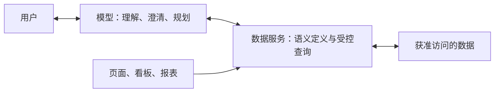

# 智能问数：从 Merine Daas 到 Rebuild 的讨论交接

整理日期：2026-10-09。本文总结用户与 Codex 在 `merine-daas` 会话中的讨论，供 Rebuild Codex 直接承接。它是需求背景与方案共识，不是已完成实现，也不是完整的接口或数据库设计。

## 1. 接手时先理解这件事

用户希望为海防业务建设智能问数：在智能体中用自然语言查询业务数据，支持必要澄清、连续追问、统计比较和逐步分析。例如：

- “去年有多少出逃人员被抓了？”——需明确在逃人员、非法出入境人员，以及抓获、到案的区别。
- “上个月有多少船只走私？”——需明确风险线索、涉案与业务认可的认定依据，以及艘数和次数的区别。
- “上个月出港了多少船？按港口分一下。和去年同期相比呢？”

旧方案主要维护问题示例、SQL 模板、回答模板，由智能体匹配和执行。用户希望突破“每增加一种问题就要补一条 SQL”的覆盖限制，让模型承担理解、澄清、查询规划和分析工作，并能随着模型能力提升继续演化。

**用户已经明确选择：先在自己的 `merine-rebuild` 项目开发试验版，完整跑通后，再在正式 `merine-daas` 项目中开发。** 两个项目有不同技术栈和权限规则，迁移时需要适配，不能直接复制代码或数据。

当前对接动作是：带着本文在 Rebuild 继续讨论和确定首期范围。请结合本项目当前代码给出具体建议，不需要重新从零比较所有路线，也不要把本文的示例视为已经拍板的完整实现清单。

## 2. 已有共识与尚未确定的内容

| 状态             | 内容                                                                                                       |
| ---------------- | ---------------------------------------------------------------------------------------------------------- |
| 已认可的主线     | 大模型 + 业务语义层 + 受控查询服务；后两者共同构成数据服务层                                               |
| 已认可的边界     | 模型通过受控能力读取业务数据，不持有数据库账号，不执行业务数据修改                                         |
| 已认可的交互     | 意图、口径、范围明确时直接查询；有影响结果的歧义时给选项或请用户补充；缺少数据时说明缺口                   |
| 已认可的建设方式 | 先在现有项目内建立职责清楚的模块，复用现有工程基础；数据服务层不要求独立服务器或微服务                     |
| 已认可的演进方向 | 指标和维度可以组合，多轮对话保留已确认条件，模型可以根据结果继续分步查询                                   |
| 推荐保留         | 现有经过验证的查询可成为业务定义、查询示例和回归基线；SQL 模板本身仍有价值                                 |
| 后续可选         | 受控 Text-to-SQL 探索通道、只读副本、主题分析库或数仓，均由实际需求驱动                                    |
| 尚未拍板         | 首批业务专题和指标、模型与部署位置、交互页面、具体 API、配置格式、数据表、是否新增依赖、工期与验收数值门槛 |

三条查询路线的定位：

1. 已验证查询：适合复杂但稳定的统计口径，可以复用。
2. **语义指标组合查询：首期主线。** 模型生成结构化查询要求，由后台按正式定义组织 SQL。
3. 受控 SQL 探索：后续用于数据和业务含义已明确、但现有组合能力表达不了的临时分析。不能把缺少定义或数据的问题自动交给模型自由写 SQL。

数仓属于数据底座选择，可以配合上述路线；它不是问数功能的前置条件，也不会自动解决统计口径问题。

## 3. 三个核心分别做什么

| 核心         | 职责                                                                                   | 不能交给它自行决定的事项                                                |
| ------------ | -------------------------------------------------------------------------------------- | ----------------------------------------------------------------------- |
| 大模型       | 理解问法；查询可用业务定义；发现歧义并澄清；生成结构化计划；分步分析；解释查询结果     | 用户身份和权限、正式指标定义、凭空补齐数据、没有证据的数字或原因        |
| 业务语义层   | 业务词典、指标口径、粒度、数据映射、关联和去重规则、允许的分析维度、数据适用条件       | 不能只放文字提示而缺少后台执行规则；不是自然语言解析器本身              |
| 受控查询服务 | 验证指标和条件、落实身份与数据权限、组织并执行查询、完成确定的计算、返回数据及统计依据 | 不能只凭 SQL 以 SELECT 开头就认定安全；不能信任模型提交的身份或授权范围 |

数据服务可以服务智能体、页面、看板和报表。对于本次试点，先围绕选定的业务分析能力建设，不扩大为全项目的数据接口重构。



模型调用工具时，由服务端程序转换为真实调用。内部模块可复用公开查询能力，不要求所有内部调用都通过 HTTP。跨模块读取遵守 Rebuild 的公开能力和查询归属规则。

## 4. 一个问题如何完成查询

1. 服务端建立可信的当前身份、操作权限和业务数据范围，并提供当前时间及业务时区。
2. 模型获取与问题有关、允许披露的指标定义和能力目录。语义层从理解阶段就参与，不是最后才匹配。
3. 确认指标、时间、范围、统计口径和分组方式。已有明确默认值时直接使用并在结果中说明；不同理解会改变答案时才请用户作选择。
4. 模型生成结构化查询要求，服务端校验指标存在性、合法组合、时间范围和权限。
5. 后台根据已批准的映射和规则执行查询；去重、总计、同比和占比等由确定的程序计算。
6. 返回数据、统计依据和数据状态。若需要进一步分析，模型可继续调用受控能力；限制总耗时、调用次数和数据量。
7. 形成自然语言答案、表格或图表，展示统计期间、实际数据范围、口径、单位和可靠的数据更新时间。

例如，以下仅为设计示意，不是现有 API 或已定稿契约：

```json
{
  "metric": "ship_departure_event_count",
  "startDate": "2026-09-01",
  "endDateExclusive": "2026-10-01",
  "groupBy": ["port"]
}
```

这表示按港口统计 2026 年 9 月的出港事件数。它不包含模型自行声明的用户身份或授权范围；用户选择的地区只能在获准范围内收窄。指标的数据源、事件有效性和去重规则仍需先定义并实现。

查询返回除数据外，应考虑：指标标识与版本、已执行条件、授权后的实际范围、单位、覆盖期间、更新时间与依据、质量或缺失提示、查询标识。具体 DTO 与错误契约在 Rebuild 再设计。

必须区分：成功且为零、数据未接入或覆盖不足、指标或组合不支持、权限受限、查询失败或超时。不能把后三类当作零；错误信息也不能泄露无权获知的对象或数据。

连续追问应保存已确认的查询状态和结果引用，包括指标、期间、范围、分组和澄清选择。不能只依赖聊天全文，让“按港口分一下”悄悄改变上一问的时间或统计口径。新一轮查询仍要核对当前权限。

模型可以分析哪些地区贡献了更多增量，但不能仅凭数量变化推断走私活动加剧或执法能力提升；数据补录、接入范围和分类变化也可能影响数字。

## 5. 业务语义层要落到哪些具体定义

先定义业务指标，再覆盖不同问法。一个指标可以通过合法维度、过滤和比较方式回答多种问题；新问法通常不需要新 SQL，但新指标或新数据关系仍需建设。

建议首批指标逐个形成简短定义卡：

| 定义项                 | 需要回答的问题                                                 |
| ---------------------- | -------------------------------------------------------------- |
| 标识、名称、别名、单位 | 是哪一个指标？业务上还有哪些叫法？                             |
| 业务含义与认定依据     | “出港”“涉走私”“到案”具体指什么，由何种业务记录认定？           |
| 统计对象与粒度         | 一行代表事件、人员、船舶，还是一次反馈？                       |
| 数据来源与有效条件     | 使用哪些来源，如何处理作废、重复、失败、未审核和删除记录？     |
| 业务标识与去重         | 同一对象或事件如何识别？跨来源是否具备可靠对应依据？           |
| 时间与地区             | 按事件、登记还是入库时间？按发生地、船籍地还是管理单位？       |
| 维度与关联             | 支持哪些分组和过滤，哪些组合合法，如何避免一对多关联放大数量？ |
| 汇总规则               | 能否跨港口、月份直接相加？总计、比率和同比如何计算？           |
| 权限适用方式           | 如何依据本业务的实际可见集合查询？权限仍由服务端执行           |
| 数据适用条件           | 覆盖期间、接入范围、字段完整性、更新依据、已知限制             |
| 维护信息               | 业务确认人、定义版本、生效时间、对应查询实现和验证样例         |

例如，同一艘船从甲港、乙港各出港一次：出港艘次可以合计为 2，但去重船舶总数是 1，不能把每港去重数直接相加。年度去重人数同样不能直接累加月度去重人数。

初期可使用版本化的结构化配置配合 Java 实现，不必先开发指标管理平台。模型说明与执行规则应围绕同一个正式定义维护；“同一份定义”不要求把所有业务逻辑塞入配置文件。查询实现与定义需要关联版本并通过测试核对。

## 6. 正式项目的已知事实：供理解业务，不代表 Rebuild 已具备

以下事实在原会话中通过 `merine-daas` 源码核对，未连接生产、旧库或真实业务数据；接手者无需为理解本文重新遍历旧项目。

| 原项目事实                                                                               | 对设计的影响                                                                                         |
| ---------------------------------------------------------------------------------------- | ---------------------------------------------------------------------------------------------------- |
| 已有问题示例、SQL 模板、回答模板、图表配置，以及智能体接入和聊天相关实现                 | 可作为后续正式项目改造的资产；不能推断 Rebuild 已有同样能力，外部工作流配置也未核验                  |
| 公安进出港统计通过 `type="0"` 的记录数计算出港数量，查询本身没有事件去重                 | 当前记录数是否能代表业务出港艘次，需要核实来源、有效状态和重复情况                                   |
| 在逃预警一条可有多次处置；新处置记录保存是否到案及创建时间，不采集实际到案时间、到案方式 | 到案反馈记录数、登记到案人数、实际到案人数和抓获人数必须区分；不能用办结数或记录创建时间冒充抓获统计 |
| 案件存在模型生成的风险分类                                                               | AI 风险分类与正式统计采用的认定依据需区分，不能自动将风险标签当作确认事实                            |
| 旧 SQL 执行入口仅做有限检查，调用路径放行；旧区划过滤不自动覆盖任意原生查询              | 正式开发必须建立受控查询边界；Rebuild 不复制这些旧入口和权限做法                                     |

对应源码线索：`GabReportShipInoutServiceImpl` / `GabReportShipInoutRepository`、`FugitiveAlertServiceImpl`、`CaseAIAnalysisComponent`、`IntelligentQaKnowledge`、`SqlExecuteServiceImpl` / `SecurityConfig`。如果之后确需查看旧源码，按 Rebuild 规则先明确授权范围；不读取同级 dump 或旧数据库。

这些不足是数据能力边界，不应通过改提示词或让模型自由生成 SQL 来掩盖。Rebuild 若构建合成出港、到案或案件数据，也不能据此声称正式项目已有相同字段或数据质量。

## 7. Rebuild 的承接条件与差异

交接时已读取 Rebuild 的入口文档和目录规则；以下是当前文档记载，不代表本轮完成了相关功能的运行验收。接手时以实际代码和最新规则为准。

- 技术栈为 React + TypeScript + Ant Design、Java 21 + Spring Boot + MyBatis、MySQL 的模块化单体。前端在 `apps/web`，后端在 `apps/api`。不沿用旧项目 Java 11、JPA 或裸 HTML 的工程约定。
- 登录采用 Spring Security Session + HttpOnly Cookie，并有 CSRF。未来模型编排调用必须保留可信身份与授权上下文，不能让模型提交 `userId` 或单位后就予以信任。
- 已有任务处置、信息流转及关联业务。任务按参与单位和责任链授权，情报按实际送达及发送链授权；**系统管理员不自动获得全部业务数据，也不能用简单的“省级看全部、下级按区划”替代现有规则。**
- 入口文档将 AI 接入列为尚未实现，不能把设计稿当作可用功能；当前可复用的模型能力需接手时核实。
- 跨模块读取优先使用公开查询能力。确需同库只读关联时，明确查询 owner、参与表、授权条件与结果归属，遵守本项目模块规则。
- 后端定义契约，再通过 OpenAPI 生成 `packages/api-contract` 中的前端类型，不手改生成文件。表结构使用新增 Flyway 迁移，按本项目数据库规则执行。
- 问数工具只有业务读取能力；数据库查询通道按最小只读权限设计。平台自己的会话、审计记录由受控后台逻辑写入，不因此开放模型业务写入能力。普通应用账号具有 DML 权限不等于问数通道已只读。
- 先随现有应用部署。将来独立部署仍需适配认证、权限、缓存、数据库访问和超时机制，不保证仅修改 URL 即可。独立服务也不会自动隔离数据库负载。

必须遵循本项目授权与环境边界：

1. 只用本项目本地容器和合成业务数据，不连接旧库、生产，不外传真实数据，不输出凭据。
2. 当前 AGENTS 明确限制外部 AI 服务，新增外部或付费调用需要对应授权；下一轮需要明确真实模型的部署位置和调用范围。未取得相应授权前，不直接联通外部模型。
3. 新增运行、开发、测试依赖、插件或基础服务，按本项目规则先说明并取得确认；本文中的概念与示例不是依赖安装授权。
4. 提交、推送、清库、删卷、重灌按项目规则单独处理；不要为试验覆盖已有数据或破坏已完成模块。

可先用替身验证界面和查询编排，但必须标明“替身验证”。用户最终希望真实模型参与的完整链路跑通，不能只用固定映射或 mock 宣称完成智能问数。

相关入口：[AGENTS](../../AGENTS.md)、[README](../../README.md)、[模块与目录规则](../rules/structure.md)、[后端规则](../rules/backend.md)、[数据库规则](../rules/database.md)、[测试规则](../rules/testing.md)。按实际任务读取，勿将所有文档当作统一前置通读清单。

## 8. 首期范围：给出建议，但先在 Rebuild 讨论确定

首期目标是完整走通一条小范围链路：**自然语言 → 指标理解 → 必要澄清 → 受控查询 → 本地数据 → 可核对答案 → 连续追问**。

有两类试点候选，尚未选择：

| 候选                                     | 优势                                                                         | 需要注意                                                                                 |
| ---------------------------------------- | ---------------------------------------------------------------------------- | ---------------------------------------------------------------------------------------- |
| 复用 Rebuild 已有任务、信息流转业务      | 有业务与合成数据基础，可验证复杂的真实授权规则；减少为了演示另外建设业务模块 | 任务数、参与单位任务数、签收数、反馈数及按时间的口径须分别定义；不强行套用原项目业务状态 |
| 构建小规模海防统计合成专题，如船舶进出港 | 接近原始客户问题，容易展示艘数与艘次、分组、趋势和非可加性                   | 先核实当前是否已有适用数据；没有时明确新增范围，不建设完整船舶系统，也不搬入旧库         |

建议先选一个小专题、少量指标，同时纳入一个明确无法回答或需要澄清的问题。任务专题可优先评估，但这是建议，不代表用户已改变海防问数的总体目标。

首期应覆盖：指标目录与正式口径、结构化查询、服务端权限、必要澄清、分组和至少一种比较、连续追问、答案依据、数据缺失与错误处理、代表性验收。

受控任意 SQL 探索、大型数仓、指标自助管理平台、通用多智能体框架和复杂自主运维不作为默认首期范围。若发现确实需要，再说明收益与成本。

## 9. 验证怎样证明“跑通”

按四个层次定位问题：

1. **业务定义**：客户认可的统计含义是什么？同船多次、跨来源重复、跨月补录、地区归属分别如何处理？
2. **来源适用性**：实际字段、标识、数据覆盖和关联质量能否支撑该定义？合成样本有事件编号，不代表原项目一定有可靠的跨来源事件标识。
3. **计算正确性**：预先人工算出合成样本答案，用真实隔离 MySQL 验证权限过滤、去重、时间边界、关联、总计与汇总。不能只与旧报表相等就认定正确。
4. **模型与完整流程**：不同问法是否选对指标和条件；澄清是否有必要；连续追问是否保持口径；权限失效、无数据和查询失败是否正确处理；回答是否忠于结果。

讨论中使用的合成样例（假定按事件时间统计，同一事件重复记录只算一次）：

| 事件 | 船舶 | 日期       | 港口 | 方向           |
| ---- | ---- | ---------- | ---- | -------------- |
| E01  | 船 A | 2026-09-03 | 甲港 | 出港           |
| E01  | 船 A | 2026-09-03 | 甲港 | 出港，重复记录 |
| E02  | 船 A | 2026-09-05 | 甲港 | 出港           |
| E03  | 船 B | 2026-09-06 | 乙港 | 出港           |
| E04  | 船 C | 2026-09-08 | 乙港 | 入港           |
| E05  | 船 D | 2026-10-01 | 甲港 | 出港           |

已知预期：9 月出港 3 艘次、2 艘船；甲港 2 艘次、乙港 1 艘次；若用户仅可查看甲港，则为 2 艘次、1 艘船。另设跨港口同船、一事件多船员关联等场景，验证去重总计与关联倍增。

这些是纯合成教学样例，不是原项目真实统计。选择任务/信息专题时，建立等价的业务样本，不要求为复用该表而新增船舶业务。

建议逐步积累约 30～50 个代表性问题，规模随首期范围调整，包括同义问法、新组合、歧义、数据缺失、越权、日期边界和连续追问。正式验收保留未用于提示示例的问题；评测模型选项和最终结果，不要求 SQL 字符串完全相同。模型、提示词或指标定义变更后复测，检查改善与回退。

“完整跑通”至少应有：获准使用的真实模型、多轮问题理解、本地真实 API 与 MySQL、跨合成账号权限验证、可核对的正确结果和失败路径。编译成功、单次成功、mock 返回或旧进程均不能代替这些证据。

## 10. 下一轮讨论从这里继续

接手 Codex 建议先完成以下判断，再与用户对齐首期实施范围：

1. 根据 Rebuild 当前实现，推荐最合适的试点专题和少量指标，解释为什么；标明数据缺口及新增工作。
2. 为首批指标列出简短定义卡，特别确认粒度、时间、去重、地区/责任关系、汇总和数据授权；业务歧义由用户确认，代码能查明的事项自行查明。
3. 明确模型接入位置、可信身份传递和数据服务调用链；说明现有能力与尚待授权的依赖或外部调用。
4. 给出符合现有模块边界的前后端落点、查询与结果契约草案、最小验证方案。接口示例和目录名称都可根据实际规则调整。
5. 形成可执行的首期步骤，随后根据用户在 Rebuild 会话中的指令开发和验收。

用户希望解释清晰、具体，能看懂页面 → API → 业务规则 → SQL 的链路；可使用 React/TypeScript 类比解释 Java 概念，但不为教学制造多余抽象。

试验完成后，适合带回正式项目的是：已确认的指标定义、查询与结果契约、模型交互经验、已验证查询、合成评测集和验收结论。正式项目仍需重新适配技术栈、数据映射、权限和模型环境，重新验证，不能把 Rebuild 通过视为正式项目已经通过。

可在 Rebuild 新会话中直接发送：

> 请先阅读 `AGENTS.md` 和 `docs/tasks/intelligent-data-query-handoff.md`，承接此前智能问数讨论。目标是先在 Rebuild 做一版完整可验证的试验，再将经验用于正式海防项目。请结合本项目当前代码，优先梳理首期专题、指标定义、模型接入与受控查询链路，给出推荐的最小落地方案和待确认的业务问题，接着与我讨论。当前先确定方案，不要把文中的示例当作已经定稿的实现要求。
