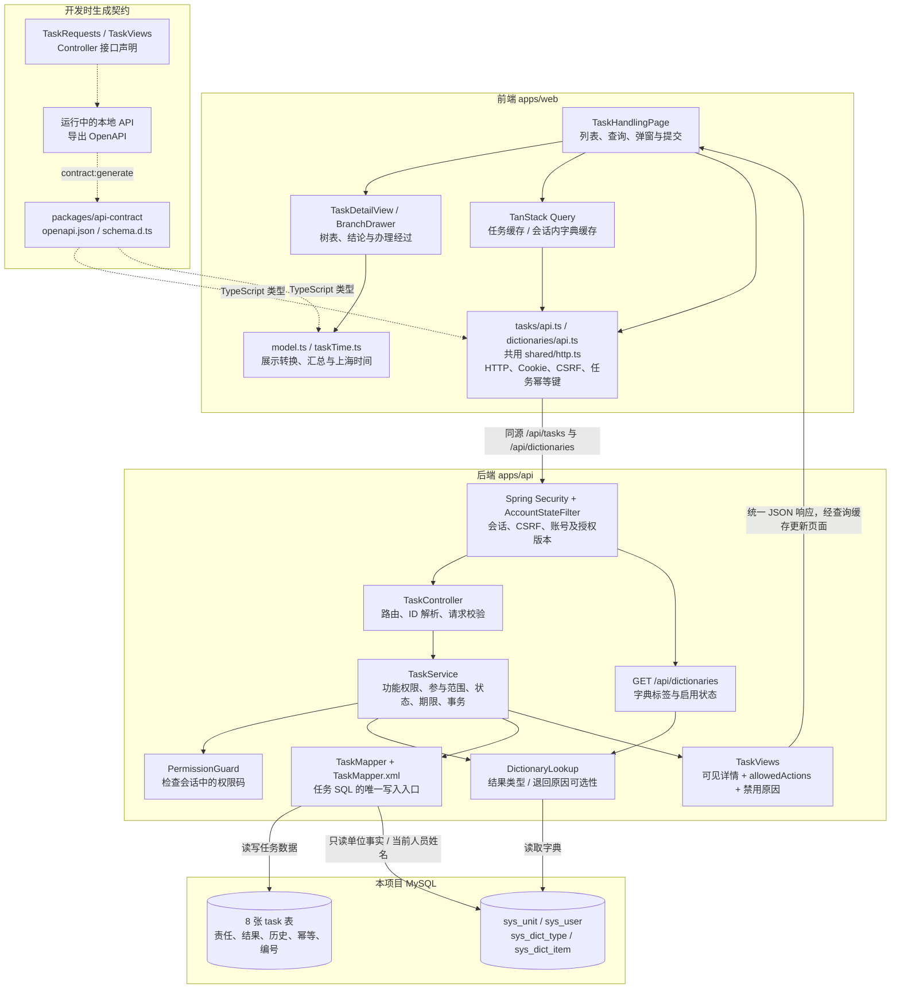
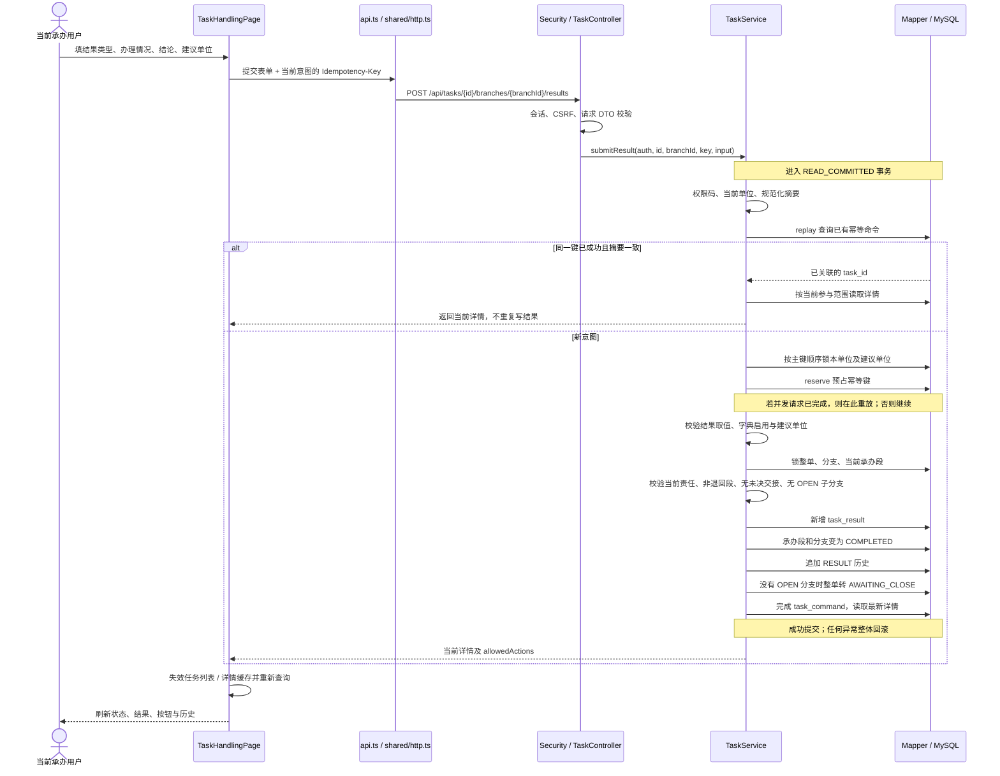

# 任务处置：模块架构

[返回图解入口](README.md) · [业务流程](business-flow.md) · [库表关系](database.md)

核对日期：2026-09-27。模块采用 React 页面 → Spring MVC Controller → Service → MyBatis → MySQL 的调用链；流程由任务用例中的显式代码实现。

## 1. 分层架构图

实线是运行时调用或数据传递；虚线是契约生成与类型依赖。

任务与字典请求都经过 Spring Security。`index.ts` 维护类型别名；`openapi.json` 和 `schema.d.ts` 从新 API 生成，不手工维护第二份接口定义。

如果用 React 的经验理解 Java：Controller 类似“请求适配入口”，Service 是处理完整业务意图的函数集合，Mapper 负责执行明确的 SQL。`TaskViews` 类似传给页面的类型化数据，其中 `allowedActions` 直接告诉页面当前可以展示哪些操作。

### 权限和按钮分别负责什么

1. Security 确定请求是否有有效会话、写请求是否通过 CSRF 校验。
2. `TaskService` 用权限码确定“能做什么”，再用单位参与范围、当前责任与状态确定“能对哪条数据做”。
3. `detailFor` 过滤可见分支和历史，计算整单及分支的 `allowedActions`。
4. 前端映射按钮名称；`enabled=false` 保留按钮并显示 `reason`，没有下发的操作不显示。
5. 点击按钮后，写接口重新校验；页面缓存里的可用按钮不能代替服务端授权。

单位管理另通过 `TaskUnitUsageLookup` 查询任务引用，以阻止删除已被任务引用的单位或调整其上级。任务数据的写入仍归 `TaskMapper`。

## 2. 一次“提交处置结果”的时序

以下是 `submitResult` 的实际顺序。创建任务还会分配编号；办结接口自行锁整单，不能套用要求整单为 `OPEN` 的 `locked()`。

同一键换内容会返回 `IDEMPOTENCY_CONFLICT`。幂等记录关联业务对象，重放读取的是**当前可见详情**，不是保存的一份旧响应 JSON。失败回滚时，结果、状态、历史和幂等占位都不能留下半成品。

## 3. 代码对照入口

| 层次     | 入口                                                                                                                                                                                                                                                           | 建议先看                                                         |
| -------- | -------------------------------------------------------------------------------------------------------------------------------------------------------------------------------------------------------------------------------------------------------------- | ---------------------------------------------------------------- |
| 页面     | [TaskHandlingPage.tsx](../../../apps/web/src/features/tasks/TaskHandlingPage.tsx)                                                                                                                                                                              | 查询、`open`、`submit`、结果和办结弹窗                           |
| 展示     | [model.ts](../../../apps/web/src/features/tasks/model.ts)                                                                                                                                                                                                      | `branchRows`、`taskSummary`、`branchCommands`、`historyEntries`  |
| HTTP     | [api.ts](../../../apps/web/src/features/tasks/api.ts)、[shared/http.ts](../../../apps/web/src/shared/http.ts)                                                                                                                                                  | 路径、幂等键、CSRF、统一错误                                     |
| 接口     | [TaskController.java](../../../apps/api/src/main/java/com/merine/rebuild/task/TaskController.java)                                                                                                                                                             | 每个动作如何进入 Service                                         |
| 业务     | [TaskService.java](../../../apps/api/src/main/java/com/merine/rebuild/task/TaskService.java)                                                                                                                                                                   | `submitResult`、`close`、`recall`、`detailFor`、`allowedActions` |
| 数据     | [TaskMapper.xml](../../../apps/api/src/main/resources/mapper/task/TaskMapper.xml)                                                                                                                                                                              | 锁定读、条件更新、历史与幂等 SQL                                 |
| 保护边界 | [TaskUnitUsageLookup.java](../../../apps/api/src/main/java/com/merine/rebuild/task/TaskUnitUsageLookup.java)                                                                                                                                                   | 单位管理如何查询任务引用                                         |
| 回归证据 | [TaskHandlingRegressionTest.java](../../../apps/api/src/test/java/com/merine/rebuild/task/TaskHandlingRegressionTest.java)、[TaskIdempotencyConcurrencyTest.java](../../../apps/api/src/test/java/com/merine/rebuild/task/TaskIdempotencyConcurrencyTest.java) | 状态与权限、禁用原因一致性、并发与回滚                           |
