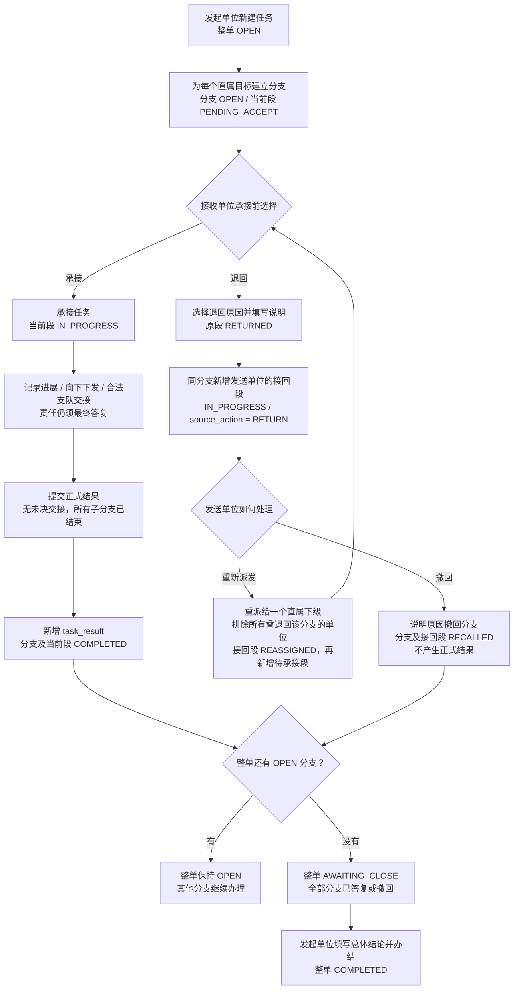
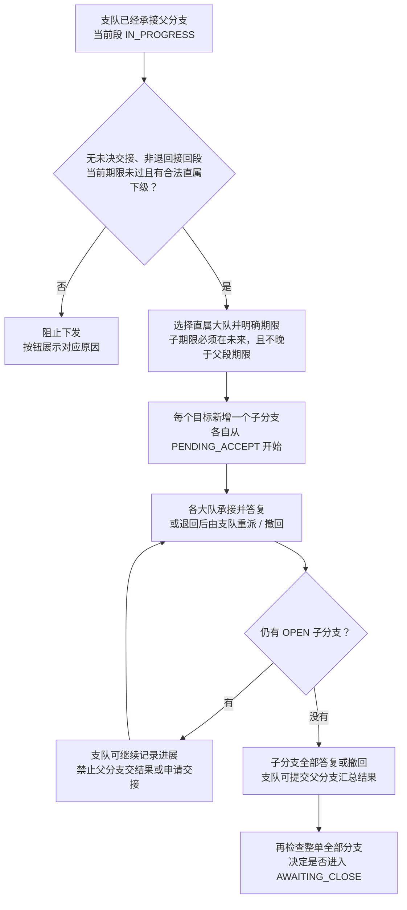
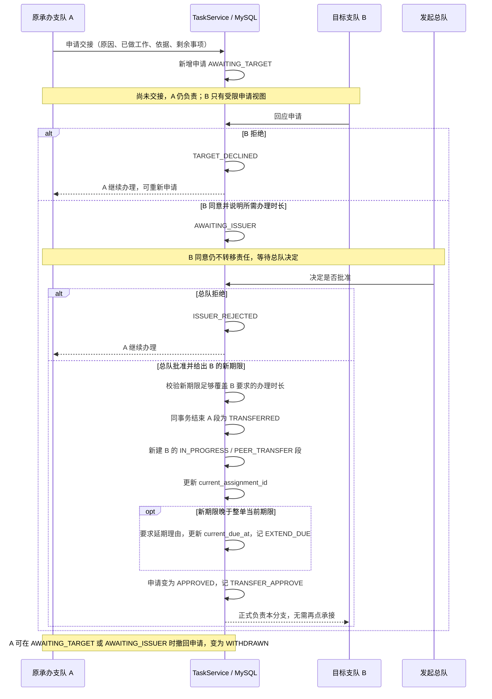

# 任务处置：业务流程

[返回图解入口](README.md) · [模块架构](architecture.md) · [库表关系](database.md)

核对日期：2026-09-27。流程图中的动作都由 [TaskService](../../../apps/api/src/main/java/com/merine/rebuild/task/TaskService.java) 校验，前端按钮只呈现服务端返回的操作。

## 1. 从下发到办结

总队可以发给直属支队，支队也可以独立发起任务给直属大队；“发起单位”不固定等于总队。

图中的“办理”不是自动流水线：承办单位可以多次记录进展，也可以直接提交结果。向下下发与支队交接各有额外前置条件，见后两张图。

### 关键规则

- 退回只允许在待承接时，原因是“派错单位 / 不属本单位职责 / 要求不明确”，另附说明。
- 退回后的接回段可以记录进展，但只允许通过**重派或撤回**结束；不能用提交结果或普通下发绕过。
- 重新派发需要当前承办期限尚未过去；过期后返回 `DUE_PASSED`，仍可以说明原因撤回。
- `COMPLETED` 分支必须有一份正式结果；`RECALLED` 分支没有结果，分支 `completed_at` 保持空，撤回时间在承办段 `ended_at`。
- 整单“待办结”不写办结时间。显式办结才写总体结论、办结人、办结时间，且不能重开。
- 办结默认使用 `TASK_CREATE`，分支撤回使用 `TASK_DISPATCH`；还必须符合单位与当前责任条件。

正式结果有五种：`FULFILLED` 目标达成、`NOT_FOUND` 经核查未发现、`PARTIAL` 部分完成、`UNABLE_TO_VERIFY` 无法核实、`OUT_OF_JURISDICTION` 转出辖区。最后一种必须选启用的建议单位，不能选本单位；建议不会自动派发任务。

## 2. 向下下发：新增子分支，父责任保留

父分支始终由支队负责汇总。子分支结束不会自动替父分支交结果。页面汇总只数当前视图最上层的分支；总队视图不把大队子分支再次计入根分支总数。

大队发现事项跨辖区时，提交如实结果与建议单位；支队按需创建关联 `source_result_id` 的**另一项任务**并给新期限，大队不能把当前分支直接平级转给其他大队。

## 3. 支队交接：同一分支更换承办单位

适用范围：总队直接下发的根分支，当前由支队办理；目标为同一总队下其他启用支队，且从未承办过该分支。没有未结束子分支才可申请。

### 责任、时间与可见范围

- 正式交接发生在**总队批准时**。旧段的期限和历史保留，新段 `accepted_at` 是批准时刻，承接人沿用 B 同意申请的用户。
- 办理时长从批准时起算；界面填小时或天，接口与数据库存分钟。批准期限必须满足该时长。
- 有未决交接时，A 可记录进展、撤回申请；不能新增子分支或提交正式结果。
- 延长整单期限只改 `current_due_at`，不改 `initial_due_at`，也不自动延长其他并行分支的期限。
- 其他分支的参与单位能看到整单延期事件及前后期限，看不到这条交接的原因和办理细节。
- 目标支队停用后，总队的批准和拒绝都会被单位校验阻止；现有恢复路径是由申请方撤回申请。

## 4. 从图走到验收

每做一步，都对照详情中的 `status`、分支 `currentAssignmentId`、`assignments`、`result`、`allowedActions` 和 `actions`。同一动作的页面禁用原因应与接口报错一致；旧任务保持原编号，旧的自动办结任务可以没有总体结论。

源码入口：[TaskController](../../../apps/api/src/main/java/com/merine/rebuild/task/TaskController.java)、[TaskService](../../../apps/api/src/main/java/com/merine/rebuild/task/TaskService.java)。自动回归入口：[TaskHandlingRegressionTest](../../../apps/api/src/test/java/com/merine/rebuild/task/TaskHandlingRegressionTest.java)。
