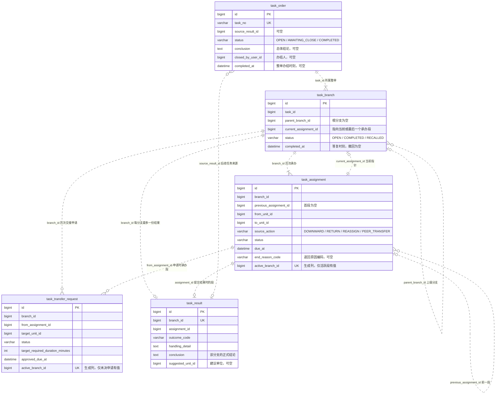
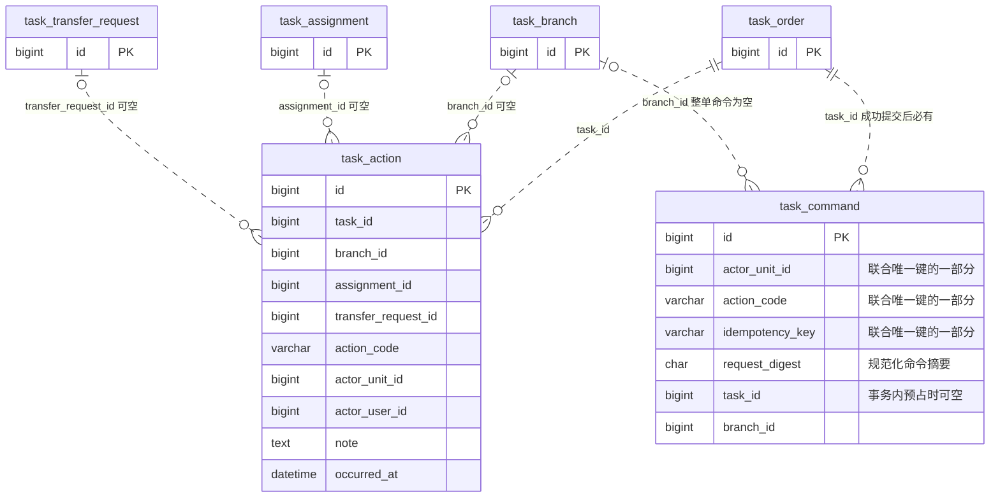
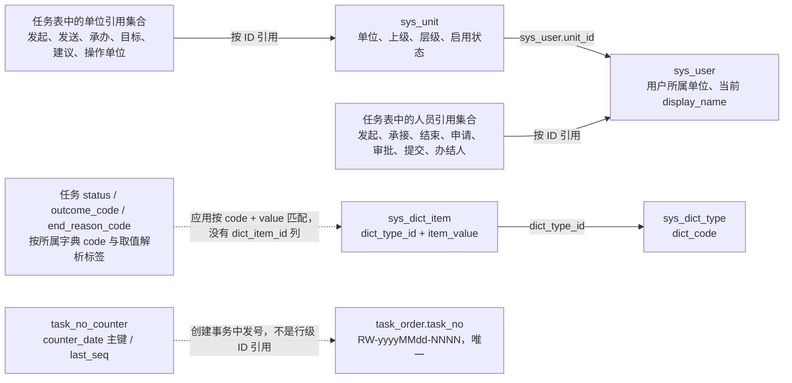

# 任务处置：库表关联关系

[返回图解入口](README.md) · [模块架构](architecture.md) · [业务流程](business-flow.md)

核对日期：2026-09-27。依据 V19 建表、V21 幂等占位调整、V23–V27 状态与字段扩展，以及当前 [TaskMapper.xml](../../../apps/api/src/main/resources/mapper/task/TaskMapper.xml)。任务模块共有 **8 张业务表**。

**以下全部是逻辑引用，不是物理外键。** ER 图中的 `PK`、`UK` 表示实际主键或唯一约束；没有把关联字段标成数据库 `FK`。连线的数量关系描述正常提交后的业务数据，事务内初始化时的短暂空指针另行说明。

## 1. 核心 ER 图：整单、分支、承办、交接、结果

只列学习关系所需的字段；所有字段的完整定义以迁移和 Mapper 为准。

读图示例：一条整单对应多个分支；一个分支对应多个历史承办段，但只有一个当前指针；一条分支最多有一份正式结果。一个结果可被多个独立后续任务作为来源，每个后续任务最多引用一个来源结果。

`current_assignment_id` 在创建事务中可以暂空，正常提交后指向同分支中的当前段；分支结束后仍保留最后一段。`previous_assignment_id` 将历次承办串起来；业务按顺序追加，当前指针和前一段引用的正确性由服务端维护，数据库没有单独的前一段唯一约束。

## 2. 历史与幂等记录挂在哪里

这两张表用途不同：

- `task_action` 回答“谁在什么时间做过什么”，用于办理记录。`CREATE`、`CLOSE` 和整单 `EXTEND_DUE` 不属于单个分支；延期通过 `transfer_request_id` 保留其交接来源。`CLOSE.note` 为空，总体结论只保存在整单。
- `task_command` 防止同一写入意图重复生效。实际唯一键是 **`(actor_unit_id, action_code, idempotency_key)`**；它不保存一份完整响应。事务内先预占，成功前补齐 `task_id`，失败整体回滚。

`RETURN` 动作关联新建的接回段；它的退回原因编码从该段的 `previous_assignment_id` 对应的旧 `RETURNED` 段读取。不要把编码误查到新的接回段上。

## 3. 单位、人员、字典与编号的关联

图中“单位引用集合 / 人员引用集合”是便于阅读的概念分组，不是另外两张表；完整字段映射见图下方。

| 来源表                  | 引用 `sys_unit(id)` 的字段                 | 引用 `sys_user(id)` 的字段                                                         |
| ----------------------- | ------------------------------------------ | ---------------------------------------------------------------------------------- |
| `task_order`            | `issuer_unit_id`                           | `issuer_user_id`、`closed_by_user_id`                                              |
| `task_branch`           | `origin_from_unit_id`、`origin_to_unit_id` | —                                                                                  |
| `task_assignment`       | `from_unit_id`、`to_unit_id`               | `accepted_by_user_id`、`ended_by_user_id`                                          |
| `task_transfer_request` | `target_unit_id`                           | `requested_by_user_id`、`target_responded_by_user_id`、`issuer_decided_by_user_id` |
| `task_result`           | `suggested_unit_id`                        | `submitted_by_user_id`                                                             |
| `task_action`           | `actor_unit_id`、`target_unit_id`          | `actor_user_id`                                                                    |
| `task_command`          | `actor_unit_id`                            | —                                                                                  |

单位名有两种来源：整单发起单位名和承办段单位名使用写入时的快照；办理记录的单位名使用单位当前名称。此次新增展示的人名统一取 `sys_user.display_name` 当前值，改名会影响历史显示。

字典对应关系：

| 数据字段                          | 字典 code                | 用法                                                |
| --------------------------------- | ------------------------ | --------------------------------------------------- |
| `task_order.status`               | `task.order.status`      | 状态标签                                            |
| `task_branch.status`              | `task.branch.status`     | 状态标签                                            |
| `task_assignment.status`          | `task.assignment.status` | 状态标签                                            |
| `task_transfer_request.status`    | `task.transfer.status`   | 状态标签                                            |
| `task_result.outcome_code`        | `task.result.outcome`    | 结果标签与启用选项；取值集合受代码和 CHECK 限制     |
| `task_assignment.end_reason_code` | `task.return.reason`     | 退回原因标签与启用选项；取值集合受代码和 CHECK 限制 |

状态字典项停用不改变状态流转，仍可解析历史标签；结果类型和退回原因提交时必须是启用选项。`task_no_counter` 按上海自然日分行，在创建事务中串行递增；回滚不消耗编号，幂等重放不发新号，旧 `TASK-…` 编号保持不变。

## 4. 重点不变量与保证位置

| 不变量                                     | 如何保证                                                                                          |
| ------------------------------------------ | ------------------------------------------------------------------------------------------------- |
| 一条分支最多一个活跃承办段                 | `active_branch_id` 生成列只为 `PENDING_ACCEPT / IN_PROGRESS` 输出 branch ID，并有唯一约束         |
| 一条分支最多一条未决交接                   | 交接表的 `active_branch_id` 只为 `AWAITING_TARGET / AWAITING_ISSUER` 输出 branch ID，并有唯一约束 |
| 一条分支最多一份正式结果                   | `task_result.branch_id` 唯一约束                                                                  |
| 分支当前指针及结果所属段必须属于同一分支   | Service 写入顺序、事务与引用一致性回归；不是物理外键兜底                                          |
| 仍有 OPEN 子分支时，父分支不能交结果或交接 | Service 在锁定整单、分支后检查                                                                    |
| 全部分支结束后等待总体结论                 | `submitResult / recall` 检查 OPEN 分支数；`close` 只接受 `AWAITING_CLOSE`                         |
| 原期限与历史责任不能被交接覆盖             | 整单保留 `initial_due_at`，每段独立保存 `due_at`，交接新增段                                      |
| 业务写入、历史与幂等记录一起成功           | 同一个数据库事务；条件更新失败或其他异常整体回滚                                                  |

学习时优先跟踪 `task_id → branch_id → current_assignment_id`，再看状态、结果和历史。最后区分三个时间：整单 `completed_at` 是办结时刻，分支 `completed_at` 是正式答复时刻，承办段 `ended_at` 也可能是退回、交接、重派或撤回时刻。

## 5. Schema 与检查入口

- [V19：原始七张任务表](../../../apps/api/src/main/resources/db/migration/V19__create_task_handling.sql)
- [V21：幂等命令事务内预占](../../../apps/api/src/main/resources/db/migration/V21__reserve_task_idempotency_command.sql)
- [V23：状态与注释](../../../apps/api/src/main/resources/db/migration/V23__extend_task_lifecycle_states.sql)
- [V24：总体结论、办结人、退回原因](../../../apps/api/src/main/resources/db/migration/V24__add_task_closure_and_return_reason.sql)
- [V25：NOT_FOUND](../../../apps/api/src/main/resources/db/migration/V25__add_task_not_found_outcome.sql)
- [V26：每日编号计数器](../../../apps/api/src/main/resources/db/migration/V26__create_task_number_counter.sql)
- [V27：状态与原因字典](../../../apps/api/src/main/resources/db/migration/V27__seed_task_state_dictionaries.sql)
- [ReferenceIntegrityRegressionTest：逻辑引用完整性](../../../apps/api/src/test/java/com/merine/rebuild/schema/ReferenceIntegrityRegressionTest.java)
- [SchemaForeignKeyRegressionTest：禁止物理外键](../../../apps/api/src/test/java/com/merine/rebuild/schema/SchemaForeignKeyRegressionTest.java)
